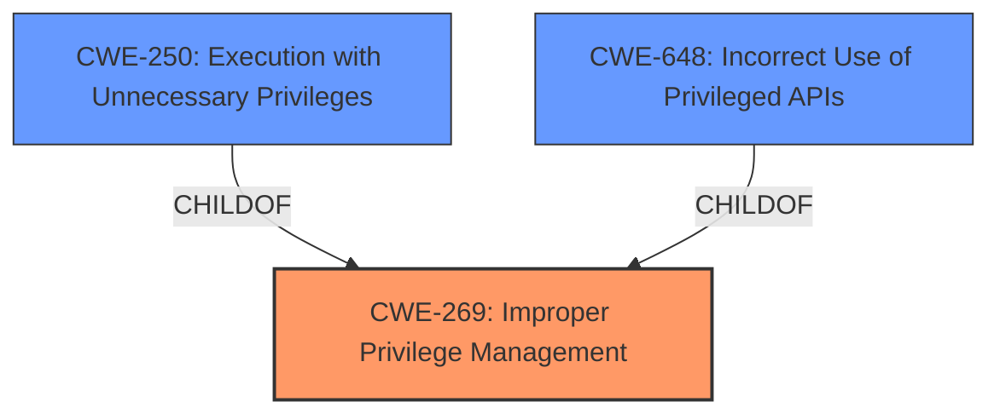

# Raw Analyzer Response for CVE-2021-25651

# Summary

| CWE ID | CWE Name | Confidence | CWE Abstraction Level | CWE Vulnerability Mapping Label | CWE-Vulnerability Mapping Notes |
|---|---|---|---|---|---|
| CWE-269 | Improper Privilege Management | 0.75 | Class | Primary | Discouraged: CWE-269 is commonly misused. |
| CWE-250 | Execution with Unnecessary Privileges | 0.60 | Base | Secondary | Allowed |
| CWE-648 | Incorrect Use of Privileged APIs | 0.50 | Base | Secondary | Allowed |

## Evidence and Confidence

*   **Confidence Score:** 0.70
*   **Evidence Strength:** MEDIUM

## Relationship Analysis
The primary CWE selected is CWE-269 (Improper Privilege Management), which is a Class-level CWE. While it's discouraged due to common misuse, the description clearly points to a problem in how privileges are managed. CWE-250 (Execution with Unnecessary Privileges) and CWE-648 (Incorrect Use of Privileged APIs) are considered as secondary, because they are potential root causes of the **privilege escalation**. CWE-250 and CWE-648 are children of CWE-269, making them more specific. The abstraction levels (Class and Base) influenced the decision to primarily focus on the broader management issue while acknowledging specific execution flaws.

## Vulnerability Chain
The vulnerability chain starts with **Improper Privilege Management (CWE-269)**, which can lead to **Execution with Unnecessary Privileges (CWE-250)** or **Incorrect Use of Privileged APIs (CWE-648)**. The end result is a **privilege escalation**, allowing a local user to gain higher-level access.

## Summary of Analysis
Initially, the description indicates a **privilege escalation** vulnerability, but it's important to map the root cause. The key phrase "**privilege escalation**" suggests an issue with how privileges are handled. The retriever results point to several CWEs related to privilege management.

The evidence supporting this analysis is primarily based on the vulnerability description: "A **privilege escalation** vulnerability was discovered in Avaya Aura Utility Services that may potentially allow a local user to escalate privileges."

CWE-269 (Improper Privilege Management) is chosen as the primary CWE because it directly addresses the **incorrect** handling of privileges, even though it is discouraged. The description doesn't provide enough detail to pinpoint the exact flaw. The child CWEs, CWE-250 and CWE-648, represent potential ways this **improper** management manifests. The selected CWEs are at the optimal level of specificity given the limited information. More detailed information is needed to choose a base CWE as the primary.

Relevant CWE Information:

# Enhanced Context (25 CWEs)

## CWE-250: Execution with Unnecessary Privileges
**Abstraction:** Base
**Status:** Draft

### Description
The product performs an operation at a privilege level that is higher than the minimum level required, which creates new weaknesses or amplifies the consequences of other weaknesses.

### Extended Description
New weaknesses can be exposed because running with extra privileges, such as root or Administrator, can disable the normal security checks being performed by the operating system or surrounding environment. Other pre-existing weaknesses can turn into security vulnerabilities if they occur while operating at raised privileges.

### Relationships
ChildOf -> CWE-269
ChildOf -> CWE-657

### Mapping Guidance
**Usage:** Allowed
**Rationale:** This CWE entry is at the Base level of abstraction, which is a preferred level of abstraction for mapping to the root causes of vulnerabilities.

## CWE-269: Improper Privilege Management
**Abstraction:** Class
**Status:** Draft

### Description
The product does not properly assign, modify, track, or check privileges for an actor, creating an unintended sphere of control for that actor.

### Extended Description
Not provided

### Relationships
ChildOf -> CWE-284

### Mapping Guidance
**Usage:** Discouraged
**Rationale:** CWE-269 is commonly misused. It can be conflated with "privilege escalation," which is a technical impact that is listed in many low-information vulnerability reports [REF-1287]. It is not useful for trend analysis.
**Comments:** If an error or mistake allows privilege escalation, then use the CWE ID for that mistake. Avoid using CWE-269 when only phrases such as "privilege escalation" or "gain privileges" are available, as these indicate technical impact of the vulnerability - not the root cause weakness. If the root cause seems to be directly related to privileges, then examine the children of CWE-269 for additional hints, such as Execution with Unnecessary Privileges (CWE-250) or Incorrect Privilege Assignment (CWE-266).

## CWE-648: Incorrect Use of Privileged APIs
**Abstraction:** Base
**Status:** Incomplete

### Description
The product does not conform to the API requirements for a function call that requires extra privileges. This could allow attackers to gain privileges by causing the function to be called incorrectly.

### Extended Description
When a product contains certain functions that perform operations requiring an elevated level of privilege, the caller of a privileged API must be careful to:
- ensure that assumptions made by the APIs are valid, such as validity of arguments
- account for known weaknesses in the design/implementation of the API
- call the API from a safe context

### Relationships
ChildOf -> CWE-269

### Mapping Guidance
**Usage:** Allowed
**Rationale:** This CWE entry is at the Base level of abstraction, which is a preferred level of abstraction for mapping to the root causes of vulnerabilities.