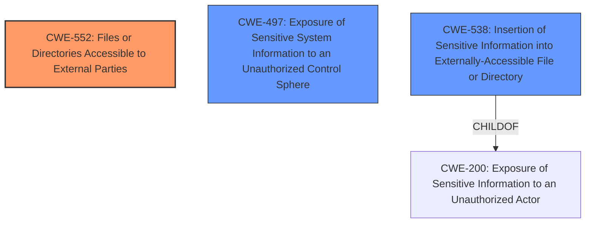

# Raw Analyzer Response for CVE-2021-25652

# Summary
| CWE ID | CWE Name | Confidence | CWE Abstraction Level | CWE Vulnerability Mapping Label | CWE-Vulnerability Mapping Notes |
|---|---|---|---|---|---|
| CWE-552 | Files or Directories Accessible to External Parties | 0.8 | Base | Allowed | Primary CWE |
| CWE-497 | Exposure of Sensitive System Information to an Unauthorized Control Sphere | 0.7 | Base | Allowed | Secondary Candidate |
| CWE-538 | Insertion of Sensitive Information into Externally-Accessible File or Directory | 0.6 | Base | Allowed | Secondary Candidate |

## Evidence and Confidence

*   **Confidence Score:** 0.8
*   **Evidence Strength:** MEDIUM

## Relationship Analysis
The primary CWE is CWE-552, which is at the Base level. I also considered CWE-497 and CWE-538 because both are related to information exposure. CWE-538 is a child of CWE-200 and is also related to CWE-552, but it's less specific than CWE-552. CWE-497 is more about system information exposure, which aligns with the vulnerability description.

## Vulnerability Chain
The chain of events starts with **insecure directory and file management**, leading to a local user gaining **unauthorized access to system functionality and configuration information**. The root cause is the **improper access control** in file/directory management, resulting in information disclosure.

## Summary of Analysis
The vulnerability description highlights that a local user can "access system functionality and configuration information that should only be available to a privileged user" due to an "information disclosure vulnerability... in the directory and file management." This points to a problem where files or directories are accessible to external parties when they should not be.

CWE-552 **Files or Directories Accessible to External Parties** best captures this vulnerability. The description of CWE-552 states: "The product makes files or directories accessible to unauthorized actors, even though they should not be." This aligns directly with the vulnerability description.

CWE-497 **Exposure of Sensitive System Information to an Unauthorized Control Sphere** is also a good fit, given the vulnerability involves the exposure of system functionality and configuration information.

CWE-538 **Insertion of Sensitive Information into Externally-Accessible File or Directory** is also considered since the vulnerability allows access to configuration information, which might be written into files.

While CWE-200 **Exposure of Sensitive Information to an Unauthorized Actor** was listed in the retriever results, it's too high-level and doesn't specify the root cause. The description states that CWE-200 is discouraged and that "loss of confidentiality is a technical impact that can arise from dozens of different weaknesses."

The selection is based on the evidence provided in the vulnerability description and the definitions of the CWEs. The relationship graph shows the connections between the chosen CWEs, with CWE-552 being the primary weakness and CWE-497 and CWE-538 as contributing factors. The chosen CWEs are at the Base level, providing the optimal level of specificity.

Relevant CWE Information:

# Enhanced Context (25 CWEs)
The following CWEs were identified as potentially relevant to this vulnerability:

## CWE-538: Insertion of Sensitive Information into Externally-Accessible File or Directory
**Abstraction Level**: Base
**Similarity Score**: 0.80
**Source**: dense

**Description**:
The product places sensitive information into files or directories that are accessible to actors who are allowed to have access to the files, but not to the sensitive information.

**Mapping Guidance**:
- Usage: Allowed
- Rationale: This CWE entry is at the Base level of abstraction, which is a preferred level of abstraction for mapping to the root causes of vulnerabilities.

## CWE-552: Files or Directories Accessible to External Parties
**Abstraction Level**: Base
**Similarity Score**: 0.79
**Source**: dense

**Description**:
The product makes files or directories accessible to unauthorized actors, even though they should not be.

**Mapping Guidance**:
- Usage: Allowed
- Rationale: This CWE entry is at the Base level of abstraction, which is a preferred level of abstraction for mapping to the root causes of vulnerabilities.

## CWE-497: Exposure of Sensitive System Information to an Unauthorized Control Sphere
**Abstraction Level**: Base
**Similarity Score**: 0.78
**Source**: dense

**Description**:
The product does not properly prevent sensitive system-level information from being accessed by unauthorized actors who do not have the same level of access to the underlying system as the product does.

**Mapping Guidance**:
- Usage: Allowed
- Rationale: This CWE entry is at the Base level of abstraction, which is a preferred level of abstraction for mapping to the root causes of vulnerabilities.