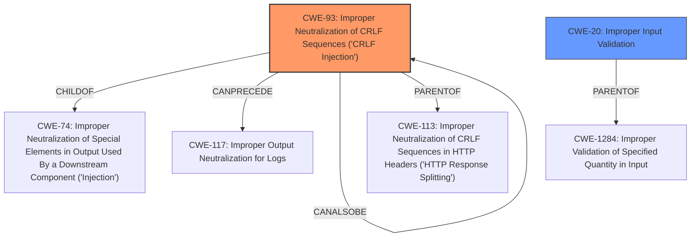

# Analysis for CVE-2021-25682

# Summary
| CWE ID | CWE Name | Confidence | CWE Abstraction Level | CWE Vulnerability Mapping Label | CWE-Vulnerability Mapping Notes |
|---|---|---|---|---|---|
| CWE-93 | Improper Neutralization of CRLF Sequences ('CRLF Injection') | 0.8 | Base | Allowed | Primary CWE. The vulnerability stems from the **improper parsing of the `/proc/pid/status` file**, specifically due to the injection of CRLF sequences. The **incorrect parsing** leads to **manipulation of `real_uid` and `real_gid`**, ultimately bypassing privilege dropping. |
| CWE-20 | Improper Input Validation | 0.6 | Class | Allowed | Secondary CWE. The vulnerability involves a lack of input validation in the `get_pid_info()` function. This allows for the injection of malicious values via the process name, which are then used as `real_uid` and `real_gid`. |

## Evidence and Confidence

*   **Confidence Score:** 0.7
*   **Evidence Strength:** MEDIUM

## Relationship Analysis
The primary relationship impacting the decision is the parent-child relationship between CWE-93 and CWE-74 (Improper Neutralization of Special Elements in Output Used By a Downstream Component ('Injection')). CWE-93 is a specific type of injection vulnerability, focusing on CRLF sequences. The vulnerability description highlights the injection of arbitrary values for `Uid` and `Gid` by crafting a malicious process name containing CRLF sequences.

## Vulnerability Chain
The vulnerability chain starts with the **improper parsing of `/proc/pid/status` file** (CWE-N/A), leading to the injection of CRLF sequences (CWE-93). This then results in the **bypassing of privilege dropping**, which allows for local privilege escalation to root.

## Summary of Analysis
The primary CWE is CWE-93 because the root cause is the **improper handling of CRLF sequences** in the `/proc/pid/status` file, which allows for the injection of malicious data. CWE-20 is a secondary CWE because the **lack of input validation** is a contributing factor. The evidence for CWE-93 comes directly from the "CVE Reference Links Content Summary" section, which states that the vulnerability stems from **improper parsing** of the `/proc/pid/status` file and that the program does not properly sanitize or validate the content, thus allowing an attacker to inject arbitrary values.

The final selection is based on the fact that CWE-93 directly addresses the specific type of injection occurring (CRLF), while CWE-20 is a more general category that applies to the lack of input validation. CWE-93 is at the optimal level of specificity because it is a Base-level CWE that accurately represents the weakness.

The Retriever Results list several candidate CWEs, including CWE-1284, CWE-367, and CWE-394. These were considered but ultimately not chosen because they did not directly address the root cause of the vulnerability, which is the **improper handling of CRLF sequences**. For example, CWE-1284 (Improper Validation of Specified Quantity in Input) is related to validating quantities, which is not the primary issue in this vulnerability. CWE-367 (Time-of-check Time-of-use (TOCTOU) Race Condition) and CWE-394 (Unexpected Status Code or Return Value) are also not directly relevant to the parsing of the `/proc/pid/status` file and the injection of CRLF sequences.

# Enhanced Query for CVE-2021-25682

## Vulnerability Description
It was discovered that the get_pid_info() function in data/apport did not properly parse the /proc/pid/status file from the kernel.

### Vulnerability Description Key Phrases
- **rootcause:** **improper parsing of /proc/pid/status file**
- **product:** data/apport
- **component:** get_pid_info() function

## CVE Reference Links Content Summary
The content is related to CVE-2021-25682.

**Root cause of vulnerability:**
The vulnerability stems from improper parsing of the `/proc/pid/status` file within the `get_pid_info` function of the `apport` program. The function iterates through each line of the file, and if a line starts with "Uid:" or "Gid:", it extracts the first argument as the real user ID (`real_uid`) or real group ID (`real_gid`), respectively.

**Weaknesses/vulnerabilities present:**
- **Incorrect parsing of `/proc/pid/status`:** The `apport` program does not properly sanitize or validate the content of the `/proc/pid/status` file. This allows an attacker to inject arbitrary values for `Uid` and `Gid` by crafting a malicious process name containing strings such as "a\rUid: 0\rGid: 0". When a process with such a name crashes, the crafted values are present in the `/proc/pid/status` file (within the Name field), which are then read by apport and used as `real_uid` and `real_gid`.

- **Bypassed privilege dropping:** Because `real_uid` and `real_gid` can be manipulated, the `drop_privileges` function in apport can be bypassed. If a crafted process with a name such as "a\rUid: 0\rGid: 0" crashes, `real_uid` and `real_gid` are set to 0. This leads to bypassing the suid check in the `write_user_coredump` function, because the process effectively runs as root when writing the core dump.

**Impact of exploitation:**
- **Local privilege escalation to root:** An unprivileged user can exploit this vulnerability to gain root privileges. By manipulating the values of `real_uid` and `real_gid`, they can bypass privilege dropping in `apport`, and create a core dump owned by root, in an arbitrary location. By controlling the contents of this core dump, they can execute arbitrary code as root.

**Attack vectors:**
- **Local attack:** The attacker must be able to execute code locally on the target system.
- **Process name manipulation:** The attacker must craft a process name with specific embedded Uid/Gid strings that will be read from the /proc/pid/status file.
- **Controlled core dump:** The attacker must be able to control the contents of the core dump file written by apport, and they need to write this to a location of their choice, by leveraging the crafted process name.

**Required attacker capabilities/position:**
- **Unprivileged user access:** The attacker only needs to have a regular user account on the target system.
- **Ability to create and execute processes:** The attacker must be able to create processes with specific names, trigger process crashes, and create FIFO files.
- **Control over process names:** The attacker must be able to control the process name of a crashing process and recycle PIDs.

## Retriever Results

### Top Combined Results

| Rank | CWE ID | Name | Abstraction | Usage  | Retrievers | Individual Scores |
|------|--------|------|-------------|-------|------------|-------------------|
| 1 | 93 | Improper Neutralization of CRLF Sequences ('CRLF Injection') | Base | Allowed | sparse | 0.190 |
| 2 | 775 | Missing Release of File Descriptor or Handle after Effective Lifetime | Variant | Allowed | sparse | 0.150 |
| 3 | 763 | Release of Invalid Pointer or Reference | Base | Allowed | sparse | 0.140 |
| 4 | 125 | Out-of-bounds Read | Base | Allowed | sparse | 0.139 |
| 5 | 367 | Time-of-check Time-of-use (TOCTOU) Race Condition | Base | Allowed | sparse | 0.139 |
| 6 | 394 | Unexpected Status Code or Return Value | Base | Allowed | dense | 0.389 |
| 7 | 386 | Symbolic Name not Mapping to Correct Object | Base | Allowed | graph | 0.002 |
| 8 | 248 | Uncaught Exception | Base | Allowed | sparse | 0.139 |
| 9 | 909 | Missing Initialization of Resource | Class | Allowed-with-Review | sparse | 0.139 |
| 10 | 1284 | Improper Validation of Specified Quantity in Input | Base | Allowed | sparse | 0.135 |

# Complete CWE Specifications

## CWE-93: Improper Neutralization of CRLF Sequences ('CRLF Injection')
**Abstraction:** Base
**Status:** Draft

### Description
The product uses CRLF (carriage return line feeds) as a special element, e.g. to separate lines or records, but it does not neutralize or incorrectly neutralizes CRLF sequences from inputs.

### Extended Description
Not provided

### Alternative Terms
None

### Relationships
ChildOf -> CWE-74
CanPrecede -> CWE-117

### Mapping Guidance
**Usage:** Allowed
**Rationale:** This CWE entry is at the Base level of abstraction, which is a preferred level of abstraction for mapping to the root causes of vulnerabilities.
**Comments:** Carefully read both the name and description to ensure that this mapping is an appropriate fit. Do not try to 'force' a mapping to a lower-level Base/Variant simply to comply with this preferred level of abstraction.
**Reasons:**
- Acceptable-Use

### Observed Examples
- **CVE-2002-1771:** CRLF injection enables spam proxy (add mail headers) using email address or name.
- **CVE-2002-1783:** CRLF injection in API function arguments modify headers for outgoing requests.
- **CVE-2004-1513:** Spoofed entries in web server log file via carriage returns

## CWE-775: Missing Release of File Descriptor or Handle after Effective Lifetime
**Abstraction:** Variant
**Status:** Incomplete

### Description
The product does not release a file descriptor or handle after its effective lifetime has ended, i.e., after the file descriptor/handle is no longer needed.

### Extended Description
When a file descriptor or handle is not released after use (typically by explicitly closing it), attackers can cause a denial of service by consuming all available file descriptors/handles, or otherwise preventing other system processes from obtaining their own file descriptors/handles.

### Alternative Terms
None

### Relationships
ChildOf -> CWE-772
ChildOf -> CWE-404
ChildOf -> CWE-404

### Mapping Guidance
**Usage:** Allowed
**Rationale:** This CWE entry is at the Variant level of abstraction, which is a preferred level of abstraction for mapping to the root causes of vulnerabilities.
**Comments:** Carefully read both the name and description to ensure that this mapping is an appropriate fit. Do not try to 'force' a mapping to a lower-level Base/Variant simply to comply with this preferred level of abstraction.
**Reasons:**
- Acceptable-Use

### Observed Examples
- **CVE-2007-0897:** Chain: anti-virus product encounters a malformed file but returns from a function without closing a file descriptor (CWE-775) leading to file descriptor consumption (CWE-400) and failed scans.

## CWE-763: Release of Invalid Pointer or Reference
**Abstraction:** Base
**Status:** Incomplete

### Description
The product attempts to return a memory resource to the system, but it calls the wrong release function or calls the appropriate release function incorrectly.

### Extended Description

This weakness can take several forms, such as:

  - The memory was allocated, explicitly or implicitly, via one memory management method and deallocated using a different, non-compatible function (CWE-762).

  - The function calls or memory management routines chosen are appropriate, however they are used incorrectly, such as in CWE-761.

### Alternative Terms
None

### Relationships
ChildOf -> CWE-404
ChildOf -> CWE-404
ChildOf -> CWE-404

### Mapping Guidance
**Usage:** Allowed
**Rationale:** This CWE entry is at the Base level of abstraction, which is a preferred level of abstraction for mapping to the root causes of vulnerabilities.
**Comments:** Carefully read both the name and description to ensure that this mapping is an appropriate fit. Do not try to 'force' a mapping to a lower-level Base/Variant simply to comply with this preferred level of abstraction.
**Reasons:**
- Acceptable-Use

### Additional Notes
**[Maintenance]** The view-1000 subtree that is associated with this weakness needs additional work. Several entries will likely be created in this branch. Currently the focus is on free() of memory, but delete and other related release routines may require the creation of intermediate entries that are not specific to a particular function. In addition, the role of other types of invalid pointers, such as an expired pointer, i.e. CWE-415 Double Free and release of uninitialized pointers, related to CWE-457.

### Observed Examples
- **CVE-2019-11930:** function "internally calls 'calloc' and returns a pointer at an index... inside the allocated buffer. This led to freeing invalid memory."

## CWE-125: Out-of-bounds Read
**Abstraction:** Base
**Status:** Draft

### Description
The product reads data past the end, or before the beginning, of the intended buffer.

### Extended Description
Not provided

### Alternative Terms
OOB read: Shorthand for "Out of bounds" read

### Relationships
ChildOf -> CWE-119
ChildOf -> CWE-119
ChildOf -> CWE-119
ChildOf -> CWE-119

### Mapping Guidance
**Usage:** Allowed
**Rationale:** This CWE entry is at the Base level of abstraction, which is a preferred level of abstraction for mapping to the root causes of vulnerabilities.
**Comments:** Carefully read both the name and description to ensure that this mapping is an appropriate fit. Do not try to 'force' a mapping to a lower-level Base/Variant simply to comply with this preferred level of abstraction.
**Reasons:**
- Acceptable-Use

### Observed Examples
- **CVE-2023-1018:** The reference implementation code for a Trusted Platform Module does not implement length checks on data, allowing for an attacker to read 2 bytes past the end of a buffer.
- **CVE-2020-11899:** Out-of-bounds read in IP stack used in embedded systems, as exploited in the wild per CISA KEV.
- **CVE-2014-0160:** Chain: "Heartbleed" bug receives an inconsistent length parameter (CWE-130) enabling an out-of-bounds read (CWE-126), returning memory that could include private cryptographic keys and other sensitive data.

## CWE-367: Time-of-check Time-of-use (TOCTOU) Race Condition
**Abstraction:** Base
**Status:** Incomplete

### Description
The product checks the state of a resource before using that resource, but the resource's state can change between the check and the use in a way that invalidates the results of the check. This can cause the product to perform invalid actions when the resource is in an unexpected state.

### Extended Description
This weakness can be security-relevant when an attacker can influence the state of the resource between check and use. This can happen with shared resources such as files, memory, or even variables in multithreaded programs.

### Alternative Terms
TOCTTOU: The TOCTTOU acronym expands to "Time Of Check To Time Of Use".
TOCCTOU: The TOCCTOU acronym is most likely a typo of TOCTTOU, but it has been used in some influential documents, so the typo is repeated fairly frequently.

### Relationships
ChildOf -> CWE-362
ChildOf -> CWE-362

### Mapping Guidance
**Usage:** Allowed
**Rationale:** This CWE entry is at the Base level of abstraction, which is a preferred level of abstraction for mapping to the root causes of vulnerabilities.
**Comments:** Carefully read both the name and description to ensure that this mapping is an appropriate fit. Do not try to 'force' a mapping to a lower-level Base/Variant simply to comply with this preferred level of abstraction.
**Reasons:**
- Acceptable-Use

### Additional Notes
**[Relationship]** TOCTOU issues do not always involve symlinks, and not every symlink issue is a TOCTOU problem.

**[Research Gap]** Non-symlink TOCTOU issues are not reported frequently, but they are likely to occur in code that attempts to be secure.

### Observed Examples
- **CVE-2015-1743:** TOCTOU in sandbox process allows installation of untrusted browser add-ons by replacing a file after it has been verified, but before it is executed
- **CVE-2003-0813:** A multi-threaded race condition allows remote attackers to cause a denial of service (crash or reboot) by causing two threads to process the same RPC request, which causes one thread to use memory after it has been freed.
- **CVE-2004-0594:** PHP flaw allows remote attackers to execute arbitrary code by aborting execution before the initialization of key data structures is complete.

## CWE-394: Unexpected Status Code or Return Value
**Abstraction:** Base
**Status:** Draft

### Description
The product does not properly check when a function or operation returns a value that is legitimate for the function, but is not expected by the product.

### Extended Description
Not provided

### Alternative Terms
None

### Relationships
ChildOf -> CWE-754

### Mapping Guidance
**Usage:** Allowed
**Rationale:** This CWE entry is at the Base level of abstraction, which is a preferred level of abstraction for mapping to the root causes of vulnerabilities.
**Comments:** Carefully read both the name and description to ensure that this mapping is an appropriate fit. Do not try to 'force' a mapping to a lower-level Base/Variant simply to comply with this preferred level of abstraction.
**Reasons:**
- Acceptable-Use

### Additional Notes
**[Relationship]** Usually primary, but can be resultant from issues such as behavioral change or API abuse. This can produce resultant vulnerabilities.

### Observed Examples
- **CVE-2004-1395:** Certain packets (zero byte and other lengths) cause a recvfrom call to produce an unexpected return code that causes a server's listening loop to exit.
- **CVE-2002-2124:** Unchecked return code from recv() leads to infinite loop.
- **CVE-2005-2553:** Kernel function does not properly handle when a null is returned by a function call, causing it to call another function that it shouldn't.

## CWE-386: Symbolic Name not Mapping to Correct Object
**Abstraction:** Base
**Status:** Draft

### Description
A constant symbolic reference to an object is used, even though the reference can resolve to a different object over time.

### Extended Description
Not provided

### Alternative Terms
None

### Relationships
ChildOf -> CWE-706
PeerOf -> CWE-367
PeerOf -> CWE-610
PeerOf -> CWE-486

### Mapping Guidance
**Usage:** Allowed
**Rationale:** This CWE entry is at the Base level of abstraction, which is a preferred level of abstraction for mapping to the root causes of vulnerabilities.
**Comments:** Carefully read both the name and description to ensure that this mapping is an appropriate fit. Do not try to 'force' a mapping to a lower-level Base/Variant simply to comply with this preferred level of abstraction.
**Reasons:**
- Acceptable-Use

## CWE-248: Uncaught Exception
**Abstraction:** Base
**Status:** Draft

### Description
An exception is thrown from a function, but it is not caught.

### Extended Description
When an exception is not caught, it may cause the program to crash or expose sensitive information.

### Alternative Terms
None

### Relationships
ChildOf -> CWE-705
ChildOf -> CWE-755
ChildOf -> CWE-703
ChildOf -> CWE-703

### Mapping Guidance
**Usage:** Allowed
**Rationale:** This CWE entry is at the Base level of abstraction, which is a preferred level of abstraction for mapping to the root causes of vulnerabilities.
**Comments:** Carefully read both the name and description to ensure that this mapping is an appropriate fit. Do not try to 'force' a mapping to a lower-level Base/Variant simply to comply with this preferred level of abstraction.
**Reasons:**
- Acceptable-Use

### Observed Examples
- **CVE-2023-41151:** SDK for OPC Unified Architecture (OPC UA) server has uncaught exception when a socket is blocked for writing but the server tries to send an error
- **CVE-2023-21087:** Java code in a smartphone OS can encounter a "boot loop" due to an uncaught exception

## CWE-909: Missing Initialization of Resource
**Abstraction:** Class
**Status:** Incomplete

### Description
The product does not initialize a critical resource.

### Extended Description
Many resources require initialization before they can be properly used. If a resource is not initialized, it could contain unpredictable or expired data, or it could be initialized to defaults that are invalid. This can have security implications when the resource is expected to have certain properties or values.

### Alternative Terms
None

### Relationships
ChildOf -> CWE-665
ChildOf -> CWE-665
CanPrecede -> CWE-908

### Mapping Guidance
**Usage:** Allowed-with-Review
**Rationale:** This CWE entry is a Class and might have Base-level children that would be more appropriate
**Comments:** Examine children of this entry to see if there is a better fit
**Reasons:**
- Abstraction

### Observed Examples
- **CVE-2020-20739:** A variable that has its value set in a conditional statement is sometimes used when the conditional fails, sometimes causing data leakage
- **CVE-2005-1036:** Chain: Bypass of access restrictions due to improper authorization (CWE-862) of a user results from an improperly initialized (CWE-909) I/O permission bitmap

## CWE-1284: Improper Validation of Specified Quantity in Input
**Abstraction:** Base
**Status:** Incomplete

### Description
The product receives input that is expected to specify a quantity (such as size or length), but it does not validate or incorrectly validates that the quantity has the required properties.

### Extended Description

Specified quantities include size, length, frequency, price, rate, number of operations, time, and others. Code may rely on specified quantities to allocate resources, perform calculations, control iteration, etc. When the quantity is not properly validated, then attackers can specify malicious quantities to cause excessive resource allocation, trigger unexpected failures, enable buffer overflows, etc.

### Alternative Terms
None

### Relationships
ChildOf -> CWE-20
ChildOf -> CWE-20
CanPrecede -> CWE-789

### Mapping Guidance
**Usage:** Allowed
**Rationale:** This CWE entry is at the Base level of abstraction, which is a preferred level of abstraction for mapping to the root causes of vulnerabilities.
**Comments:** Carefully read both the name and description to ensure that this mapping is an appropriate fit. Do not try to 'force' a mapping to a lower-level Base/Variant simply to comply with this preferred level of abstraction.
**Reasons:**
- Acceptable-Use

### Additional Notes
**[Maintenance]** This entry is still under development and will continue to see updates and content improvements.

### Observed Examples
- **CVE-2022-21668:** Chain: Python library does not limit the resources used to process images that specify a very large number of bands (CWE-1284), leading to excessive memory consumption (CWE-789) or an integer overflow (CWE-190).
- **CVE-2008-1440:** lack of validation of length field leads to infinite loop
- **CVE-2008-2374:** lack of validation of string length fields allows memory consumption or buffer over-read

