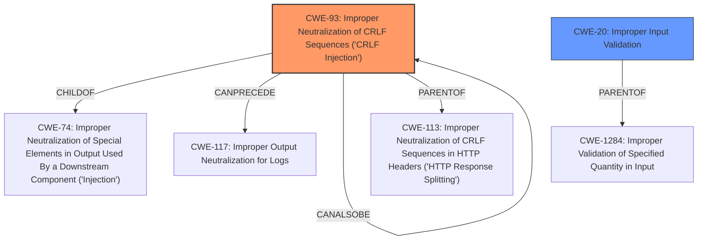

# Analysis Report for CVE-2021-25682

# Vulnerability Analysis Report: CVE-2021-25682

## Description


## Analysis (with Relationship Data)

# Summary
| CWE ID | CWE Name | Confidence | CWE Abstraction Level | CWE Vulnerability Mapping Label | CWE-Vulnerability Mapping Notes |
|---|---|---|---|---|---|
| CWE-93 | Improper Neutralization of CRLF Sequences ('CRLF Injection') | 0.8 | Base | Allowed | Primary CWE. The vulnerability stems from the **improper parsing of the `/proc/pid/status` file**, specifically due to the injection of CRLF sequences. The **incorrect parsing** leads to **manipulation of `real_uid` and `real_gid`**, ultimately bypassing privilege dropping. |
| CWE-20 | Improper Input Validation | 0.6 | Class | Allowed | Secondary CWE. The vulnerability involves a lack of input validation in the `get_pid_info()` function. This allows for the injection of malicious values via the process name, which are then used as `real_uid` and `real_gid`. |

## Evidence and Confidence

*   **Confidence Score:** 0.7
*   **Evidence Strength:** MEDIUM

## Relationship Analysis
The primary relationship impacting the decision is the parent-child relationship between CWE-93 and CWE-74 (Improper Neutralization of Special Elements in Output Used By a Downstream Component ('Injection')). CWE-93 is a specific type of injection vulnerability, focusing on CRLF sequences. The vulnerability description highlights the injection of arbitrary values for `Uid` and `Gid` by crafting a malicious process name containing CRLF sequences.



## Vulnerability Chain
The vulnerability chain starts with the **improper parsing of `/proc/pid/status` file** (CWE-N/A), leading to the injection of CRLF sequences (CWE-93). This then results in the **bypassing of privilege dropping**, which allows for local privilege escalation to root.

## Summary of Analysis
The primary CWE is CWE-93 because the root cause is the **improper handling of CRLF sequences** in the `/proc/pid/status` file, which allows for the injection of malicious data. CWE-20 is a secondary CWE because the **lack of input validation** is a contributing factor. The evidence for CWE-93 comes directly from the "CVE Reference Links Content Summary" section, which states that the vulnerability stems from **improper parsing** of the `/proc/pid/status` file and that the program does not properly sanitize or validate the content, thus allowing an attacker to inject arbitrary values.

The final selection is based on the fact that CWE-93 directly addresses the specific type of injection occurring (CRLF), while CWE-20 is a more general category that applies to the lack of input validation. CWE-93 is at the optimal level of specificity because it is a Base-level CWE that accurately represents the weakness.

The Retriever Results list several candidate CWEs, including CWE-1284, CWE-367, and CWE-394. These were considered but ultimately not chosen because they did not directly address the root cause of the vulnerability, which is the **improper handling of CRLF sequences**. For example, CWE-1284 (Improper Validation of Specified Quantity in Input) is related to validating quantities, which is not the primary issue in this vulnerability. CWE-367 (Time-of-check Time-of-use (TOCTOU) Race Condition) and CWE-394 (Unexpected Status Code or Return Value) are also not directly relevant to the parsing of the `/proc/pid/status` file and the injection of CRLF sequences.


## CWE Relationship Analysis

Current CWEs represent these abstraction levels: .


### Vulnerability Chain Analysis

**Chain starting from CWE-113:**
- 113 (Improper Neutralization of CRLF Sequences in HTTP Headers ('HTTP Request/Response Splitting')) - ROOT


**Chain starting from CWE-394:**
- 394 (Unexpected Status Code or Return Value) - ROOT


### CWE Relationship Diagram

```mermaid
graph TD
    classDef primary fill:#f96,stroke:#333,stroke-width:2px
    classDef secondary fill:#69f,stroke:#333
    classDef tertiary fill:#9e9,stroke:#333
```


*Report generated on 2025-04-02 05:32:29*
