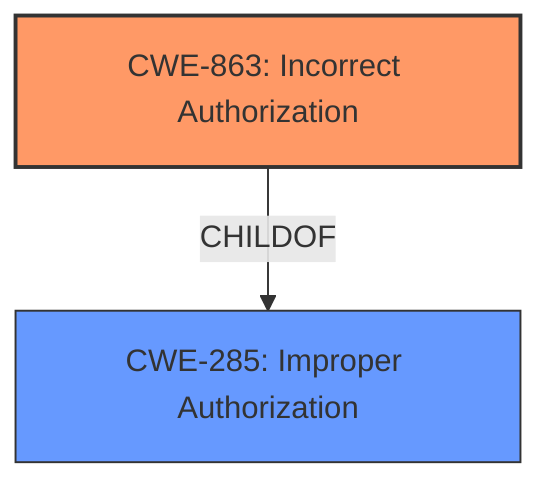

# Enhanced Analysis for CVE-2021-25768

# Summary
| CWE ID | CWE Name | Confidence | CWE Abstraction Level | CWE Vulnerability Mapping Label | CWE-Vulnerability Mapping Notes |
|---|---|---|---|---|---|
| CWE-863 | Incorrect Authorization | 1.0 | Class | Primary | Allowed-with-Review |
| CWE-285 | Improper Authorization | 0.7 | Class | Secondary | Discouraged |

## Evidence and Confidence

*   **Confidence Score:** 0.9
*   **Evidence Strength:** HIGH

## Relationship Analysis
The primary CWE selected is CWE-863, "Incorrect Authorization," which is a child of CWE-285, "Improper Authorization." CWE-285 is a higher-level class that encompasses cases where authorization checks are either missing or incorrect. Given the vulnerability description explicitly mentions that the permissions were **improperly checked**, CWE-863 is a more precise classification than its parent. No specific chain relationships are relevant here, as the described vulnerability is a direct authorization flaw.



## Vulnerability Chain
The vulnerability chain is straightforward:

1.  **Root Cause:** **Improperly checked permissions** for attachment actions (CWE-863).
2.  **Impact:** Unauthorized users could manipulate attachments, leading to data integrity and confidentiality breaches.

## Summary of Analysis
The analysis is based on the vulnerability description and the CVE reference summary, which clearly state that the vulnerability is due to **improperly checked permissions** for attachment actions in JetBrains YouTrack.

The evidence from the vulnerability description:
- "**rootcause:** **improperly checked permissions for attachments actions**"
The evidence from the CVE Reference Links Content Summary:
- "**Root cause of vulnerability:** Improper permissions checks for attachment actions in YouTrack."
- "**Weaknesses/vulnerabilities present:** Inadequate permission checks for actions performed on attachments within YouTrack. This could allow users to perform actions they are not authorized to do."

CWE-863, "Incorrect Authorization", directly aligns with this description because it refers to situations where an authorization check is performed, but it's done incorrectly. The retriever results also list CWE-863 as a highly relevant CWE. While CWE-285, "Improper Authorization," could also apply, it's more general and includes cases where authorization checks are missing entirely, which isn't the case here. Therefore, CWE-863 is the more specific and appropriate choice.

The selection of CWE-863 is at the optimal level of specificity, as it accurately reflects the core weakness described in the vulnerability. It is a Class-level CWE, but there are no more specific Base or Variant-level CWEs that better capture the incorrect authorization check.

Relevant CWE Information:

# Enhanced Context (25 CWEs)
The following CWEs were identified as potentially relevant to this vulnerability:

## CWE-668: Exposure of Resource to Wrong Sphere
**Abstraction Level**: Class
**Similarity Score**: 0.77
**Source**: dense
**Description**:
The product exposes a resource to the wrong control sphere, providing unintended actors with inappropriate access to the resource.
**Mapping Guidance**:
- Usage: Discouraged
- Rationale: CWE-668 is high-level and is often misused as a catch-all when lower-level CWE IDs might be applicable. It is sometimes used for low-information vulnerability reports [REF-1287]. It is a level-1 Class (i.e., a child of a Pillar). It is not useful for trend analysis.
**Not Used:** This is too high level. The issue isn't that a resource is exposed to the wrong sphere, but that the authorization check itself is flawed.

## CWE-41: Improper Resolution of Path Equivalence
**Abstraction Level**: Base
**Similarity Score**: 0.76
**Source**: dense
**Description**:
The product is vulnerable to file system contents disclosure through path equivalence. Path equivalence involves the use of special characters in file and directory names. The associated manipulations are intended to generate multiple names for the same object.
**Mapping Guidance**:
- Usage: Allowed
- Rationale: This CWE entry is at the Base level of abstraction, which is a preferred level of abstraction for mapping to the root causes of vulnerabilities.
**Not Used:** This CWE is specific to path equivalence issues, which are not mentioned in the vulnerability description.

## CWE-59: Improper Link Resolution Before File Access ('Link Following')
**Abstraction Level**: Base
**Similarity Score**: 0.76
**Source**: dense
**Description**:
The product attempts to access a file based on the filename, but it does not properly prevent that filename from identifying a link or shortcut that resolves to an unintended resource.
**Mapping Guidance**:
- Usage: Allowed
- Rationale: This CWE entry is at the Base level of abstraction, which is a preferred level of abstraction for mapping to the root causes of vulnerabilities.
**Not Used:** This CWE relates to link following issues and is not relevant to the described authorization problem.

## CWE-1321: Improperly Controlled Modification of Object Prototype Attributes ('Prototype Pollution')
**Abstraction Level**: Variant
**Similarity Score**: 0.76
**Source**: dense
**Description**:
The product receives input from an upstream component that specifies attributes that are to be initialized or updated in an object, but it does not properly control modifications of attributes of the object prototype.
**Mapping Guidance**:
- Usage: Allowed
- Rationale: This CWE entry is at the Variant level of abstraction, which is a preferred level of abstraction for mapping to the root causes of vulnerabilities.
**Not Used:** Prototype pollution is a specific type of vulnerability that is not related to the **improper permissions check** described here.

## CWE-73: External Control of File Name or Path
**Abstraction Level**: Base
**Similarity Score**: 0.75
**Source**: dense
**Description**:
The product allows user input to control or influence paths or file names that are used in filesystem operations.
**Mapping Guidance**:
- Usage: Allowed
- Rationale: This CWE entry is at the Base level of abstraction, which is a preferred level of abstraction for mapping to the root causes of vulnerabilities.
**Not Used:** This CWE relates to external control of file names or paths, which is not relevant to the described authorization problem.

## CWE-693: Protection Mechanism Failure
**Abstraction Level**: Pillar
**Similarity Score**: 0.75
**Source**: dense
**Description**:
The product does not use or incorrectly uses a protection mechanism that provides sufficient defense against directed attacks against the product.
**Mapping Guidance**:
- Usage: Discouraged
- Rationale: This CWE entry is extremely high-level, a Pillar.
**Not Used:** This is too high level. The issue isn't a general protection mechanism failure, but specifically incorrect authorization.

## CWE-664: Improper Control of a Resource Through its Lifetime
**Abstraction Level**: Pillar
**Similarity Score**: 0.75
**Source**: dense
**Description**:
The product does not maintain or incorrectly maintains control over a resource throughout its lifetime of creation, use, and release.
**Mapping Guidance**:
- Usage: Discouraged
- Rationale: This CWE entry is high-level when lower-level children are available.
**Not Used:** This is a high-level CWE that doesn't accurately describe the **improper permission check**.

## CWE-274: Improper Handling of Insufficient Privileges
**Abstraction Level**: Base
**Similarity Score**: 0.75
**Source**: dense
**Description**:
The product does not handle or incorrectly handles when it has insufficient privileges to perform an operation, leading to resultant weaknesses.
**Mapping Guidance**:
- Usage: Discouraged
- Rationale: This CWE entry could be deprecated in a future version of CWE.
**Not Used:** The issue isn't about handling insufficient privileges but rather performing the authorization check incorrectly.

## CWE-345: Insufficient Verification of Data Authenticity
**Abstraction Level**: Class
**Similarity Score**: 0.75
**Source**: dense
**Description**:
The product does not sufficiently verify the origin or authenticity of data, in a way that causes it to accept invalid data.
**Mapping Guidance**:
- Usage: Discouraged
- Rationale: This CWE entry is a level-1 Class (i.e., a child of a Pillar). It might have lower-level children that would be more appropriate
**Not Used:** This CWE is about data authenticity, which is unrelated to the **improper permission check**.

## CWE-23: Relative Path Traversal
**Abstraction Level**: Base
**Similarity Score**: 0.74
**Source**: dense
**Description**:
The product uses external input to construct a pathname that should be within a restricted directory, but it does not properly neutralize sequences such as ".." that can resolve to a location that is outside of


## CWE Relationship Analysis

Current CWEs represent these abstraction levels: .


### Vulnerability Chain Analysis

**Chain starting from CWE-664:**
- 664 (Improper Control of a Resource Through its Lifetime) - ROOT


**Chain starting from CWE-41:**
- 41 (Improper Resolution of Path Equivalence) - ROOT


### CWE Relationship Diagram

```mermaid
graph TD
    classDef primary fill:#f96,stroke:#333,stroke-width:2px
    classDef secondary fill:#69f,stroke:#333
    classDef tertiary fill:#9e9,stroke:#333
```