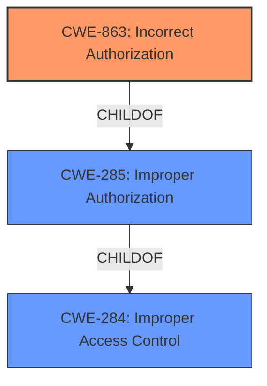

# Raw Analyzer Response for CVE-2021-25777

# Summary
| CWE ID | CWE Name | Confidence | CWE Abstraction Level | CWE Vulnerability Mapping Label | CWE-Vulnerability Mapping Notes |
|---|---|---|---|---|---|
| CWE-863 | Incorrect Authorization | 0.9 | Class | Allowed-with-Review | Primary CWE |

## Evidence and Confidence

*   **Confidence Score:** 0.9
*   **Evidence Strength:** HIGH

## Relationship Analysis
The primary CWE selected is CWE-863, "Incorrect Authorization". This is a Class-level CWE. While the retriever results suggested other CWEs, including child CWEs of CWE-863, the provided information does not give enough specificity to go to the Base or Variant level of abstraction.

## Vulnerability Chain
The vulnerability chain starts with the **improper permissions checking** during token removal. This leads to the potential for unauthorized actions, as the system **fails** to properly verify if the user has privileges to remove the tokens. The final impact is the disruption of service or unauthorized access to resources.

## Summary of Analysis
The vulnerability description indicates an **improper permissions checking** issue during token removal in JetBrains TeamCity. The CVE Reference Links Content Summary confirms this, stating the root cause is **improper permissions checks** during token removal, leading to insufficient authorization checks.

Based on this information, CWE-863 "Incorrect Authorization" is selected. CWE-863 is a Class-level CWE, and the provided description doesn't go into enough detail to select more specific Base or Variant CWEs. The description of CWE-863 states: "The product performs an authorization check when an actor attempts to access a resource or perform an action, but it does not correctly perform the check." This aligns directly with the **improper permissions checking** described in the vulnerability.

The use of CWE-285 "Improper Authorization" was considered, but the mapping guidance discourages its use due to its high level of abstraction, suggesting to "Look at CWE-285's children and consider mapping to CWEs such as CWE-862: Missing Authorization, CWE-863: Incorrect Authorization, CWE-732: Incorrect Permission Assignment for Critical Resource, or others." Since the provided information indicates that the authorization check *is* performed, but **incorrectly**, CWE-863 is a better fit than CWE-862.

CWE-732 "Incorrect Permission Assignment for Critical Resource" was also considered. However, the vulnerability is not about the initial assignment of permissions, but about the **incorrect checking** of permissions during token removal. Therefore, CWE-863 is the more appropriate choice.

The evidence to support the selection of CWE-863 is based on the "Vulnerability Description Key Phrases": "**rootcause:** **improper permissions checking**" and the "CVE Reference Links Content Summary": "**Root cause of vulnerability:** **Improper permissions checks** during token removal in TeamCity."

The final selection is CWE-863 as it best represents the vulnerability based on the available information.