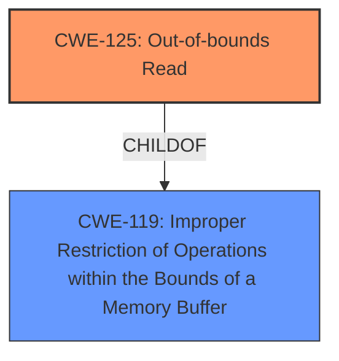

# Analysis Report for CVE-2021-25801

# Vulnerability Analysis Report: CVE-2021-25801

## Description


## Analysis (with Relationship Data)

# Summary
| CWE ID | CWE Name | Confidence | CWE Abstraction Level | CWE Vulnerability Mapping Label | CWE-Vulnerability Mapping Notes |
|---|---|---|---|---|---|
| CWE-125 | Out-of-bounds Read | 1.0 | Base | Allowed | Primary CWE |
| CWE-119 | Improper Restriction of Operations within the Bounds of a Memory Buffer | 0.7 | Class | Discouraged | Secondary Candidate |

## Evidence and Confidence

*   **Confidence Score:** 0.9
*   **Evidence Strength:** HIGH

## Relationship Analysis
The primary CWE is CWE-125, which is a child of CWE-119. CWE-119 is a more general class of vulnerability, while CWE-125 is a specific type of out-of-bounds read. The base level abstraction is more appropriate.



## Vulnerability Chain
The chain of events is as follows:
1.  A malformed .avi file is crafted with invalid subindex data.
2.  The VLC Media Player parses the .avi file.
3.  Due to a lack of proper validation, an out-of-bounds read occurs in the `__Parse_indx` component.
4.  The VLC Media Player crashes.

The root cause is the **lack of proper validation** of subindex data. The impact is an out-of-bounds read, leading to a crash.

## Summary of Analysis
The initial analysis identified a **buffer overflow** vulnerability leading to an out-of-bounds read. The retriever results suggested CWE-119 (Improper Restriction of Operations within the Bounds of a Memory Buffer), CWE-190 (Integer Overflow or Wraparound), and CWE-120 (Buffer Copy without Checking Size of Input ('Classic Buffer Overflow')) as potential candidates.

However, based on the provided evidence, the vulnerability is specifically an out-of-bounds read, where the product reads data past the end or before the beginning of the intended buffer. Therefore, CWE-125 (Out-of-bounds Read) is the most appropriate CWE.

The vulnerability description states: "A **buffer overflow** vulnerability in the __Parse_indx component of VideoLAN VLC Media Player 3.0.11 allows attackers to cause an out-of-bounds read via a crafted .avi file."

The CVE Reference Links Content Summary states: "The vulnerability stems from a **lack of proper validation** of subindex data within AVI files, leading to a potential invalid memory dereference." and "The primary weakness is the insufficient checking of the subindex data in the AVI file format. This **lack of validation** could cause a program crash due to an invalid memory access if an attacker provides a malformed AVI file with invalid subindex data."

CWE-125 is at the base level of abstraction, which is preferred. The mapping guidance for CWE-125 states "This CWE entry is at the Base level of abstraction, which is a preferred level of abstraction for mapping to the root causes of vulnerabilities."

CWE-119 is a broader category that encompasses various memory safety issues. While it is related, CWE-125 provides a more precise classification of the vulnerability. The mapping guidance for CWE-119 is "Discouraged" and states "CWE-119 is commonly misused in low-information vulnerability reports when lower-level CWEs could be used instead, or when more details about the vulnerability are available."

Therefore, CWE-125 is the optimal choice, as it accurately reflects the specific weakness (out-of-bounds read) and is at the appropriate level of specificity.

Relevant CWE Information:

# Enhanced Context (25 CWEs)

## CWE-125: Out-of-bounds Read
**CWE-125 (Out-of-bounds Read)** is the primary CWE because the vulnerability description explicitly states that a buffer overflow allows attackers to cause an out-of-bounds read. The CVE Reference Links Content Summary confirms this by stating the vulnerability leads to a potential invalid memory dereference due to insufficient checking of subindex data. This aligns perfectly with the description of CWE-125, which involves reading data past the end or before the beginning of the intended buffer.
**Abstraction Level**: Base
**Similarity Score**: 0.76 (dense), 6563.26 (sparse)
**Rationale**: The vulnerability involves reading data beyond the intended buffer, fitting the definition of CWE-125.
**Usage**: Allowed.
**Confidence**: 1.0

## CWE-119: Improper Restriction of Operations within the Bounds of a Memory Buffer
**CWE-119 (Improper Restriction of Operations within the Bounds of a Memory Buffer)** was considered because the vulnerability involves operations on a memory buffer without proper boundary checks, which could result in reading from unexpected memory locations. However, CWE-125 is a more specific classification of this issue.
**Abstraction Level**: Class
**Similarity Score**: 6233.12 (sparse)
**Rationale**: The vulnerability involves operations on a memory buffer without proper boundary checks, which could result in reading from unexpected memory locations.
**Usage**: Discouraged.
**Confidence**: 0.7

## CWE-190: Integer Overflow or Wraparound
**CWE-190 (Integer Overflow or Wraparound)** was considered but is not the primary CWE because the vulnerability's root cause is the insufficient validation of subindex data, leading to an out-of-bounds read, rather than an integer overflow. While integer overflows could potentially be involved in calculating buffer sizes or indexes, the provided information does not explicitly indicate this.
**Abstraction Level**: Base
**Similarity Score**: 0.75 (dense), 6763.82 (sparse)
**Rationale**: Integer overflows may play a role in calculating buffer sizes, but the primary issue is the out-of-bounds read.
**Usage**: Allowed.

## CWE-120: Buffer Copy without Checking Size of Input ('Classic Buffer Overflow')
**CWE-120 (Buffer Copy without Checking Size of Input)** was considered but is not the primary CWE because the vulnerability is specifically an out-of-bounds read. CWE-120 involves copying data without checking the size of the input, leading to a buffer overflow (write).
**Abstraction Level**: Base
**Similarity Score**: 4.82 (graph)
**Rationale**: The vulnerability is specifically an out-of-bounds read, not a buffer copy without checking size.
**Usage**: Allowed-with-Review

## Other CWEs:
CWE-122, CWE-126, CWE-128, CWE-193, CWE-121, CWE-787, CWE-124, CWE-191, CWE-805, CWE-131, CWE-788, CWE-170, CWE-123, CWE-130, CWE-1284, CWE-617, CWE-195, CWE-463, CWE-1339 were not selected because they did not accurately reflect the specific nature of the out-of-bounds read vulnerability.


## CWE Relationship Analysis

Current CWEs represent these abstraction levels: .


### Vulnerability Chain Analysis

**Chain starting from CWE-787:**
- 787 (Out-of-bounds Write) - ROOT


**Chain starting from CWE-463:**
- 463 (Deletion of Data Structure Sentinel) - ROOT


### CWE Relationship Diagram

```mermaid
graph TD
    classDef primary fill:#f96,stroke:#333,stroke-width:2px
    classDef secondary fill:#69f,stroke:#333
    classDef tertiary fill:#9e9,stroke:#333
```


*Report generated on 2025-04-01 17:18:53*
