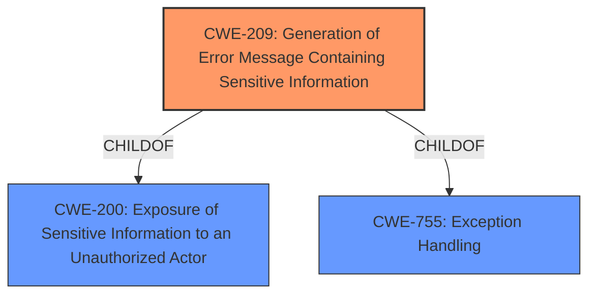

# Analysis for CVE-2021-25809

# Summary
| CWE ID | CWE Name | Confidence | CWE Abstraction Level | CWE Vulnerability Mapping Label | CWE-Vulnerability Mapping Notes |
|---|---|---|---|---|---|
| CWE-209 | Generation of Error Message Containing Sensitive Information | 1 | Base | Allowed | Primary CWE. The application reveals the server's physical path in an error message. |

## Evidence and Confidence

*   **Confidence Score:** 1
*   **Evidence Strength:** HIGH

## Relationship Analysis
The primary CWE, CWE-209, stands alone without any significant hierarchical, chain, or peer relationships that significantly impact its selection. While CWE-209 has parent CWEs like CWE-200 and CWE-755, these are more general and less descriptive of the specific vulnerability. The Retriever Results also list other path traversal related CWEs, but those are not applicable because the vulnerability is about leaking information, not path traversal.

## Vulnerability Chain
The vulnerability chain is straightforward: a request to a specific PHP file leads to an error message that exposes the server's physical path. The root cause is the **lack of proper error handling** and the direct accessibility of the `top.php` file, resulting in **physical path leakage**.

## Summary of Analysis
The analysis concludes that CWE-209 is the most appropriate classification for this vulnerability. This decision is strongly supported by the provided evidence, specifically:

*   The **Vulnerability Description** mentions a **"physical path leakage"** via an error message.
*   The **CVE Reference Links Content Summary** explicitly states that the error message reveals the server's **"physical path"** due to a missing function definition and **lack of proper error handling**.

The retriever results also ranked CWE-209 as the top candidate. While other CWEs related to path traversal and information exposure were considered, they were ultimately deemed less relevant as the core issue is the disclosure of sensitive path information within an error message. The selection of CWE-209 is at the optimal level of specificity, as it accurately captures the nature of the weakness without being overly broad or narrow.

Relevant CWE Information:

*   **CWE-209: Generation of Error Message Containing Sensitive Information:** The product generates an error message that includes sensitive information about its environment, users, or associated data. This perfectly aligns with the vulnerability where the error message reveals the server's physical path.

All other CWEs were considered but not used:

*   CWE-22, CWE-23, CWE-36, CWE-41, CWE-59, CWE-73: These CWEs relate to path traversal vulnerabilities, which are not the primary issue in this case. The vulnerability is about information leakage, not unauthorized file access.
*   CWE-74: This CWE relates to injection vulnerabilities, which is not the case here.
*   CWE-425: Direct Request ('Forced Browsing'): While the vulnerability involves direct access to a PHP file, the core issue is the leakage of sensitive information via the error message, not the lack of authorization.
*   CWE-472: External Control of Assumed-Immutable Web Parameter: This CWE is not applicable because the vulnerability doesn't involve the modification of assumed-immutable parameters.
*   CWE-552, CWE-668: These CWEs are too broad and do not accurately reflect the specific vulnerability.
*   CWE-909: Missing Initialization of Resource: While the error might be caused by a missing definition, the direct consequence and vulnerability is the information leak.
*   CWE-1313: Hardware Allows Activation of Test or Debug Logic at Runtime: This CWE is not relevant as the vulnerability is software-related and doesn't involve hardware test or debug logic.
*   CWE-96: Improper Neutralization of Directives in Statically Saved Code ('Static Code Injection'): This CWE is not applicable as the vulnerability does not involve injecting code into a static resource.
*   CWE-471: Modification of Assumed-Immutable Data (MAID): This CWE is not applicable as the vulnerability does not involve modification of immutable data.
*   CWE-201: Insertion of Sensitive Information Into Sent Data: While related to information exposure, CWE-209 is more specific in that it is an error message that contains the sensitive information.