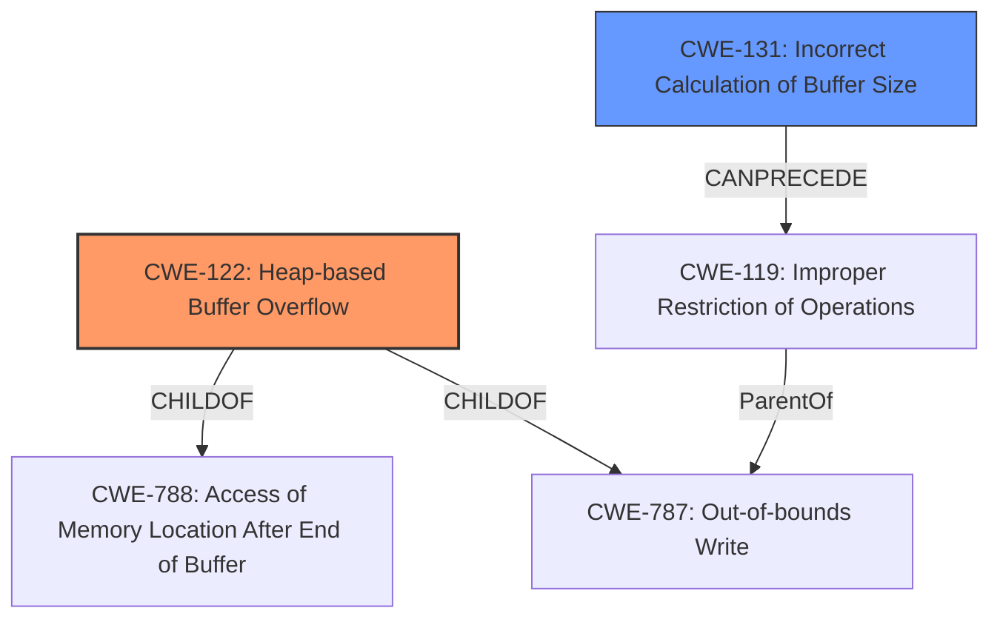

# Enhanced Analysis for CVE-2021-25900

# Summary
| CWE ID | CWE Name | Confidence | CWE Abstraction Level | CWE Vulnerability Mapping Label | CWE-Vulnerability Mapping Notes |
|---|---|---|---|---|---|
| CWE-122 | Heap-based Buffer Overflow | 1.0 | Variant | Allowed | Primary CWE |
| CWE-131 | Incorrect Calculation of Buffer Size | 0.8 | Base | Allowed | Secondary Candidate |

## Evidence and Confidence

*   **Confidence Score:** 0.9
*   **Evidence Strength:** HIGH

## Relationship Analysis
The primary CWE is CWE-122, which is a variant of CWE-788 (Access of Memory Location After End of Buffer) and CWE-787 (Out-of-bounds Write). CWE-131 can precede CWE-119. These relationships confirm that the heap-based buffer overflow can be a direct result of an incorrect calculation of the buffer size.



## Vulnerability Chain
The vulnerability chain starts with the **incorrect calculation of the buffer size** (CWE-131) which leads to a **heap-based buffer overflow** (CWE-122). The **buffer overflow** can lead to memory corruption and potentially arbitrary code execution.

## Summary of Analysis
The vulnerability is described as a **heap-based buffer overflow** in the `SmallVecinsert_many` function of the smallvec crate. The root cause is a bug in the `SmallVec::insert_many` method that allocates a smaller buffer than needed, leading to the overflow.

The primary CWE is CWE-122 (Heap-based Buffer Overflow). The vulnerability description explicitly mentions "heap-based buffer overflow," aligning perfectly with CWE-122's description: "A heap overflow condition is a buffer overflow, where the buffer that can be overwritten is allocated in the heap portion of memory".

The secondary CWE is CWE-131 (Incorrect Calculation of Buffer Size). The CVE Reference Links Content Summary states: "A bug in the `SmallVec::insert_many` method caused it to allocate a buffer smaller than needed, leading to a buffer overflow." This aligns with CWE-131's description: "The product does not correctly calculate the size to be used when allocating a buffer, which could lead to a buffer overflow."

CWE-119 (Improper Restriction of Operations within the Bounds of a Memory Buffer) was considered, but it's a Class-level CWE, and the more specific variant CWE-122 is a better fit. CWE-190 (Integer Overflow or Wraparound) was also considered, but there's no direct evidence of an integer overflow in the description. The focus is on incorrect buffer size calculation, not necessarily an overflow of an integer used in the calculation.

The selected CWEs are at the optimal level of specificity, with CWE-122 being a Variant and CWE-131 being a Base CWE. These levels provide a clear and accurate representation of the vulnerability's root cause and nature.


## CWE Relationship Analysis

Current CWEs represent these abstraction levels: .


### Vulnerability Chain Analysis

**Chain starting from CWE-787:**
- 787 (Out-of-bounds Write) - ROOT


**Chain starting from CWE-122:**
- 122 (Heap-based Buffer Overflow) - ROOT


### CWE Relationship Diagram

```mermaid
graph TD
    classDef primary fill:#f96,stroke:#333,stroke-width:2px
    classDef secondary fill:#69f,stroke:#333
    classDef tertiary fill:#9e9,stroke:#333
```