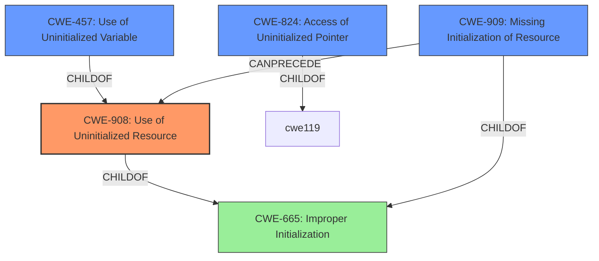

# Analysis for CVE-2021-25905

# Summary
| CWE ID | CWE Name | Confidence | CWE Abstraction Level | CWE Vulnerability Mapping Label | CWE-Vulnerability Mapping Notes |
|---|---|---|---|---|---|
| **CWE-908** | **Use of Uninitialized Resource** | 1.0 | Base | Primary | Allowed |
| CWE-457 | Use of Uninitialized Variable | 0.75 | Variant | Secondary | Allowed |
| CWE-824 | Access of Uninitialized Pointer | 0.75 | Base | Secondary | Allowed |
| CWE-909 | Missing Initialization of Resource | 0.5 | Class | Secondary | Allowed-with-Review |

## Evidence and Confidence

*   **Confidence Score:** 1.0
*   **Evidence Strength:** HIGH

## Relationship Analysis
The primary CWE is CWE-908 **Use of Uninitialized Resource**, which has child relationships to CWE-665 **Improper Initialization**. CWE-457 **Use of Uninitialized Variable** is a variant of CWE-908. CWE-909 **Missing Initialization of Resource** is a class-level CWE that can precede CWE-908. CWE-824 **Access of Uninitialized Pointer** is a base-level CWE that is also related to uninitialized memory. The relationships suggest a chain from missing initialization to the use of the uninitialized resource.

## Vulnerability Chain
The vulnerability chain starts with the **missing initialization** of the buffer (implicitly related to CWE-909), leading to the **use of uninitialized memory** (CWE-908). This can then potentially lead to undefined behavior.

## Summary of Analysis
The initial analysis identified the core issue as reading from uninitialized memory. The evidence from the vulnerability description key phrases indicates the **weakness** as "**read uninitialized memory**." The CVE Reference Links Content Summary confirms that the root cause is the `GreedyAccessReader` creating an uninitialized buffer and passing it to a user-provided `Read` implementation.

The retriever results also support this, with CWE-908 **Use of Uninitialized Resource** being the top candidate.

Based on the evidence, CWE-908 **Use of Uninitialized Resource** is the most appropriate primary CWE. It's a base-level CWE and accurately describes the vulnerability. CWE-457 **Use of Uninitialized Variable** is a more specific variant, but CWE-908 is preferred as it more generally describes the **use of uninitialized memory**, not just variables. CWE-824 **Access of Uninitialized Pointer** and CWE-909 **Missing Initialization of Resource** are also considered as secondary CWEs because a pointer might be used to access the uninitialized memory (CWE-824) and the resource wasn't properly initialized to begin with (CWE-909).

The selection of CWE-908 is at the optimal level of specificity because it directly addresses the root cause of the vulnerability, which is the **use of uninitialized memory**.

Relevant CWE Information:

# Enhanced Context (25 CWEs)
The following CWEs were identified as potentially relevant to this vulnerability:

## CWE-824: Access of Uninitialized Pointer
**Abstraction Level**: Base
**Similarity Score**: 0.79
**Source**: dense

**Description**:
The product accesses or uses a pointer that has not been initialized.

**Mapping Guidance**:
- Usage: Allowed
- Rationale: This CWE entry is at the Base level of abstraction, which is a preferred level of abstraction for mapping to the root causes of vulnerabilities.

## CWE-822: Untrusted Pointer Dereference
**Abstraction Level**: Base
**Similarity Score**: 0.78
**Source**: dense

**Description**:
The product obtains a value from an untrusted source, converts this value to a pointer, and dereferences the resulting pointer.

**Mapping Guidance**:
- Usage: Allowed
- Rationale: This CWE entry is at the Base level of abstraction, which is a preferred level of abstraction for mapping to the root causes of vulnerabilities.

## CWE-457: Use of Uninitialized Variable
**Abstraction Level**: Variant
**Similarity Score**: 0.78
**Source**: dense

**Description**:
The code uses a variable that has not been initialized, leading to unpredictable or unintended results.

**Mapping Guidance**:
- Usage: Allowed
- Rationale: This CWE entry is at the Variant level of abstraction, which is a preferred level of abstraction for mapping to the root causes of vulnerabilities.

## CWE-226: Sensitive Information in Resource Not Removed Before Reuse
**Abstraction Level**: Base
**Similarity Score**: 0.78
**Source**: dense

**Description**:
The product releases a resource such as memory or a file so that it can be made available for reuse, but it does not clear or "zeroize" the information contained in the resource before the product performs a critical state transition or makes the resource available for reuse by other entities.

**Mapping Guidance**:
- Usage: Allowed
- Rationale: This CWE entry is at the Base level of abstraction, which is a preferred level of abstraction for mapping to the root causes of vulnerabilities.

## CWE-909: Missing Initialization of Resource
**Abstraction Level**: Class
**Similarity Score**: 0.78
**Source**: dense

**Description**:
The product does not initialize a critical resource.

**Mapping Guidance**:
- Usage: Allowed-with-Review
- Rationale: This CWE entry is a Class and might have Base-level children that would be more appropriate

## CWE-667: Improper Locking
**Abstraction Level**: Class
**Similarity Score**: 0.78
**Source**: dense

**Description**:
The product does not properly acquire or release a lock on a resource, leading to unexpected resource state changes and behaviors.

**Mapping Guidance**:
- Usage: Allowed-with-Review
- Rationale: This CWE entry is a Class and might have Base-level children that would be more appropriate

## CWE-404: Improper Resource Shutdown or Release
**Abstraction Level**: Class
**Similarity Score**: 0.77
**Source**: dense

**Description**:
The product does not release or incorrectly releases a resource before it is made available for re-use.

**Mapping Guidance**:
- Usage: Allowed-with-Review
- Rationale: This CWE entry is a Class and might have Base-level children that would be more appropriate

## CWE-665: Improper Initialization
**Abstraction Level**: Class
**Similarity Score**: 0.77
**Source**: dense

**Description**:
The product does not initialize or incorrectly initializes a resource, which might leave the resource in an unexpected state when it is accessed or used.

**Mapping Guidance**:
- Usage: Discouraged
- Rationale: This CWE entry is a level-1 Class (i.e., a child of a Pillar). It might have lower-level children that would be more appropriate

## CWE-908: Use of Uninitialized Resource
**Abstraction Level**: Base
**Similarity Score**: 0.77
**Source**: dense

**Description**:
The product uses or accesses a resource that has not been initialized.

**Mapping Guidance**:
- Usage: Allowed
- Rationale: This CWE entry is at the Base level of abstraction, which is a preferred level of abstraction for mapping to the root causes of vulnerabilities.

## CWE-366: Race Condition within a Thread
**Abstraction Level**: Base
**Similarity Score**: 0.77
**Source**: dense

**Description**:
If two threads of execution use a resource simultaneously, there exists the possibility that resources may be used while invalid, in turn making the state of execution undefined.

**Mapping Guidance**:
- Usage: Allowed
- Rationale: This CWE entry is at the Base level of abstraction, which is a preferred level of abstraction for mapping to the root causes of vulnerabilities.

## CWE-252: Unchecked Return Value
**Abstraction Level**: Base
**Similarity Score**: 5553.11
**Source**: sparse

**Description**: