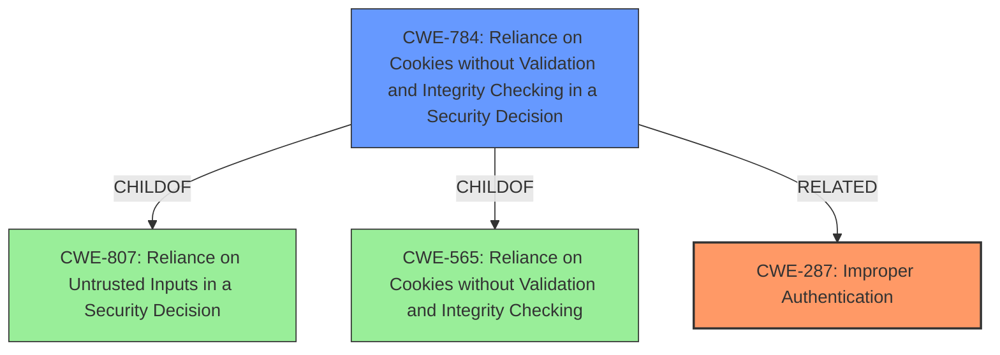

# Analysis Report for CVE-2021-25910

# Vulnerability Analysis Report: CVE-2021-25910

## Description


## Analysis (with Relationship Data)

# Summary
| CWE ID | CWE Name | Confidence | CWE Abstraction Level | CWE Vulnerability Mapping Label | CWE-Vulnerability Mapping Notes |
|---|---|---|---|---|---|
| CWE-287 | Improper Authentication | 0.9 | Class | Primary | Discouraged |
| CWE-784 | Reliance on Cookies without Validation and Integrity Checking in a Security Decision | 0.7 | Variant | Secondary | Allowed |

## Evidence and Confidence

*   **Confidence Score:** 0.8
*   **Evidence Strength:** MEDIUM

## Relationship Analysis
The primary CWE selected is CWE-287, **Improper Authentication**, which is a Class-level CWE. Given the specificity of the vulnerability residing within the cookie parameter, CWE-784, **Reliance on Cookies without Validation and Integrity Checking in a Security Decision**, a Variant of CWE-807 and CWE-565 is considered as a related weakness. CWE-287 is a high-level class, and the mapping guidance discourages its use when more specific CWEs are applicable. However, I am going with the primary **rootcause** as **Improper Authentication** because the description states that the vulnerability leads to modifications as an authenticated user. Therefore, the issue isn't a complete lack of authentication, but rather a flaw in how authentication is being handled, thus a weakness.



## Vulnerability Chain
The chain of events involves an **improper authentication** mechanism, specifically related to the cookie parameter. The **Improper Authentication** allows a local attacker to perform unauthorized modifications.
- **Root Cause:** **Improper Authentication** (CWE-287) due to a vulnerability in the cookie parameter.
- **Weakness:** Reliance on cookies without proper validation (CWE-784), leading to the ability to bypass authentication mechanisms.
- **Impact:** Modifications in several parameters of the affected device as an authenticated user.

## Summary of Analysis
The initial analysis focused on the **Improper Authentication** vulnerability, as highlighted in the description. The retriever results pointed towards CWE-287, which aligns with the **rootcause** mentioned. However, the description also indicates that the vulnerability is related to the cookie parameter, suggesting CWE-784 as a potential secondary weakness.

The analysis considered the relationship between CWE-287 and CWE-784, with CWE-784 being a more specific variant related to cookie handling. Given the context of the vulnerability, both CWEs are relevant. CWE-287 represents the high-level authentication issue, while CWE-784 provides more specific details about the cookie-related weakness.

The final decision is based on the evidence that the vulnerability stems from **Improper Authentication** (CWE-287), with a contributing factor related to the reliance on cookies without proper validation and integrity checking (CWE-784). The selection is at an optimal level of specificity, as CWE-287 captures the overall authentication issue, and CWE-784 provides additional context about the cookie-related weakness.

Relevant CWE Information:

# Enhanced Context (25 CWEs)
The following CWEs were identified as potentially relevant to this vulnerability:

## CWE-799: Improper Control of Interaction Frequency
**Abstraction Level**: Class
**Similarity Score**: 0.79
**Source**: dense

**Description**:
The product does not properly limit the number or frequency of interactions that it has with an actor, such as the number of incoming requests.

**Mapping Guidance**:
- Usage: Allowed-with-Review
- Rationale: This CWE entry is a Class and might have Base-level children that would be more appropriate

## CWE-807: Reliance on Untrusted Inputs in a Security Decision
**Abstraction Level**: Base
**Similarity Score**: 0.78
**Source**: dense

**Description**:
The product uses a protection mechanism that relies on the existence or values of an input, but the input can be modified by an untrusted actor in a way that bypasses the protection mechanism.

**Mapping Guidance**:
- Usage: Allowed
- Rationale: This CWE entry is at the Base level of abstraction, which is a preferred level of abstraction for mapping to the root causes of vulnerabilities.

## CWE-472: External Control of Assumed-Immutable Web Parameter
**Abstraction Level**: Base
**Similarity Score**: 0.75
**Source**: dense

**Description**:
The web application does not sufficiently verify inputs that are assumed to be immutable but are actually externally controllable, such as hidden form fields.

**Mapping Guidance**:
- Usage: Allowed
- Rationale: This CWE entry is at the Base level of abstraction, which is a preferred level of abstraction for mapping to the root causes of vulnerabilities.

## CWE-1220: Insufficient Granularity of Access Control
**Abstraction Level**: Base
**Similarity Score**: 0.74
**Source**: dense

**Description**:
The product implements access controls via a policy or other feature with the intention to disable or restrict accesses (reads and/or writes) to assets in a system from untrusted agents. However, implemented access controls lack required granularity, which renders the control policy too broad because it allows accesses from unauthorized agents to the security-sensitive assets.

**Mapping Guidance**:
- Usage: Allowed
- Rationale: This CWE entry is at the Base level of abstraction, which is a preferred level of abstraction for mapping to the root causes of vulnerabilities.

## CWE-565: Reliance on Cookies without Validation and Integrity Checking
**Abstraction Level**: Base
**Similarity Score**: 0.74
**Source**: dense

**Description**:
The product relies on the existence or values of cookies when performing security-critical operations, but it does not properly ensure that the setting is valid for the associated user.

**Mapping Guidance**:
- Usage: Allowed
- Rationale: This CWE entry is at the Base level of abstraction, which is a preferred level of abstraction for mapping to the root causes of vulnerabilities.

## CWE-653: Improper Isolation or Compartmentalization
**Abstraction Level**: Class
**Similarity Score**: 0.74
**Source**: dense

**Description**:
The product does not properly compartmentalize or isolate functionality, processes, or resources that require different privilege levels, rights, or permissions.

**Mapping Guidance**:
- Usage: Allowed
- Rationale: This CWE entry is at the Base level of abstraction, which is a preferred level of abstraction for mapping to the root causes of vulnerabilities.

## CWE-274: Improper Handling of Insufficient Privileges
**Abstraction Level**: Base
**Similarity Score**: 0.74
**Source**: dense

**Description**:
The product does not handle or incorrectly handles when it has insufficient privileges to perform an operation, leading to resultant weaknesses.

**Mapping Guidance**:
- Usage: Discouraged
- Rationale: This CWE entry could be deprecated in a future version of CWE.

## CWE-784: Reliance on Cookies without Validation and Integrity Checking in a Security Decision
**Abstraction Level**: Variant
**Similarity Score**: 0.74
**Source**: dense

**Description**:
The product uses a protection mechanism that relies on the existence or values of a cookie, but it does not properly ensure that the cookie is valid for the associated user.

**Mapping Guidance**:
- Usage: Allowed
- Rationale: This CWE entry is at the Variant level of abstraction, which is a preferred level of abstraction for mapping to the root causes of vulnerabilities.

## CWE-1289: Improper Validation of Unsafe Equivalence in Input
**Abstraction Level**: Base
**Similarity Score**: 0.73
**Source**: dense

**Description**:
The product receives an input value that is used as a resource identifier or other type of reference, but it does not validate or incorrectly validates that the input is equivalent to a potentially-unsafe value.

**Mapping Guidance**:
- Usage: Allowed
- Rationale: This CWE entry is at the Base level of abstraction, which is a preferred level of abstraction for mapping to the root causes of vulnerabilities.

## CWE-307: Improper Restriction of Excessive Authentication Attempts
**Abstraction Level**: Base
**Similarity Score**: 0.73
**Source**: dense

**Description**:
The product does not implement sufficient measures to prevent multiple failed authentication attempts within a short time frame.

**Mapping Guidance**:
- Usage: Allowed
- Rationale: This CWE entry is


## CWE Relationship Analysis

Current CWEs represent these abstraction levels: .


### Vulnerability Chain Analysis

**Chain starting from CWE-653:**
- 653 (Improper Isolation or Compartmentalization) - ROOT


**Chain starting from CWE-784:**
- 784 (Reliance on Cookies without Validation and Integrity Checking in a Security Decision) - ROOT


### CWE Relationship Diagram

```mermaid
graph TD
    classDef primary fill:#f96,stroke:#333,stroke-width:2px
    classDef secondary fill:#69f,stroke:#333
    classDef tertiary fill:#9e9,stroke:#333
```


*Report generated on 2025-04-01 19:18:48*
