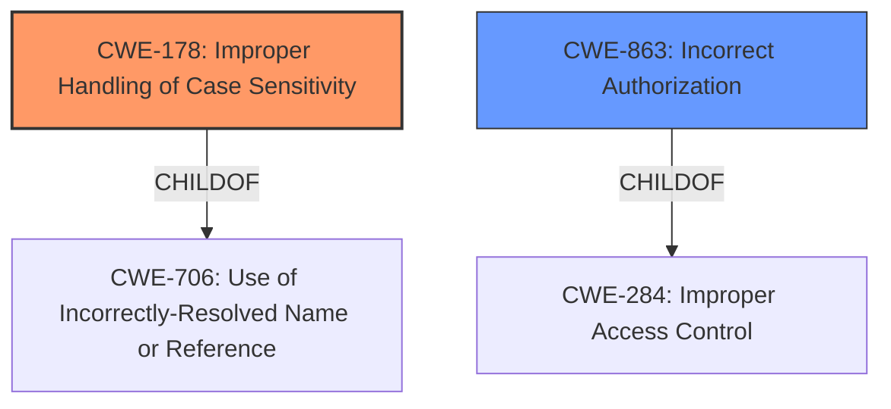

# Raw Analyzer Response for CVE-2021-25920

# Summary
| CWE ID | CWE Name | Confidence | CWE Abstraction Level | CWE Vulnerability Mapping Label | CWE-Vulnerability Mapping Notes |
|---|---|---|---|---|---|
| CWE-178 | Improper Handling of Case Sensitivity | 0.9 | Base | Primary | Allowed |
| CWE-863 | Incorrect Authorization | 0.7 | Class | Secondary | Allowed-with-Review |

## Evidence and Confidence

*   **Confidence Score:** 0.8
*   **Evidence Strength:** HIGH

## Relationship Analysis
The primary CWE selected is CWE-178, which is a **Base** level CWE, offering good specificity. It is related to CWE-706 (Use of Incorrectly-Resolved Name or Reference) as a child. CWE-863 is a **Class** level CWE and a child of CWE-284. While CWE-863 is less specific than CWE-178, it is still relevant as the authorization process is performed incorrectly because of the case sensitivity issue.

## Vulnerability Chain
The vulnerability chain starts with the **IMPROPER HANDLING OF CASE SENSITIVITY** during user creation (CWE-178). This leads to the possibility of creating accounts with names that differ only in casing. Subsequently, the **INCORRECT AUTHORIZATION** (CWE-863) allows the malicious user to access the victim's data because the application does not properly distinguish between the case-sensitive usernames. The final impact is the ability to read and send sensitive messages on behalf of the victim user.

## Summary of Analysis
The initial assessment, based on the vulnerability description, points to **Improper Access Control**. However, the CVE Reference Links Content Summary provides more granular details, leading to a more accurate classification.

The description states: "In OpenEMR, versions v2.7.2-rc1 to 6.0.0 are vulnerable to **Improper Access Control** when creating a new user, which leads to a malicious user able to read and send sensitive messages on behalf of the victim user."
And the CVE Reference Links Content Summary States:
"**Improper Access Control:** The vulnerability stems from the lack of proper access control during user creation, specifically regarding case-sensitive usernames."
"**Improper Handling of Case Sensitivity (CWE-178):** The system does not treat usernames with different casing as distinct entities."
"**Incorrect Authorization (CWE-863):** The system fails to correctly authorize access based on user identity, allowing one user to impersonate another."

The graph relationships show that CWE-178 is a base level vulnerability that causes the incorrect authorization. The final selection of CWE-178 and CWE-863 is at the optimal level of specificity because CWE-178 describes the root cause, and CWE-863 describes the authorization issue that arises because of the root cause.

Relevant CWE Information:

# Enhanced Context (25 CWEs)
The following CWEs were identified as potentially relevant to this vulnerability:

## CWE-274: Improper Handling of Insufficient Privileges
**Why it was not selected:** This CWE focuses on handling insufficient privileges, which isn't the core issue here. The problem is the incorrect handling of case sensitivity, leading to authorization bypass, not a matter of insufficient privileges.

## CWE-653: Improper Isolation or Compartmentalization
**Why it was not selected:** This CWE refers to the lack of isolation between functionalities. Although related to access control, it doesn't directly address the case sensitivity issue.

## CWE-668: Exposure of Resource to Wrong Sphere
**Why it was not selected:** This is a high-level class, and the vulnerability is more accurately described by the base CWE-178.

## CWE-1220: Insufficient Granularity of Access Control
**Why it was not selected:** While related to access control, the core issue is the case sensitivity problem, not the granularity of access control.

## CWE-266: Incorrect Privilege Assignment
**Why it was not selected:** The issue isn't an incorrect assignment of privileges but the failure to distinguish between users based on case sensitivity.

## CWE-664: Improper Control of a Resource Through its Lifetime
**Why it was not selected:** Too abstract. The vulnerability is better described by the more specific CWE-178.

## CWE-280: Improper Handling of Insufficient Permissions or Privileges
**Why it was not selected:** Similar to CWE-274, the vulnerability isn't about insufficient privileges but the failure to distinguish between users due to case sensitivity.

## CWE-267: Privilege Defined With Unsafe Actions
**Why it was not selected:** Not applicable. The problem isn't with unsafe actions associated with a privilege but with improper handling of case sensitivity.

## CWE-639: Authorization Bypass Through User-Controlled Key
**Why it was not selected:** This CWE focuses on user-controlled keys, but the bypass in this case is due to case sensitivity, not the manipulation of a key.

## CWE-404: Improper Resource Shutdown or Release
**Why it was not selected:** This is not related to the described vulnerability.

## CWE-79: Improper Neutralization of Input During Web Page Generation ('Cross-site Scripting')
**Why it was not selected:** This vulnerability does not relate to Cross-Site Scripting.

## CWE-942: Permissive Cross-domain Policy with Untrusted Domains
**Why it was not selected:** Not related to the vulnerability description.

## CWE-285: Improper Authorization
**Why it was not selected:** CWE-863 is a better fit as it focuses on incorrect authorization.

## CWE-306: Missing Authentication for Critical Function
**Why it was not selected:** Authentication is present, but authorization fails due to case sensitivity.

## CWE-269: Improper Privilege Management
**Why it was not selected:** This CWE is too high-level and doesn't accurately describe the root cause.