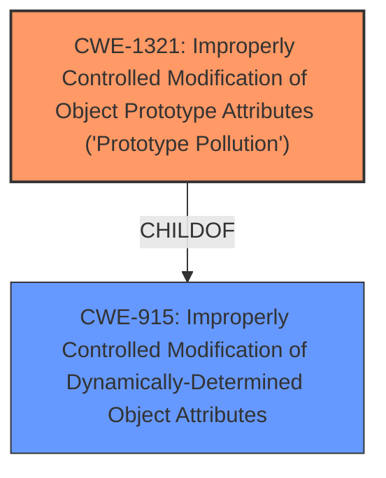

# Analysis Report for CVE-2021-25949

# Vulnerability Analysis Report: CVE-2021-25949

## Description


## Analysis (with Relationship Data)

# Summary
| CWE ID  | CWE Name | Confidence | CWE Abstraction Level | CWE Vulnerability Mapping Label | CWE-Vulnerability Mapping Notes |
|-----------------|------------------------------------------------------------------------------------------|-------------------|--------------------------|-----------------------------------|---------------------------------------------------------------------------------------------------------------------------------|
| CWE-1321 | Improperly Controlled Modification of Object Prototype Attributes ('Prototype Pollution') | 1.0 | Variant | Primary | Allowed |
| CWE-915 | Improperly Controlled Modification of Dynamically-Determined Object Attributes | 0.7 | Base | Secondary | Allowed |

## Evidence and Confidence

*   **Confidence Score:** 1.0
*   **Evidence Strength:** HIGH

## Relationship Analysis
The primary CWE, CWE-1321, is a **Variant** and a child of CWE-915.
CWE-915 is a **Base** level CWE and is considered a more generalized form of CWE-1321.
This parent-child relationship indicates that CWE-1321 is a specific type of CWE-915, where the object being modified is the prototype.
This specificity makes CWE-1321 a more accurate choice.



## Vulnerability Chain
The vulnerability chain starts with the **improperly controlled modification of object prototype attributes** (CWE-1321), which leads to a denial of service and potentially remote code execution.
The root cause is the **prototype pollution** itself.

## Summary of Analysis
The initial analysis, supported by the provided evidence, clearly points to CWE-1321 as the primary weakness. The "**rootcause: prototype pollution**" phrase in the "Vulnerability Description Key Phrases" section directly aligns with the CWE-1321 description, which focuses on the improper control of modifications to object prototypes. The "CVE Reference Links Content Summary" section confirms that the `setGetter()` function lacks validation, allowing manipulation of the object's prototype, further supporting CWE-1321.

The selection of CWE-1321 is based on the high degree of specificity it offers compared to its parent CWE-915. While CWE-915 (Improperly Controlled Modification of Dynamically-Determined Object Attributes) is relevant, CWE-1321 specifically addresses the "**prototype pollution**" issue, making it the more accurate and appropriate choice.

The "CVE Reference Links Content Summary" section contains the following details.
```
{
  "guidelines_version": "3",
  "cve_id": "CVE-2021-25949",
  "response": {
    "relevant": true,
    "summary": "The vulnerability is due to the `setGetter()` function in the 'set-getter' NPM module not validating the object type before assigning the value to a property, leading to prototype pollution. An attacker could inject a `__proto__` property to cause a denial of service or potentially remote code execution.",
    "details": {
      "root_cause": "The `setGetter()` function lacks validation on the type of object before assigning a value to a property, allowing an attacker to manipulate the object's prototype.",
      "weaknesses": [
        "Prototype Pollution",
          "Improperly Controlled Modification of Object Prototype Attributes",
          "Improperly Controlled Modification of Dynamically-Determined Object Attributes"
      ],
      "impact": "An attacker can cause a denial of service or potentially achieve remote code execution.",
      "attack_vectors": [
        "The vulnerability can be exploited by providing a malicious value to the 'prop' argument of the `setGetter()` function, specifically by including a `__proto__` property within the prop value."
      ],
      "attacker_capabilities": "The attacker needs the ability to control the input passed to the vulnerable function. The exploit does not require any privilege or user interaction. "
    }
  }
}
```

The retriever results also listed CWE-1321 as the top candidate.

The other CWEs from the "Complete CWE Specifications" section were considered, but they did not fit as accurately as CWE-1321:

- CWE-20 (Improper Input Validation): While input validation is generally important, this vulnerability's root cause is the specific **improper modification of the object prototype**, not just a general lack of input validation. Therefore, CWE-20 is too general.
- CWE-190 (Integer Overflow or Wraparound), CWE-119 (Improper Restriction of Operations within the Bounds of a Memory Buffer), CWE-1284 (Improper Validation of Specified Quantity in Input), CWE-674 (Uncontrolled Recursion): These CWEs are not directly related to the prototype pollution issue.
- CWE-767 (Access to Critical Private Variable via Public Method): This is not applicable as the issue is not about accessing private variables.
- CWE-1188 (Initialization of a Resource with an Insecure Default): This CWE is not related to the manipulation of the object prototype.
- CWE-1333 (Inefficient Regular Expression Complexity): This CWE is not related to the prototype pollution issue.
- CWE-843 (Access of Resource Using Incompatible Type ('Type Confusion')): This is not a type confusion issue, but rather the **modification of the prototype itself**.
- CWE-915 (Improperly Controlled Modification of Dynamically-Determined Object Attributes): This is a base CWE, whereas CWE-1321 is a more specific **variant** of this issue.
- CWE-789 (Memory Allocation with Excessive Size Value), CWE-125 (Out-of-bounds Read): These CWEs address memory-related issues, not object prototype manipulation.
- CWE-770 (Allocation of Resources Without Limits or Throttling): This CWE is about resource allocation issues and not prototype pollution.
- CWE-73 (External Control of File Name or Path), CWE-22 (Improper Limitation of a Pathname to a Restricted Directory ('Path Traversal')): The weakness isn't related to file paths.
- CWE-471 (Modification of Assumed-Immutable Data (MAID)): While related to modification, this CWE doesn't specifically address the prototype.

Relevant CWE Information:
# Enhanced Context (25 CWEs)
The following CWEs were identified as potentially relevant to this vulnerability:

## CWE-664: Improper Control of a Resource Through its Lifetime
**Abstraction Level**: Pillar
**Similarity Score**: 0.74
**Source**: dense

**Description**:
The product does not maintain or incorrectly maintains control over a resource throughout its lifetime of creation, use, and release.

**Mapping Guidance**:
- Usage: Discouraged
- Rationale: This CWE entry is high-level when lower-level children are available.


## CWE-1325: Improperly Controlled Sequential Memory Allocation
**Abstraction Level**: Base
**Similarity Score**: 0.73
**Source**: dense

**Description**:
The product manages a group of objects or resources and performs a separate memory allocation for each object, but it does not properly limit the total amount of memory that is consumed by all of the combined objects.

**Mapping Guidance**:
- Usage: Allowed
- Rationale: This CWE entry is at the Base level of abstraction, which is a preferred level of abstraction for mapping to the root causes of vulnerabilities.


## CWE-691: Insufficient Control Flow Management
**Abstraction Level**: Pillar
**Similarity Score**: 0.73
**Source**: dense

**Description**:
The code does not sufficiently manage its control flow during execution, creating conditions in which the control flow can be modified in unexpected ways.

**Mapping Guidance**:
- Usage: Discouraged
- Rationale: This CWE entry is extremely high-level, a Pillar. However, classification research is limited for weaknesses of this type, so there can be gaps or organizational difficulties within CWE that force use of this weakness, even at such a high level of abstraction.


## CWE-404: Improper Resource Shutdown or Release
**Abstraction Level**: Class
**Similarity Score**: 0.72
**Source**: dense

**Description**:
The product does not release or incorrectly releases a resource before it is made available for re-use.

**Mapping Guidance**:
- Usage: Allowed-with-Review
- Rationale: This CWE entry is a Class and might have Base-level children that would be more appropriate


## CWE-405: Asymmetric Resource Consumption (Amplification)
**Abstraction Level**: Class
**Similarity Score**: 0.72
**Source**: dense

**Description**:
The product does not properly control situations in which an adversary can cause the product to consume or produce excessive resources without requiring the adversary to invest equivalent work or otherwise


## CWE Relationship Analysis

Current CWEs represent these abstraction levels: .


### Vulnerability Chain Analysis

**Chain starting from CWE-691:**
- 691 (Insufficient Control Flow Management) - ROOT


**Chain starting from CWE-404:**
- 404 (Improper Resource Shutdown or Release) - ROOT


### CWE Relationship Diagram

```mermaid
graph TD
    classDef primary fill:#f96,stroke:#333,stroke-width:2px
    classDef secondary fill:#69f,stroke:#333
    classDef tertiary fill:#9e9,stroke:#333
```


*Report generated on 2025-04-01 23:10:54*
