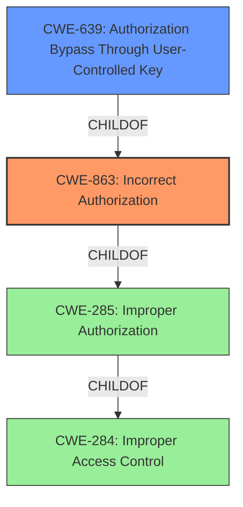

# Analysis Report for CVE-2021-25954

# Vulnerability Analysis Report: CVE-2021-25954

## Description


## Analysis (with Relationship Data)

# Summary
| CWE ID | CWE Name | Confidence | CWE Abstraction Level | CWE Vulnerability Mapping Label | CWE-Vulnerability Mapping Notes |
|---|---|---|---|---|---|
| CWE-863 | Incorrect Authorization | 0.9 | Class | Primary | Allowed-with-Review |
| CWE-639 | Authorization Bypass Through User-Controlled Key | 0.7 | Base | Secondary | Allowed |

## Evidence and Confidence

*   **Confidence Score:** 0.8
*   **Evidence Strength:** HIGH

## Relationship Analysis
The primary CWE selected is CWE-863, "Incorrect Authorization," which is a Class-level CWE. CWE-639, "Authorization Bypass Through User-Controlled Key," is a Base-level CWE and a child of CWE-863, offering more specificity. However, the evidence is not strong enough to confirm that the vulnerability *directly* involves manipulation of a key. Thus, while CWE-639 is considered, CWE-863 is the primary mapping. The relationship influences the selection by suggesting a more specific CWE, but the final choice depends on the strength of the evidence.



## Vulnerability Chain
The vulnerability chain starts with the **improper access control** mechanism, where the system **does not restrict or incorrectly restricts access to a resource from an unauthorized actor**. This leads to **incorrect authorization**, where the product performs an authorization check, but it is flawed. This ultimately allows a low-privileged attacker to **modify a private note**, which they should not have access to.

## Summary of Analysis
The initial assessment focused on the **improper access control** that allowed low-privileged users to modify private notes. The evidence from the "CVE Reference Links Content Summary" section clearly indicates that the root cause is related to flawed authorization checks, which aligns with CWE-863.

The provided information states:

*   "The vulnerability stems from a **lack of proper access control** within the Dolibarr ERP CRM application. Specifically, low-privileged users are able to modify private notes, which should only be editable by administrators."
*   "**Improper Access Control (CWE-284):** The application fails to enforce the correct permissions, allowing unauthorized users to modify sensitive data."
*   "**Incorrect Authorization (CWE-863):** The system doesn't correctly verify user privileges before allowing the modification of private notes."

CWE-284 is too high-level, as it's a Pillar. CWE-863 is a better fit as a Class. CWE-639 is a potential child of CWE-863, but the evidence does not explicitly state that the attacker is manipulating a "key value identifying the data." The technical details mention modifying the request to change the note type from "public" to "private," but this is more about bypassing the authorization check rather than directly manipulating a key. Therefore, CWE-863 is the most appropriate and specific CWE.

Relevant CWE Information:

# Enhanced Context (25 CWEs)
The following CWEs were identified as potentially relevant to this vulnerability:

## CWE-639: Authorization Bypass Through User-Controlled Key
**Abstraction Level**: Base
**Similarity Score**: 0.76
**Source**: dense

**Description**:
The system's authorization functionality does not prevent one user from gaining access to another user's data or record by modifying the key value identifying the data.

**Mapping Guidance**:
- Usage: Allowed
- Rationale: This CWE entry is at the Base level of abstraction, which is a preferred level of abstraction for mapping to the root causes of vulnerabilities.

## CWE-863: Incorrect Authorization
**Abstraction Level**: Class

### Description
The product performs an authorization check when an actor attempts to access a resource or perform an action, but it does not correctly perform the check.

### Mapping Guidance
**Usage:** Allowed-with-Review
**Rationale:** This CWE entry is a Class and might have Base-level children that would be more appropriate
**Comments:** Examine children of this entry to see if there is a better fit


## CWE Relationship Analysis

Current CWEs represent these abstraction levels: .


### Vulnerability Chain Analysis

**Chain starting from CWE-285:**
- 285 (Improper Authorization) - ROOT


**Chain starting from CWE-284:**
- 284 (Improper Access Control) - ROOT


### CWE Relationship Diagram

```mermaid
graph TD
    classDef primary fill:#f96,stroke:#333,stroke-width:2px
    classDef secondary fill:#69f,stroke:#333
    classDef tertiary fill:#9e9,stroke:#333
```


*Report generated on 2025-04-01 23:34:04*
