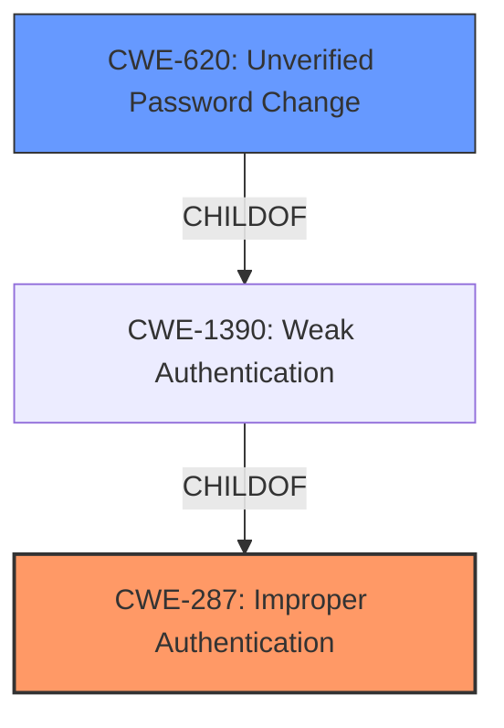

# Enhanced Analysis for CVE-2021-25956

# Summary
| CWE ID | CWE Name | Confidence | CWE Abstraction Level | CWE Vulnerability Mapping Label | CWE-Vulnerability Mapping Notes |
|---|---|---|---|---|---|
| CWE-287 | Improper Authentication | 0.9 | Class | Primary | Discouraged |
| CWE-620 | Unverified Password Change | 0.8 | Base | Secondary | Allowed |

## Evidence and Confidence

*   **Confidence Score:** 0.85
*   **Evidence Strength:** HIGH

## Relationship Analysis
The primary relationship is between CWE-287 and CWE-620. CWE-620 is a child of CWE-1390 (Weak Authentication), which itself is a child of CWE-287. This hierarchical relationship suggests that CWE-620 is a more specific instance of the broader authentication issue described by CWE-287. However, the evidence more strongly supports the **improper authentication** due to the **failure to validate an existing login name**.



## Vulnerability Chain
The vulnerability chain starts with an **improper authentication** mechanism, specifically the **failure to validate already existing Login name** during user renaming by an administrator. This leads to the overwriting of the victim user's password, culminating in a complete account takeover.
  - **Root Cause:** **Fails to validate already existing Login name** (CWE-N/A, see Summary of Analysis)
  - **Weakness:** **Unverified Password Change** (CWE-620)
  - **Impact:** Complete account takeover

## Summary of Analysis
The vulnerability lies in the **failure to validate an already existing login name** when an administrator modifies user details, leading to potential account takeover.

The vulnerability description states: "In Dolibarr application, v3.3.beta1_20121221 to v13.0.2 have Modify access for admin level users to change other users details but **fails to validate already existing Login name**, while renaming the user Login. This leads to complete account takeover of the victim user. This happens since the password gets overwritten for the victim user having a similar login name."

The CVE Reference Links Content Summary provides further evidence. The root cause is the "Dolibarr application **fails to validate the uniqueness of login names** when an administrator modifies user details." The impact is "Complete account takeover of the victim user. The password of the victim user is overwritten, allowing the attacker to gain access to the victim's account." It also notes the presence of "Improper Authentication (CWE-287)" and "Improper Access Control (CWE-284)".

CWE-287 (Improper Authentication) is selected as the primary CWE because the core issue is that the system does not properly verify the uniqueness of the login name during the user modification process. This **failure to validate** the new login against existing ones allows for the bypass of expected authentication controls. However, the Mapping Guidance for CWE-287 is Discouraged because "This CWE entry might be misused when lower-level CWE entries are likely to be applicable. It is a level-1 Class (i.e., a child of a Pillar)."
Despite the discouragement, it is still the most appropriate based on the **rootcause** information provided.

CWE-620 (Unverified Password Change) is added as a secondary CWE because the vulnerability leads to the victim's password being overwritten without proper verification. While this is a consequence of the **improper authentication**, it highlights the specific mechanism by which the account takeover is achieved. This is a base level CWE and its usage is "Allowed".

CWEs considered but not used:

*   CWE-288 (Authentication Bypass Using an Alternate Path or Channel): This CWE doesn't fit because there isn't an alternate path being used; the admin is using the intended functionality, but the functionality is flawed.
*   CWE-1390 (Weak Authentication): This is a class level CWE and its Mapping Guidance recommends examining children of this entry to see if there is a better fit.
*   CWE-303 (Incorrect Implementation of Authentication Algorithm): This is considered but not selected because there is no specific evidence to suggest that an authentication algorithm was implemented incorrectly.
*   CWE-90 (Improper Neutralization of Special Elements used in an LDAP Query ('LDAP Injection')): This is not selected because LDAP is not involved.
*   CWE-79 (Improper Neutralization of Input During Web Page Generation ('Cross-site Scripting')): This is not selected because XSS is not involved.
*   CWE-863 (Incorrect Authorization): This is not selected because authorization occurs after authentication.
*   CWE-613 (Insufficient Session Expiration): This is not selected because session expiration is not the issue.

The selected CWEs are at the optimal level of specificity. CWE-287 captures the general authentication issue, while CWE-620 provides a specific detail of the password change mechanism.


## CWE Relationship Analysis

Current CWEs represent these abstraction levels: .


### Vulnerability Chain Analysis

**Chain starting from CWE-288:**
- 288 (Authentication Bypass Using an Alternate Path or Channel) - ROOT


**Chain starting from CWE-303:**
- 303 (Incorrect Implementation of Authentication Algorithm) - ROOT


### CWE Relationship Diagram

```mermaid
graph TD
    classDef primary fill:#f96,stroke:#333,stroke-width:2px
    classDef secondary fill:#69f,stroke:#333
    classDef tertiary fill:#9e9,stroke:#333
```