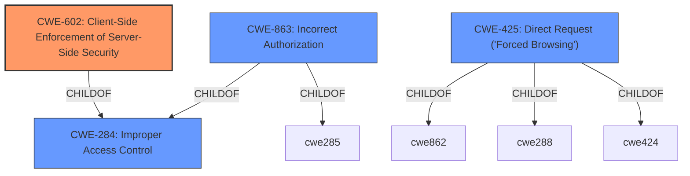

# Analysis for CVE-2021-25973

# Summary
| CWE ID  | CWE Name | Confidence | CWE Abstraction Level | CWE Vulnerability Mapping Label | CWE-Vulnerability Mapping Notes |
|-----------------|---------------------------------------------------|-------------------|--------------------------|-----------------------------------|---------------------------------------------------|
| **CWE-602** | **Client-Side Enforcement of Server-Side Security** | 0.9  | Class  | Primary | Allowed-with-Review |
| CWE-284  | Improper Access Control | 0.7  | Pillar  | Secondary | Discouraged  |
| CWE-863  | Incorrect Authorization | 0.7 | Class | Secondary | Allowed-with-Review |
| CWE-425 | Direct Request ('Forced Browsing') | 0.6 | Base | Secondary | Allowed |

## Evidence and Confidence

*   **Confidence Score:** 0.8
*   **Evidence Strength:** HIGH

## Relationship Analysis
The primary relationship that impacted the decision was the parent-child relationship, specifically how CWE-602, CWE-863, and CWE-425 are related to the more general CWE-284. The vulnerability description clearly indicates that the issue arises from relying solely on client-side restrictions, which aligns directly with the definition of CWE-602. The other CWEs represent different facets of this primary weakness, with CWE-863 describing the nature of the authorization failure and CWE-425 highlighting the direct access vulnerability.

## Vulnerability Chain
The chain of weaknesses starts with the **Improper Access Control**, stemming from the **Client-Side Enforcement of Server-Side Security**. This leads to the **Incorrect Authorization**, enabling **Direct Request ('Forced Browsing')**.
  - Root Cause: Client-Side Enforcement of Server-Side Security (CWE-602)
  - Weakness: Improper Access Control (CWE-284)
  - Weakness: Incorrect Authorization (CWE-863)
  - Impact: Direct Request ('Forced Browsing') (CWE-425)

## Summary of Analysis
Initially, the **Improper Access Control** seemed like the right choice, but looking at the details of how the application was handling the access control, it became clear that the root cause was **Client-Side Enforcement of Server-Side Security**.

The vulnerability description states "guest role users can self-register even when the admin does not allow. This happens due to front-end restriction only." The "CVE Reference Links Content Summary" adds, "The application only implements the restriction of user self-registration in the front-end, allowing bypassing by directly accessing the signup URL."

This evidence directly supports CWE-602 because the server relies on the client (front-end) to enforce the restriction, which is easily bypassed. CWE-284 is too general, and while it's related, CWE-602 pinpoints the exact mechanism causing the problem. CWE-863 is also relevant because the authorization check is performed incorrectly, but it's a consequence of the client-side enforcement. CWE-425 also applies as the attacker is directly requesting the signup URL, bypassing the intended access controls.

Therefore, the selected CWEs provide the optimal level of specificity by focusing on the client-side enforcement as the primary weakness, with the others adding context to the access control and authorization failures.

Relevant CWE Information:

# Enhanced Context (25 CWEs)
The following CWEs were identified as potentially relevant to this vulnerability:

## CWE-472: External Control of Assumed-Immutable Web Parameter
**Abstraction Level**: Base
**Similarity Score**: 0.79
**Source**: dense

**Description**:
The web application does not sufficiently verify inputs that are assumed to be immutable but are actually externally controllable, such as hidden form fields.

**Mapping Guidance**:
- Usage: Allowed
- Rationale: This CWE entry is at the Base level of abstraction, which is a preferred level of abstraction for mapping to the root causes of vulnerabilities.

## CWE-639: Authorization Bypass Through User-Controlled Key
**Abstraction Level**: Base
**Similarity Score**: 0.77
**Source**: dense

**Description**:
The system's authorization functionality does not prevent one user from gaining access to another user's data or record by modifying the key value identifying the data.

**Mapping Guidance**:
- Usage: Allowed
- Rationale: This CWE entry is at the Base level of abstraction, which is a preferred level of abstraction for mapping to the root causes of vulnerabilities.

## CWE-274: Improper Handling of Insufficient Privileges
**Abstraction Level**: Base
**Similarity Score**: 0.76
**Source**: dense

**Description**:
The product does not handle or incorrectly handles when it has insufficient privileges to perform an operation, leading to resultant weaknesses.

**Mapping Guidance**:
- Usage: Discouraged
- Rationale: This CWE entry could be deprecated in a future version of CWE.

## CWE-425: Direct Request ('Forced Browsing')
**Abstraction Level**: Base
**Similarity Score**: 0.76
**Source**: dense

**Description**:
The web application does not adequately enforce appropriate authorization on all restricted URLs, scripts, or files.

**Mapping Guidance**:
- Usage: Allowed
- Rationale: This CWE entry is at the Base level of abstraction, which is a preferred level of abstraction for mapping to the root causes of vulnerabilities.

## CWE-807: Reliance on Untrusted Inputs in a Security Decision
**Abstraction Level**: Base
**Similarity Score**: 0.76
**Source**: dense

**Description**:
The product uses a protection mechanism that relies on the existence or values of an input, but the input can be modified by an untrusted actor in a way that bypasses the protection mechanism.

**Mapping Guidance**:
- Usage: Allowed
- Rationale: This CWE entry is at the Base level of abstraction, which is a preferred level of abstraction for mapping to the root causes of vulnerabilities.

## CWE-41: Improper Resolution of Path Equivalence
**Abstraction Level**: Base
**Similarity Score**: 0.76
**Source**: dense

**Description**:
The product is vulnerable to file system contents disclosure through path equivalence. Path equivalence involves the use of special characters in file and directory names. The associated manipulations are intended to generate multiple names for the same object.

**Mapping Guidance**:
- Usage: Allowed
- Rationale: This CWE entry is at the Base level of abstraction, which is a preferred level of abstraction for mapping to the root causes of vulnerabilities.

## CWE-668: Exposure of Resource to Wrong Sphere
**Abstraction Level**: Class
**Similarity Score**: 0.76
**Source**: dense

**Description**:
The product exposes a resource to the wrong control sphere, providing unintended actors with inappropriate access to the resource.

**Mapping Guidance**:
- Usage: Discouraged
- Rationale: CWE-668 is high-level and is often misused as a catch-all when lower-level CWE IDs might be applicable. It is sometimes used for low-information vulnerability reports [REF-1287]. It is a level-1 Class (i.e., a child of a Pillar). It is not useful for trend analysis.

## CWE-552: Files or Directories Accessible to External Parties
**Abstraction Level**: Base
**Similarity Score**: 0.76
**Source**: dense

**Description**:
The product makes files or directories accessible to unauthorized actors, even though they should not be.

**Mapping Guidance**:
- Usage: Allowed
- Rationale: This CWE entry is at the Base level of abstraction, which is a preferred level of abstraction for mapping to the root causes of vulnerabilities.

## CWE-1220: Insufficient Granularity of Access Control
**Abstraction Level**: Base
**Similarity Score**: 0.76
**Source**: dense

**Description**:
The product implements access controls via a policy or other feature with the intention to disable or restrict accesses (reads and/or writes) to assets in a system from untrusted agents. However, implemented access controls lack required granularity, which renders the control