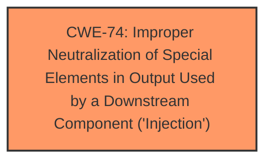

# Analysis for CVE-2021-25980

# Summary
| CWE ID | CWE Name | Confidence | CWE Abstraction Level | CWE Vulnerability Mapping Label | CWE-Vulnerability Mapping Notes |
|---|---|---|---|---|---|
| CWE-74 | Improper Neutralization of Special Elements in Output Used by a Downstream Component ('Injection') | 1.0 | Class | Primary | Allowed-with-Review |

## Evidence and Confidence

*   **Confidence Score:** 1.0
*   **Evidence Strength:** HIGH

## Relationship Analysis
The primary CWE is CWE-74, which is a class level CWE. The retriever results did not return a more specific CWE, but the description clearly states that the **Host Header Injection** is the **weakness**.

## Vulnerability Chain
The chain of events is:
1.  **Weakness:** **Host Header Injection** due to **lack of input validation**
2.  **Impact:** Reset victim's password and account takeover

## Summary of Analysis
The analysis is based on the provided evidence, specifically the "Vulnerability Description Key Phrases" and the "CVE Reference Links Content Summary". The key phrase identifies **Host Header Injection** as the **weakness**. The CVE Reference states that the application **does not properly validate or sanitize the Host header** of incoming HTTP requests when generating password reset links. Also, the CVE Reference states that the application uses the value of the Host header directly to create the password reset link without sanitizing it. The evidence strongly supports the classification of CWE-74 because of the Host header is used to construct a URL, and the application doesn't neutralize special characters that could modify how it is parsed or interpreted.

Relevant CWE Information:

# Enhanced Context (25 CWEs)
The following CWEs were identified as potentially relevant to this vulnerability:

## CWE-80: Improper Neutralization of Script-Related HTML Tags in a Web Page (Basic XSS)
**Abstraction Level**: Variant
**Similarity Score**: 0.81
**Source**: dense

**Description**:
The product receives input from an upstream component, but it does not neutralize or incorrectly neutralizes special characters such as "<", ">", and "&" that could be interpreted as web-scripting elements when they are sent to a downstream component that processes web pages.
**NOT USED:** This is related to Cross-Site Scripting (XSS), but the described vulnerability focuses on **Host Header Injection** for password reset, not general web page scripting.

## CWE-74: Improper Neutralization of Special Elements in Output Used by a Downstream Component ('Injection')
**Abstraction Level**: Class
**Similarity Score**: 0.80
**Source**: dense

**Description**:
The product constructs all or part of a command, data structure, or record using externally-influenced input from an upstream component, but it does not neutralize or incorrectly neutralizes special elements that could modify how it is parsed or interpreted when it is sent to a downstream component.

**Mapping Guidance**:
- Usage: Discouraged
- Rationale: CWE-74 is high-level and often misused when lower-level weaknesses are more appropriate.
**USED:** This CWE is chosen because it accurately describes the **Host Header Injection** vulnerability, where the application fails to neutralize special elements in the Host header, leading to potential manipulation of the generated password reset link.

## CWE-116: Improper Encoding or Escaping of Output
**Abstraction Level**: Class
**Similarity Score**: 0.78
**Source**: dense

**Description**:
The product prepares a structured message for communication with another component, but encoding or escaping of the data is either missing or done incorrectly. As a result, the intended structure of the message is not preserved.
**NOT USED:** While encoding/escaping could be part of the mitigation, the core issue is the **lack of neutralization** of special elements in the Host header, making CWE-74 more relevant.

## CWE-472: External Control of Assumed-Immutable Web Parameter
**Abstraction Level**: Base
**Similarity Score**: 0.78
**Source**: dense

**Description**:
The web application does not sufficiently verify inputs that are assumed to be immutable but are actually externally controllable, such as hidden form fields.
**NOT USED:** This CWE focuses on the lack of verification of assumed-immutable parameters, like hidden form fields. The **Host Header Injection** vulnerability is specific to the Host header, not a general immutable parameter issue.

## CWE-1289: Improper Validation of Unsafe Equivalence in Input
**Abstraction Level**: Base
**Similarity Score**: 0.77
**Source**: dense

**Description**:
The product receives an input value that is used as a resource identifier or other type of reference, but it does not validate or incorrectly validates that the input is equivalent to a potentially-unsafe value.
**NOT USED:** This CWE is about validating equivalence to unsafe values, which is not the primary issue in **Host Header Injection**. The core problem is the **lack of neutralization** of special elements.

## CWE-184: Incomplete List of Disallowed Inputs
**Abstraction Level**: Base
**Similarity Score**: 0.76
**Source**: dense

**Description**:
The product implements a protection mechanism that relies on a list of inputs (or properties of inputs) that are not allowed by policy or otherwise require other action to neutralize before additional processing takes place, but the list is incomplete.
**NOT USED:** This CWE is about an incomplete list of disallowed inputs, not the primary issue of **Host Header Injection**, where the application fails to neutralize special elements.

## CWE-138: Improper Neutralization of Special Elements
**Abstraction Level**: Class
**Similarity Score**: 0.76
**Source**: dense

**Description**:
The product receives input from an upstream component, but it does not neutralize or incorrectly neutralizes special elements that could be interpreted as control elements or syntactic markers when they are sent to a downstream component.
**NOT USED:** CWE-138 is a high level class. CWE-74 is more descriptive of the specific **Host Header Injection**.

## CWE-639: Authorization Bypass Through User-Controlled Key
**Abstraction Level**: Base
**Similarity Score**: 0.76
**Source**: dense

**Description**:
The system's authorization functionality does not prevent one user from gaining access to another user's data or record by modifying the key value identifying the data.
**NOT USED:** This CWE describes an authorization bypass. The **Host Header Injection** is an attack vector to reset a password.

## CWE-319: Cleartext Transmission of Sensitive Information
**Abstraction Level**: Base
**Similarity Score**: 0.76
**Source**: dense

**Description**:
The product transmits sensitive or security-critical data in cleartext in a communication channel that can be sniffed by unauthorized actors.
**NOT USED:** This CWE relates to cleartext transmission. The **Host Header Injection** is about failing to sanitize the host header.

## CWE-451: User Interface (UI) Misrepresentation of Critical Information
**Abstraction Level**: Class
**Similarity Score**: 0.76
**Source**: dense

**Description**:
The user interface (UI) does not properly represent critical information to the user, allowing the information - or its source - to be obscured or spoofed. This is often a component in phishing attacks.
**NOT USED:** This CWE is about UI misrepresentation. The **Host Header Injection** is failing to sanitize the host header.

## CWE-79: Improper Neutralization of Input During Web Page Generation ('Cross-site Scripting')
**Abstraction Level**: Base
**Similarity Score**: 7309.25
**Source**: sparse

**Description**:
The product does not neutralize or incorrectly neutralizes user-controllable input before it is placed in output that is used as a web page that is served to other users.
**NOT USED:** While XSS could be a related attack, the primary vulnerability is **Host Header Injection**.

## CWE-74: Improper Neutralization of Special Elements in Output Used by a Downstream Component ('Injection')
**Abstraction Level**: Class
**Similarity Score**: 7143.30
**Source**: sparse

**Description**:
The product constructs all or part of a command, data structure, or record using externally-influenced input from an upstream component, but it does not neutralize or incorrectly neutralizes special elements that could modify how it is parsed or interpreted when it is sent to a downstream component.

**Mapping Guidance**:
- Usage: Discouraged
- Rationale: CWE-74 is high-level and often misused when lower-level weaknesses are more appropriate.
**USED:** This CWE is chosen because it accurately describes the **Host Header Injection** vulnerability, where the application fails to neutralize special elements in the Host header, leading to potential manipulation of the generated password reset link.

## CWE-116: Improper Encoding or Escaping of Output
**Abstraction Level**: Class
**Similarity Score**: 6909.49
**Source**: sparse

**Description**:
The product prepares a structured message for communication with another component, but encoding or escaping of the data is either missing or done incorrectly. As a result, the intended structure of the message is not