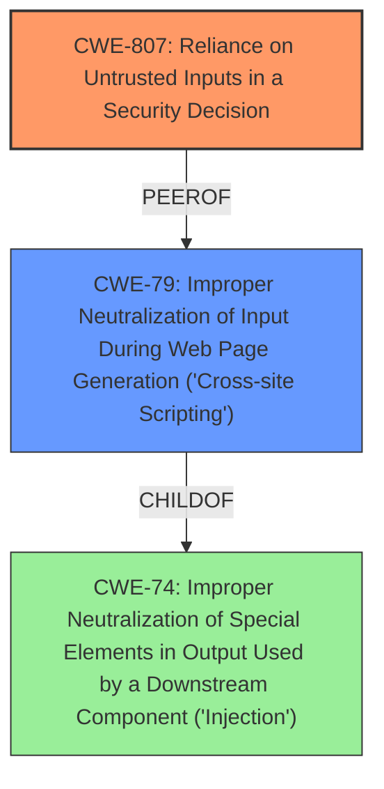

# Raw Analyzer Response for CVE-2021-25994

# Summary
| CWE ID | CWE Name | Confidence | CWE Abstraction Level | CWE Vulnerability Mapping Label | CWE-Vulnerability Mapping Notes |
|---|---|---|---|---|---|
| CWE-807 | Reliance on Untrusted Inputs in a Security Decision | 0.9 | Base | Primary | Allowed |
| CWE-79 | Improper Neutralization of Input During Web Page Generation ('Cross-site Scripting') | 0.6 | Base | Secondary | Allowed |

## Evidence and Confidence

*   **Confidence Score:** 0.75
*   **Evidence Strength:** HIGH

## Relationship Analysis
The primary CWE selected is CWE-807, which describes the **reliance on untrusted inputs in a security decision**. This is a Base level CWE. CWE-79 is a secondary CWE, but it does not precisely fit the vulnerability, since the **Host header is not being directly displayed on a web page but used to create a password reset link**. This is why CWE-807 has a higher confidence. The analysis considered that CWE-79 is child of CWE-74 which is related to injection.

## Vulnerability Chain
The vulnerability chain starts with the **unvalidated Host header**, which is then used to generate a password reset link. This link is sent to the user, and if clicked, it can lead to account takeover. The chain is:
1.  **Reliance on Untrusted Inputs in a Security Decision (CWE-807):** The application uses the Host header without validation to create a password reset link.
2.  Improper Generation of Password Reset Link: The **Host header** is incorporated into the reset link without sanitization, allowing an attacker to manipulate the domain in the link.
3.  Account Takeover: By controlling the password reset link, an attacker can redirect the user to a malicious site, steal the reset token, and take over the account.

## Summary of Analysis
The initial assessment focused on the **Host Header Injection** as the **weakness**, which immediately suggests CWE-79. However, deeper analysis reveals that the core issue is that the application relies on an untrusted input (**Host header**) to make a security decision (generating a password reset link). According to the CVE description, "The application is vulnerable to Host Header Injection because it doesn't validate the Host header when generating password reset links." This aligns perfectly with CWE-807 description: "The product uses a protection mechanism that relies on the existence or values of an input, but the input can be modified by an untrusted actor in a way that bypasses the protection mechanism."

The decision to choose CWE-807 as the primary CWE is based on the fact that it directly addresses the root cause of the vulnerability: the **reliance on the untrusted Host header**. While CWE-79 is related due to the potential for the **Host header** to be used in a cross-site scripting attack, it doesn't fully capture the essence of the **weakness**, which is the flawed trust in user-supplied data for a critical security function. The selection of the base level CWE is due to the fact it accurately represents the weakness.

Relevant CWE Information:

# Enhanced Context (25 CWEs)

## CWE-807: Reliance on Untrusted Inputs in a Security Decision
**Abstraction Level**: Base
**Similarity Score**: 0.75
**Source**: dense

**Description**:
The product uses a protection mechanism that relies on the existence or values of an input, but the input can be modified by an untrusted actor in a way that bypasses the protection mechanism.

**Mapping Guidance**:
- Usage: Allowed
- Rationale: This CWE entry is at the Base level of abstraction, which is a preferred level of abstraction for mapping to the root causes of vulnerabilities.

## CWE-79: Improper Neutralization of Input During Web Page Generation ('Cross-site Scripting')
**Abstraction Level**: Base
**Similarity Score**: 8827.30
**Source**: sparse

**Description**:
The product does not neutralize or incorrectly neutralizes user-controllable input before it is placed in output that is used as a web page that is served to other users.

**Mapping Guidance**:
- Usage: Allowed
- Rationale: This CWE entry is at the Base level of abstraction, which is a preferred level of abstraction for mapping to the root causes of vulnerabilities.