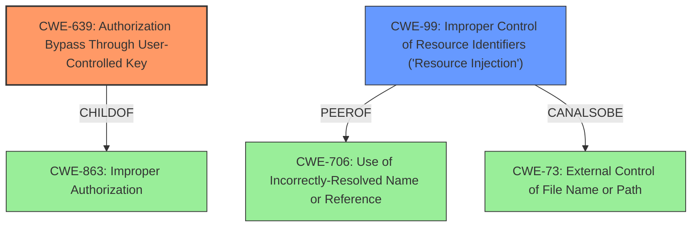

# Raw Analyzer Response for CVE-2021-26024

# Summary

| CWE ID | CWE Name | Confidence | CWE Abstraction Level | CWE Vulnerability Mapping Label | CWE-Vulnerability Mapping Notes |
|---|---|---|---|---|---|
| CWE-639 | Authorization Bypass Through User-Controlled Key | 1.0 | Base | Allowed | Primary CWE |
| CWE-99 | Improper Control of Resource Identifiers ('Resource Injection') | 0.7 | Class | Allowed-with-Review | Secondary Candidate |

## Evidence and Confidence

*   **Confidence Score:** 0.9
*   **Evidence Strength:** MEDIUM

## Relationship Analysis
The primary relationship influencing the decision is that CWE-639 is a more specific type of authorization bypass, which is a child of CWE-863 (Improper Authorization). CWE-99 is a peer of CWE-706 (Use of Incorrectly-Resolved Name or Reference) and can also be related to CWE-73 (External Control of File Name or Path), offering alternative classifications depending on how the resource identifier is exploited. The choice of CWE-639 as the primary CWE is driven by the description's emphasis on user-controlled keys and access to other user accounts, fitting the base-level abstraction of CWE-639 more accurately than the broader class-level abstraction of CWE-99.

## Vulnerability Chain
The vulnerability chain starts with an **Insecure Direct Object Reference** (**WEAKNESS**), leading to the ability to create favorites for any other user account (**IMPACT**). The root cause is the **lack of proper authorization checks** when creating favorites, allowing one user to manipulate identifiers and act on behalf of another user. This results in unauthorized access to resources.

## Summary of Analysis
The initial assessment strongly points to CWE-639 because the **Vulnerability Description** explicitly mentions the ability to create favorites for *any other user account*, aligning perfectly with the "Authorization Bypass Through User-Controlled Key" concept. This is further supported by the **Vulnerability Description Key Phrases**, which identifies *Insecure Direct Object Reference* as the root cause. The **CVE Reference Links Content Summary** provided *no specific information about CVE-2021-26024*, but the evidence from the vulnerability description is sufficient to make a confident assessment.

CWE-99 was considered as a secondary candidate, but its broader scope ("Improper Control of Resource Identifiers") makes it less specific than CWE-639, which directly addresses the authorization bypass through user-controlled keys.

The final decision is based on the evidence of **Insecure Direct Object Reference** enabling the creation of favorites for other user accounts (**IMPACT**). CWE-639 is chosen as the primary CWE because it best represents the root cause (**WEAKNESS**) and aligns with the provided evidence, offering the optimal level of specificity.

Relevant CWE Information:
- **CWE-639: Authorization Bypass Through User-Controlled Key**
  - **Technical Explanation:** The Nagios XI Favorites component **fails to properly validate whether a user has the right to create a favorite for another user's account**. By manipulating the key (likely a user ID or session ID) associated with the favorite creation process, an attacker can bypass authorization checks and create favorites on behalf of other users.
  - **Security Implications and Potential Impact:** This allows an attacker to modify the favorite configurations of other users, potentially leading to information disclosure, tampering with user preferences, or even privilege escalation if favorites are linked to other sensitive functionalities.
  - **Parent-Child Relationships and Chain Patterns:** CWE-639 is a child of CWE-863 (Improper Authorization) and CWE-284 (Improper Access Control). This highlights the broader context of the vulnerability as a failure in access control mechanisms.
  - **MITRE Mapping Guidance Influence:** The MITRE mapping guidance for CWE-639 recommends its usage and specifies that it is at the Base level of abstraction, which is a preferred level for mapping root causes. This guidance supports the choice of CWE-639 as the primary CWE.
- **CWE-99: Improper Control of Resource Identifiers ('Resource Injection')**
  - **Technical Explanation:** While "Insecure Direct Object Reference" could be related to CWE-99, the core issue in this case is not the injection of a resource identifier, but rather the **failure to properly authorize the manipulation of resource identifiers** (user keys) to perform actions on behalf of other users.
  - **Security Implications and Potential Impact:** If the application did not restrict or incorrectly restricted the input before it was used as an identifier for a resource that may be outside the intended sphere of control. This may enable an attacker to access or modify otherwise protected system resources.
  - **Parent-Child Relationships and Chain Patterns:** CWE-99 is a child of CWE-74 (Improper Neutralization of Special Elements in Output Used by a Downstream Component ('Injection')).
  - **MITRE Mapping Guidance Influence:** The MITRE mapping guidance for CWE-99 recommends its usage with review, noting that it is a Class and might have Base-level children that would be more appropriate

Other CWEs Considered:
- **CWE-732: Incorrect Permission Assignment for Critical Resource:** While incorrect permissions could contribute, the primary issue is the lack of authorization checks, not the assignment of incorrect permissions.
- **CWE-96: Improper Neutralization of Directives in Statically Saved Code ('Static Code Injection'):** Not applicable because the vulnerability does not involve the injection of code into static resources.
- **CWE-138: Improper Neutralization of Special Elements:** Too broad and not directly related to authorization bypass.
- **CWE-918: Server-Side Request Forgery (SSRF):** Irrelevant to the described vulnerability.
- **CWE-386: Symbolic Name not Mapping to Correct Object:** Not applicable as the vulnerability doesn't involve incorrect mapping of symbolic names.
- **CWE-425: Direct Request ('Forced Browsing'):** While related to authorization, CWE-639 is a better fit because it specifically addresses the manipulation of user-controlled keys for authorization bypass.
- **CWE-79: Improper Neutralization of Input During Web Page Generation ('Cross-site Scripting'):** Irrelevant as the vulnerability doesn't involve XSS.
- **CWE-1321: Improperly Controlled Modification of Object Prototype Attributes ('Prototype Pollution'):** This is not related to modification of object prototypes.