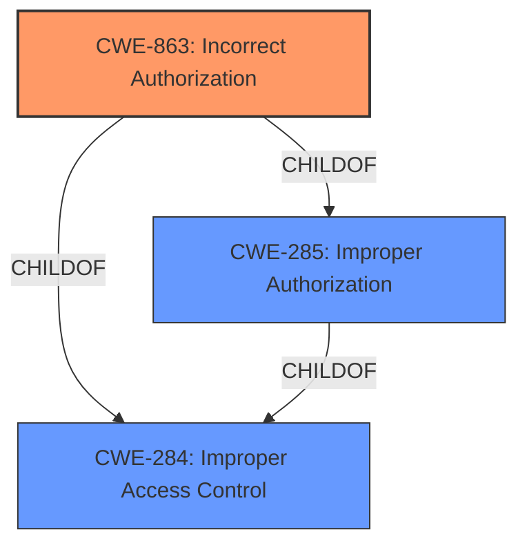

# Raw Analyzer Response for CVE-2021-26027

# Summary
| CWE ID  | CWE Name                       | Confidence | CWE Abstraction Level | CWE Vulnerability Mapping Label | CWE-Vulnerability Mapping Notes |
|---------|--------------------------------|------------|-----------------------|---------------------------------|-----------------------------------|
| CWE-863 | Incorrect Authorization        | 0.9        | Class                 | Primary                         | Allowed-with-Review              |
| CWE-285 | Improper Authorization         | 0.7        | Class                 | Secondary                       | Discouraged                       |
| CWE-284 | Improper Access Control        | 0.6        | Pillar                | Secondary                       | Discouraged                       |

## Evidence and Confidence

*   **Confidence Score:** 0.9
*   **Evidence Strength:** HIGH

## Relationship Analysis
The primary CWE is CWE-863, "Incorrect Authorization," which is a child of CWE-285, "Improper Authorization," and CWE-284, "Improper Access Control." The vulnerability description clearly indicates that the **incorrect ACL checks** are the root cause, making CWE-863 the most specific and appropriate choice. While CWE-285 and CWE-284 are related, they are higher-level classifications and less precise.

## Vulnerability Chain
The vulnerability chain starts with the **incorrect ACL checks** (CWE-863), which allows an unauthorized attacker to change the category of an article. The chain is relatively short and directly leads to the impact.

## Summary of Analysis
The analysis is based on the provided evidence, particularly the vulnerability description key phrases and the CVE reference links content summary. The key phrase "**incorrect ACL checks**" directly aligns with the definition of CWE-863. The content summary confirms that the root cause is indeed related to access control list issues, leading to unauthorized modifications.

The selection of CWE-863 is based on its specificity and relevance to the vulnerability. While CWE-285 and CWE-284 were also considered, they are broader classifications that don't capture the specific nature of the **incorrect ACL checks**.

Relevant CWE Information:

*   **CWE-863: Incorrect Authorization**: The product performs an authorization check when an actor attempts to access a resource or perform an action, but it does not correctly perform the check.
*   **CWE-285: Improper Authorization**: The product does not perform or incorrectly performs an authorization check when an actor attempts to access a resource or perform an action.
*   **CWE-284: Improper Access Control**: The product does not restrict or incorrectly restricts access to a resource from an unauthorized actor.

The vulnerability description states "Incorrect ACL checks could allow unauthorized change of the category for an article". This aligns directly with CWE-863, making it the most appropriate choice.

All other CWEs were considered but rejected because they did not fit the specific vulnerability as accurately as CWE-863. For example, CWE-22 (Improper Limitation of a Pathname to a Restricted Directory) and CWE-73 (External Control of File Name or Path) are related to file system operations, which are not relevant to this authorization issue. CWE-306 (Missing Authentication for Critical Function) is about missing authentication, but this vulnerability involves **incorrect** authorization checks, not a complete absence of them.