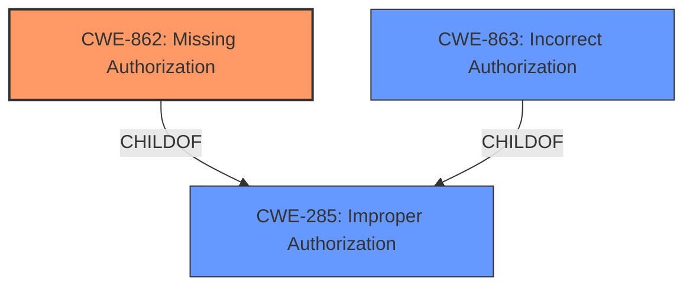

# Analysis Report for CVE-2021-26040

# Vulnerability Analysis Report: CVE-2021-26040

## Description


## Analysis (with Relationship Data)

# Summary
| CWE ID | CWE Name | Confidence | CWE Abstraction Level | CWE Vulnerability Mapping Label | CWE-Vulnerability Mapping Notes |
|---|---|---|---|---|---|
| CWE-862 | Missing Authorization | 0.9 | Class | Primary | Allowed-with-Review |
| CWE-863 | Incorrect Authorization | 0.7 | Class | Secondary | Allowed-with-Review |
| CWE-285 | Improper Authorization | 0.5 | Class | Secondary | Discouraged |

## Evidence and Confidence

*   **Confidence Score:** 0.9
*   **Evidence Strength:** HIGH

## Relationship Analysis
The primary relationship influencing the CWE selection is the hierarchical structure of authorization-related CWEs. CWE-285 "Improper Authorization" is a high-level class. Its children, CWE-862 "Missing Authorization" and CWE-863 "Incorrect Authorization," offer more specific classifications. Since the vulnerability involves a failure to properly check user permissions before executing a file deletion command, either CWE-862 or CWE-863 is more appropriate than CWE-285. Given that the description specifies that the media manager does not correctly check permissions, the choice between CWE-862 and CWE-863 is based on whether there was an authorization check at all (CWE-862), or whether the check was implemented incorrectly (CWE-863).



## Vulnerability Chain
The vulnerability chain involves a **missing** or **incorrect** authorization check, leading to unauthorized file deletion.

1.  **Root Cause:** **Missing** or **Incorrect** authorization check in the media manager.
2.  **Weakness:** Failure to validate user permissions before executing the file deletion command.
3.  **Impact:** Unauthorized file deletion, potentially leading to data loss or service disruption.

## Summary of Analysis
The initial analysis focused on identifying the root cause of the vulnerability. The vulnerability description and CVE Reference Links Content Summary both point to an authorization issue in the Joomla! media manager. The system **does not correctly check user permissions before allowing a file deletion command to be executed**.

The Retriever Results also pointed to CWE-863 "Incorrect Authorization" and CWE-285 "Improper Authorization".

The selection of CWE-862 "Missing Authorization" as the primary CWE is based on the evidence that the authorization check is **missing**, or not properly implemented.
The selection of CWE-863 "Incorrect Authorization" as a secondary CWE is based on the evidence that the authorization check is **incorrect**.
CWE-285 is too high-level and therefore not specific enough.

The final decision to use CWE-862 as the primary is influenced by the combination of evidence and the hierarchical relationship between CWEs.

Relevant CWE Information:

*   **CWE-862: Missing Authorization** - The product does not perform an authorization check when an actor attempts to access a resource or perform an action. This aligns with the vulnerability where the media manager **does not correctly check user permissions**.
*   **CWE-863: Incorrect Authorization** - The product performs an authorization check when an actor attempts to access a resource or perform an action, but it does not correctly perform the check.
*   **CWE-285: Improper Authorization** - The product does not perform or incorrectly performs an authorization check when an actor attempts to access a resource or perform an action. This is a more general case that encompasses both missing and incorrect authorization, making it less specific.

The selected CWEs are at the optimal level of specificity, accurately representing the **missing** or **incorrect** authorization check that leads to the vulnerability.


## CWE Relationship Analysis

Current CWEs represent these abstraction levels: .


### Vulnerability Chain Analysis

**Chain starting from CWE-863:**
- 863 (Incorrect Authorization) - ROOT


**Chain starting from CWE-285:**
- 285 (Improper Authorization) - ROOT


### CWE Relationship Diagram

```mermaid
graph TD
    classDef primary fill:#f96,stroke:#333,stroke-width:2px
    classDef secondary fill:#69f,stroke:#333
    classDef tertiary fill:#9e9,stroke:#333
```


*Report generated on 2025-04-02 04:39:56*
