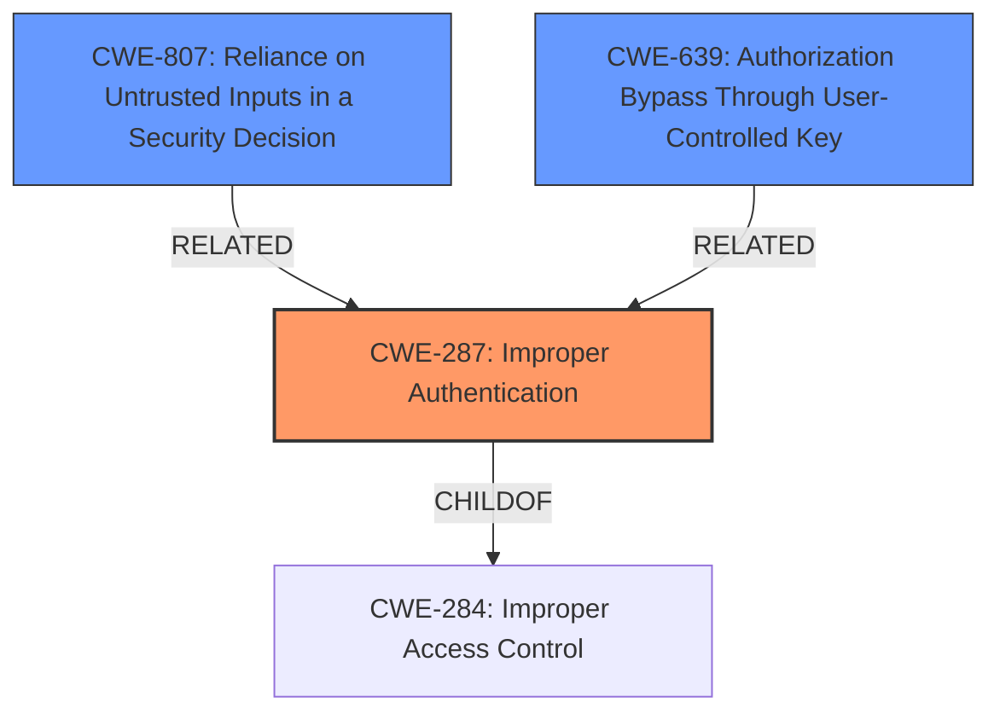

# Raw Analyzer Response for CVE-2021-26077

# Summary
| CWE ID | CWE Name | Confidence | CWE Abstraction Level | CWE Vulnerability Mapping Label | CWE-Vulnerability Mapping Notes |
|---|---|---|---|---|---|
| CWE-287 | Improper Authentication | 0.9 | Class | Primary | Discouraged |
| CWE-807 | Reliance on Untrusted Inputs in a Security Decision | 0.7 | Base | Secondary | Allowed |
| CWE-639 | Authorization Bypass Through User-Controlled Key | 0.6 | Base | Secondary | Allowed |

## Evidence and Confidence

*   **Confidence Score:** 0.8
*   **Evidence Strength:** HIGH

## Relationship Analysis
The primary CWE selected is CWE-287, which is a Class-level CWE. The relationship analysis indicates that CWE-287 is a child of CWE-284 (Improper Access Control), but it is also flagged as Discouraged due to the potential for more specific mappings. However, given that the core issue is the **improper authentication** of context JWTs where server-to-server JWTs are expected, CWE-287 serves as a suitable high-level classification.

The other potential CWEs, CWE-807 and CWE-639, represent more specific aspects of the vulnerability. CWE-807 highlights the reliance on untrusted inputs (context JWTs) for security decisions (lifecycle endpoints). CWE-639 points to the possibility of bypassing authorization by manipulating user-controlled keys (JWTs).

## Vulnerability Chain
The vulnerability chain begins with the **improper acceptance of context JWTs** in lifecycle endpoints where only server-to-server JWTs should be accepted. This leads to **broken authentication**, allowing an attacker to send authenticated re-installation events. The chain can be represented as follows:

**Improper JWT Acceptance (Root Cause) -> Broken Authentication -> Authenticated Re-installation Events (Impact)**

## Summary of Analysis
The analysis centers on the **broken authentication** in Atlassian Connect Spring Boot (ACSB), where context JWTs are erroneously accepted in lifecycle endpoints. This **weakness** allows attackers to send authenticated re-installation events, posing a security risk.

The primary CWE choice, CWE-287 (Improper Authentication), is influenced by the vulnerability's core nature: a failure to properly authenticate actors claiming a specific identity. The vulnerability description states that ACSB versions erroneously **accept context JWTs in lifecycle endpoints** where only server-to-server JWTs should be accepted. The CVE Reference Links Content Summary reinforces that the primary **weakness** is the **broken authentication** logic.

Although CWE-287 is a Class-level CWE, the available information does not pinpoint a more specific Base or Variant CWE, making CWE-287 the most appropriate choice given the evidence. While CWE-1390 (Weak Authentication) or CWE-306 (Missing Authentication for Critical Function) were considered, the issue is more nuanced than simply weak or missing authentication; it's about the **incorrect use of one type of authentication token (context JWT) in place of another (server-to-server JWT)**.

CWE-807 (Reliance on Untrusted Inputs in a Security Decision) is a secondary consideration because the lifecycle endpoints rely on JWTs (inputs) that can be manipulated by an attacker. The framework's failure to properly validate these JWTs leads to the vulnerability. The CVE Reference Links Content Summary mentions that the frameworks failed to enforce proper JWT validation.

CWE-639 (Authorization Bypass Through User-Controlled Key) is also considered as a secondary CWE because an attacker can potentially bypass authorization checks by sending crafted JWTs.

Relevant CWE Information:

# Enhanced Context (25 CWEs)
The following CWEs were identified as potentially relevant to this vulnerability:

## CWE-287: Improper Authentication
**Abstraction Level**: Class
**Similarity Score**: 7282.63
**Source**: sparse

**Description**:
When an actor claims to have a given identity, the product does not prove or insufficiently proves that the claim is correct.

**Mapping Guidance**:
- Usage: Discouraged
- Rationale: This CWE entry might be misused when lower-level CWE entries are likely to be applicable. It is a level-1 Class (i.e., a child of a Pillar).

## CWE-807: Reliance on Untrusted Inputs in a Security Decision
**Abstraction Level**: Base
**Similarity Score**: 0.78
**Source**: dense

**Description**:
The product uses a protection mechanism that relies on the existence or values of an input, but the input can be modified by an untrusted actor in a way that bypasses the protection mechanism.

**Mapping Guidance**:
- Usage: Allowed
- Rationale: This CWE entry is at the Base level of abstraction, which is a preferred level of abstraction for mapping to the root causes of vulnerabilities.

## CWE-639: Authorization Bypass Through User-Controlled Key
**Abstraction Level**: Base
**Similarity Score**: 7451.54
**Source**: sparse

**Description**:
The system's authorization functionality does not prevent one user from gaining access to another user's data or record by modifying the key value identifying the data.

**Mapping Guidance**:
- Usage: Allowed
- Rationale: This CWE entry is at the Base level of abstraction, which is a preferred level of abstraction for mapping to the root causes of vulnerabilities.