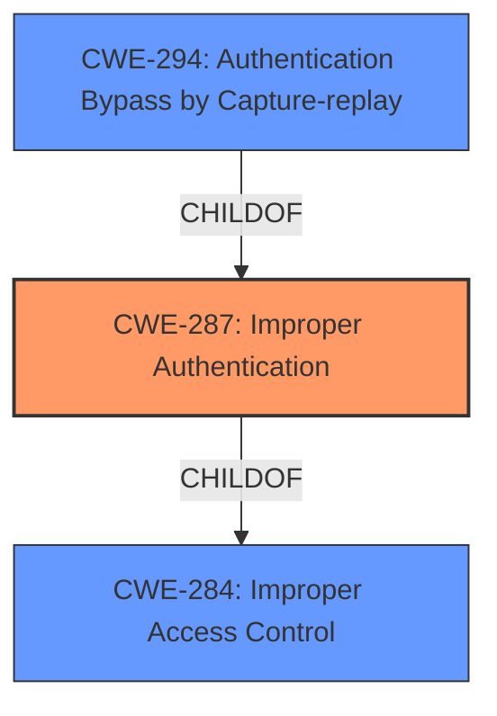

# Raw Analyzer Response for CVE-2021-26088

# Summary
| CWE ID | CWE Name | Confidence | CWE Abstraction Level | CWE Vulnerability Mapping Label | CWE-Vulnerability Mapping Notes |
|---|---|---|---|---|---|
| CWE-287 | Improper Authentication | 1.0 | Class | Primary | Allowed |
| CWE-294 | Authentication Bypass by Capture-replay | 0.7 | Base | Secondary | Allowed |

## Evidence and Confidence

*   **Confidence Score:** 0.9
*   **Evidence Strength:** HIGH

## Relationship Analysis
The primary CWE is CWE-287, "Improper Authentication," which is a Class-level CWE. The vulnerability description explicitly mentions "**improper authentication**," and the CVE Reference Links Content Summary reinforces this by stating that the "**core issue** is that the FSSO Collector **does not properly authenticate** login notification packets received from DC agents." The relationship analysis shows that CWE-287 is a child of CWE-284, "Improper Access Control," which is a Pillar. While CWE-284 is a parent, it is too abstract. The secondary CWE is CWE-294, "Authentication Bypass by Capture-replay," which is a Base-level CWE. This is relevant because the vulnerability involves sending crafted UDP packets, which could potentially be captured and replayed. However, the vulnerability description doesn't explicitly mention capture-replay, so it's a secondary consideration.

## Vulnerability Chain
The chain of events is as follows:
1.  **Root Cause:** **Improper Authentication** (CWE-287) in the FSSO Collector.
2.  **Mechanism:** Sending specifically crafted UDP login notification packets by an unauthenticated user.
3.  **Impact:** Bypass FSSO firewall policy and access the protected network.

## Summary of Analysis
The initial assessment strongly points to CWE-287, "Improper Authentication," as the primary weakness. The vulnerability description explicitly mentions this weakness, and the CVE Reference Links Content Summary confirms that the FSSO Collector **does not properly authenticate** login notification packets. The evidence directly supports this classification. "An **improper authentication** vulnerability in FSSO Collector version 5.0.295 and below may allow an unauthenticated user to bypass a FSSO firewall policy and access the protected network via sending specifically crafted UDP login notification packets."

While other CWEs like CWE-294, "Authentication Bypass by Capture-replay," and CWE-303, "Incorrect Implementation of Authentication Algorithm," were considered, they are not as directly supported by the evidence. CWE-294 is a potential secondary weakness, as the crafted UDP packets could potentially be captured and replayed. However, there's no explicit mention of replay attacks. CWE-303 is related to the algorithm implementation, but the description doesn't focus on the implementation but instead on the **lack of proper authentication** of the packets.

The final decision is based on the available evidence and the principle of selecting the most specific CWE that accurately describes the weakness. CWE-287 is the most appropriate choice, given the available information.

Relevant CWE Information:

# Enhanced Context (25 CWEs)

## CWE-303: Incorrect Implementation of Authentication Algorithm
**Abstraction Level**: Base
**Similarity Score**: 0.77
**Source**: dense

**Description**:
The requirements for the product dictate the use of an established authentication algorithm, but the implementation of the algorithm is incorrect.

**Mapping Guidance**:
- Usage: Allowed
- Rationale: This CWE entry is at the Base level of abstraction, which is a preferred level of abstraction for mapping to the root causes of vulnerabilities.

**Why Not Used**: While the vulnerability involves authentication, the primary issue is the **lack of proper authentication**, not an incorrect implementation of an existing algorithm. The description does not provide evidence of an algorithm being implemented incorrectly.

## CWE-1391: Use of Weak Credentials
**Abstraction Level**: Class
**Similarity Score**: 0.77
**Source**: dense

**Description**:
The product uses weak credentials (such as a default key or hard-coded password) that can be calculated, derived, reused, or guessed by an attacker.

**Mapping Guidance**:
- Usage: Allowed-with-Review
- Rationale: This CWE entry is a Class and might have Base-level children that would be more appropriate

**Why Not Used**: The vulnerability description doesn't mention the use of weak credentials. The issue is related to the **absence of proper authentication** of the UDP packets.

## CWE-1390: Weak Authentication
**Abstraction Level**: Class
**Similarity Score**: 0.76
**Source**: dense

**Description**:
The product uses an authentication mechanism to restrict access to specific users or identities, but the mechanism does not sufficiently prove that the claimed identity is correct.

**Mapping Guidance**:
- Usage: Allowed-with-Review
- Rationale: This CWE entry is a Class and might have Base-level children that would be more appropriate

**Why Not Used**: The description specifically points to **improper authentication**, suggesting a failure in the authentication process itself, rather than simply a weak mechanism.

## CWE-798: Use of Hard-coded Credentials
**Abstraction Level**: Base
**Similarity Score**: 0.76
**Source**: dense

**Description**:
The product contains hard-coded credentials, such as a password or cryptographic key.

**Mapping Guidance**:
- Usage: Allowed
- Rationale: This CWE entry is at the Base level of abstraction, which is a preferred level of abstraction for mapping to the root causes of vulnerabilities.

**Why Not Used**: The description does not provide any evidence of hard-coded credentials being used.

## CWE-345: Insufficient Verification of Data Authenticity
**Abstraction Level**: Class
**Similarity Score**: 0.76
**Source**: dense

**Description**:
The product does not sufficiently verify the origin or authenticity of data, in a way that causes it to accept invalid data.

**Mapping Guidance**:
- Usage: Discouraged
- Rationale: This CWE entry is a level-1 Class (i.e., a child of a Pillar). It might have lower-level children that would be more appropriate

**Why Not Used**: While related, the core issue is about **improperly authenticating** the source of the UDP packets, not just the data's authenticity.

## CWE-807: Reliance on Untrusted Inputs in a Security Decision
**Abstraction Level**: Base
**Similarity Score**: 0.76
**Source**: dense

**Description**:
The product uses a protection mechanism that relies on the existence or values of an input, but the input can be modified by an untrusted actor in a way that bypasses the protection mechanism.

**Mapping Guidance**:
- Usage: Allowed
- Rationale: This CWE entry is at the Base level of abstraction, which is a preferred level of abstraction for mapping to the root causes of vulnerabilities.

**Why Not Used**: This CWE is about relying on untrusted inputs for security decisions. While the crafted UDP packets are untrusted, the primary issue is the **lack of proper authentication**, rather than a reliance on the packets themselves.

## CWE-288: Authentication Bypass Using an Alternate Path or Channel
**Abstraction Level**: Base
**Similarity Score**: 0.76
**Source**: dense

**Description**:
The product requires authentication, but the product has an alternate path or channel that does not require authentication.

**Mapping Guidance**:
- Usage: Allowed
- Rationale: This CWE entry is at the Base level of abstraction, which is a preferred level of abstraction for mapping to the root causes of vulnerabilities.

**Why Not Used**: The description doesn't suggest the existence of an alternate path or channel. The vulnerability stems from the **lack of authentication** for the existing UDP login notification packets.

## CWE-74: Improper Neutralization of Special Elements in Output Used by a Downstream Component ('Injection')
**Abstraction Level**: Class
**Similarity Score**: 0.75
**Source**: dense

**Description**:
The product constructs all or part of a command, data structure, or record using externally-influenced input from an upstream component, but it does not neutralize or incorrectly neutralizes special elements that could modify how it is parsed or interpreted when it is sent to a downstream component.

**Mapping Guidance**:
- Usage: Discouraged
- Rationale: CWE-74 is high-level and often misused when lower-level weaknesses are more appropriate.

**Why Not Used**: This CWE is related to injection vulnerabilities. While the crafted UDP packets are being sent, the **root cause** is **improper authentication**, not injection.

## CWE-294: Authentication Bypass by Capture-replay
**