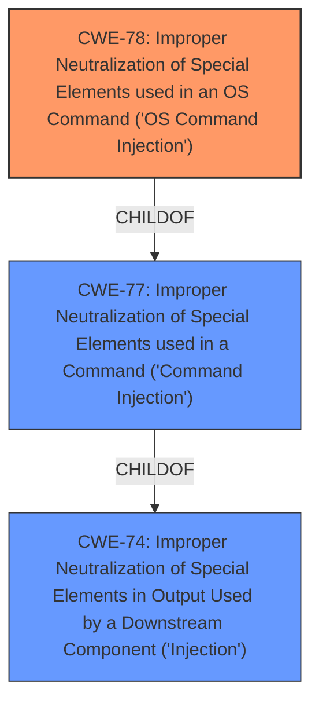

# Analysis for CVE-2021-26097

# Summary
| CWE ID | CWE Name | Confidence | CWE Abstraction Level | CWE Vulnerability Mapping Label | CWE-Vulnerability Mapping Notes |
|---|---|---|---|---|---|
| CWE-78 | Improper Neutralization of Special Elements used in an OS Command ('OS Command Injection') | 1.0 | Base | Allowed | Primary CWE |

## Evidence and Confidence

*   **Confidence Score:** 1.0
*   **Evidence Strength:** HIGH

## Relationship Analysis
The primary relationship that influenced the decision was the ChildOf relationship between CWE-78 (OS Command Injection) and CWE-77 (Command Injection). CWE-78 is a more specific case of CWE-77, focusing specifically on OS commands. Since the vulnerability description explicitly mentions "OS Command", CWE-78 was chosen as the more appropriate and specific classification. The Retriever Results also showed CWE-78 as the top combined result with a score of 1.0.

## Vulnerability Chain
The vulnerability chain starts with **improper input handling**, leading to **OS command injection**, which allows an authenticated attacker to execute unauthorized code or commands.

## Summary of Analysis
The initial analysis strongly points to CWE-78 due to the explicit mention of "OS Command Injection" in both the vulnerability description and the CVE Reference Links Content Summary. The vulnerability description key phrases also highlight **improper input handling** as a root cause and **OS command injection** as a weakness.

The evidence supporting this decision is strong:
- Vulnerability Description: "An **improper neutralization of special elements used in an OS Command** vulnerability..."
- Vulnerability Description Key Phrases: "**weakness:** **OS command injection**"
- CVE Reference Links Content Summary: "**Root cause of vulnerability:** Improper neutralization of special elements used in an OS command."

The relationship analysis reinforces this decision, as CWE-78 is a specific type of command injection. The Retriever Results further supports the choice of CWE-78 with a score of 1.0.

The selection of CWE-78 is at the optimal level of specificity because it directly addresses the type of command injection (OS command injection) present in the vulnerability.
I am confident in this assessment based on the provided evidence.

Relevant CWE Information:

# Enhanced Context (25 CWEs)
The following CWEs were identified as potentially relevant to this vulnerability:

## CWE-74: Improper Neutralization of Special Elements in Output Used by a Downstream Component ('Injection')
**Abstraction Level**: Class
**Similarity Score**: 0.73
**Source**: dense

**Description**:
The product constructs all or part of a command, data structure, or record using externally-influenced input from an upstream component, but it does not neutralize or incorrectly neutralizes special elements that could modify how it is parsed or interpreted when it is sent to a downstream component.

**Mapping Guidance**:
- Usage: Discouraged
- Rationale: CWE-74 is high-level and often misused when lower-level weaknesses are more appropriate.

*   **Why it was not used:** While CWE-74 is a parent of CWE-78 and relates to injection, it is a more general class. The vulnerability description specifically mentions "OS Command," making CWE-78 a more precise fit.

## CWE-77: Improper Neutralization of Special Elements used in a Command ('Command Injection')
**Abstraction Level**: Class
**Similarity Score**: 0.80
**Source**: dense

**Description**:
The product constructs all or part of a command using externally-influenced input from an upstream component, but it does not neutralize or incorrectly neutralizes special elements that could modify the intended command when it is sent to a downstream component.

**Mapping Guidance**:
- Usage: Allowed-with-Review
- Rationale: CWE-77 is often misused when OS command injection (CWE-78) was intended instead [REF-1287].

*   **Why it was not used:** CWE-77 is a parent of CWE-78, but less specific. The vulnerability explicitly involves OS commands, which makes CWE-78 the more suitable choice.

## CWE-89: Improper Neutralization of Special Elements used in an SQL Command ('SQL Injection')
**Abstraction Level**: Base
**Similarity Score**: 0.344
**Source**: sparse

**Description**:
The product constructs all or part of an SQL command using externally-influenced input from an upstream component, but it does not neutralize or incorrectly neutralizes special elements that could modify the intended SQL command when it is sent to a downstream component.

**Mapping Guidance**:
- Usage: Allowed
- Rationale: This CWE entry is at the Base level of abstraction, which is a preferred level of abstraction for mapping to the root causes of vulnerabilities.

*   **Why it was not used:** This CWE relates to SQL injection, which is not relevant to the vulnerability description about OS command injection.

## CWE-22: Improper Limitation of a Pathname to a Restricted Directory ('Path Traversal')
**Abstraction Level**: Base
**Similarity Score**: 0.313
**Source**: sparse

**Description**:
The product uses external input to construct a pathname that is intended to identify a file or directory that is located underneath a restricted parent directory, but the product does not properly neutralize special elements within the pathname that can cause the pathname to resolve to a location that is outside of the restricted directory.

**Mapping Guidance**:
- Usage: Allowed
- Rationale: This CWE entry is at the Base level of abstraction, which is a preferred level of abstraction for mapping to the root causes of vulnerabilities.

*   **Why it was not used:** This CWE relates to path traversal, which is not relevant to the vulnerability description about OS command injection.

## CWE-120: Buffer Copy without Checking Size of Input ('Classic Buffer Overflow')
**Abstraction Level**: Base
**Similarity Score**: 0.002
**Source**: graph

**Description**:
The product copies an input buffer to an output buffer without verifying that the size of the input buffer is less than the size of the output buffer, leading to a buffer overflow.

**Mapping Guidance**:
- Usage: Allowed-with-Review
- Rationale: There are some indications that this CWE ID might be misused and selected simply because it mentions "buffer overflow" - an increasingly vague term. This CWE entry is only appropriate for "Buffer Copy" operations (not buffer reads), in which where there is no "Checking [the] Size of Input", and (by implication of the copy) writing past the end of the buffer.

*   **Why it was not used:** This CWE relates to buffer overflows, which is not relevant to the vulnerability description about OS command injection.