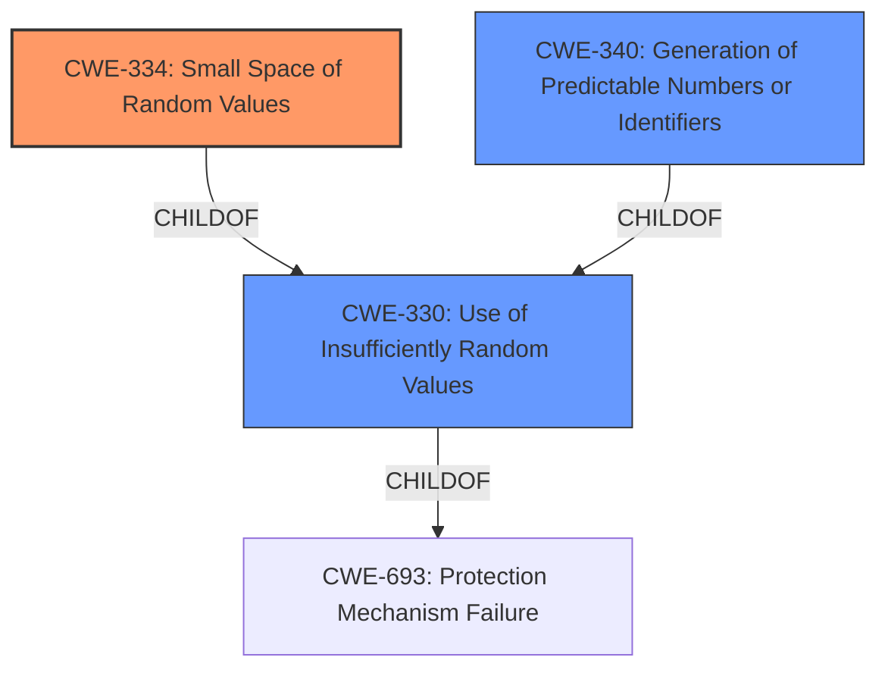

# Enhanced Analysis for CVE-2021-26098

# Summary
| CWE ID  | CWE Name                                                | Confidence | CWE Abstraction Level | CWE Vulnerability Mapping Label | CWE-Vulnerability Mapping Notes |
|---------|----------------------------------------------------------|------------|-----------------------|---------------------------------|---------------------------------|
| CWE-334 | Small Space of Random Values                            | 1          | Base                  | Primary CWE                     | Allowed                         |
| CWE-340 | Generation of Predictable Numbers or Identifiers        | 0.7        | Class                 | Secondary Candidate             | Allowed-with-Review           |
| CWE-330 | Use of Insufficiently Random Values                     | 0.6        | Class                 | Secondary Candidate             | Discouraged                     |

## Evidence and Confidence

*   **Confidence Score:** 0.9
*   **Evidence Strength:** HIGH

## Relationship Analysis
The primary CWE, CWE-334 **Small Space of Random Values**, is a child of CWE-330 **Use of Insufficiently Random Values**, which indicates a hierarchical relationship where CWE-334 is a more specific case of CWE-330. CWE-330 is a child of CWE-693 **Protection Mechanism Failure**. CWE-340 **Generation of Predictable Numbers or Identifiers** is also a child of CWE-330, representing a parallel classification. Selecting CWE-334 provides the most specific identification of the vulnerability.



## Vulnerability Chain
The vulnerability chain begins with the **ROOT CAUSE** of having a **small space of random values** (CWE-334). This leads to the possibility of predicting valid session IDs, allowing an attacker to gain unauthorized access or information.

## Summary of Analysis
The analysis is based on the provided vulnerability description and supporting evidence. The description explicitly mentions "**small space of random values**" as the **weakness**, which aligns directly with CWE-334 **Small Space of Random Values**. The CVE Reference Links Content Summary confirms this, stating that the root cause is the FortiSandbox RPC API using a **small space of random values** for generating session IDs, making them predictable. The retriever results also list CWE-334 as the top candidate with a high score.

CWE-334 is a Base level CWE, which is the preferred level of abstraction. The mapping guidance for CWE-334 states that it is ALLOWED and that one should carefully read both the name and description to ensure it is an appropriate fit. The vulnerability description and supporting evidence align perfectly with CWE-334.

CWE-330 **Use of Insufficiently Random Values** and CWE-340 **Generation of Predictable Numbers or Identifiers** were also considered. However, CWE-334 is a more specific case of both of these, making it the more appropriate choice. The mapping guidance for CWE-330 discourages its use and suggests examining its children for a better fit. Similarly, the mapping guidance for CWE-340 suggests examining its children for a better fit.

Therefore, based on the evidence and mapping guidance, CWE-334 **Small Space of Random Values** is the most appropriate CWE for this vulnerability.

Relevant CWE Information:

# Enhanced Context (25 CWEs)
The following CWEs were identified as potentially relevant to this vulnerability:

## CWE-330: Use of Insufficiently Random Values
**Abstraction Level**: Class
**Similarity Score**: 0.78
**Source**: dense

**Description**:
The product uses insufficiently random numbers or values in a security context that depends on unpredictable numbers.

**Mapping Guidance**:
- Usage: Discouraged
- Rationale: This CWE entry is a level-1 Class (i.e., a child of a Pillar). It might have lower-level children that would be more appropriate


## CWE-340: Generation of Predictable Numbers or Identifiers
**Abstraction Level**: Class
**Similarity Score**: 0.76
**Source**: dense

**Description**:
The product uses a scheme that generates numbers or identifiers that are more predictable than required.

**Mapping Guidance**:
- Usage: Allowed-with-Review
- Rationale: This CWE entry is a Class and might have Base-level children that would be more appropriate


## CWE-335: Incorrect Usage of Seeds in Pseudo-Random Number Generator (PRNG)
**Abstraction Level**: Base
**Similarity Score**: 0.76
**Source**: dense

**Description**:
The product uses a Pseudo-Random Number Generator (PRNG) but does not correctly manage seeds.

**Mapping Guidance**:
- Usage: Allowed
- Rationale: This CWE entry is at the Base level of abstraction, which is a preferred level of abstraction for mapping to the root causes of vulnerabilities.


## CWE-331: Insufficient Entropy
**Abstraction Level**: Base
**Similarity Score**: 0.76
**Source**: dense

**Description**:
The product uses an algorithm or scheme that produces insufficient entropy, leaving patterns or clusters of values that are more likely to occur than others.

**Mapping Guidance**:
- Usage: Allowed
- Rationale: This CWE entry is at the Base level of abstraction, which is a preferred level of abstraction for mapping to the root causes of vulnerabilities.


## CWE-334: Small Space of Random Values
**Abstraction Level**: Base
**Similarity Score**: 0.75
**Source**: dense

**Description**:
The number of possible random values is smaller than needed by the product, making it more susceptible to brute force attacks.

**Mapping Guidance**:
- Usage: Allowed
- Rationale: This CWE entry is at the Base level of abstraction, which is a preferred level of abstraction for mapping to the root causes of vulnerabilities.


## CWE-1391: Use of Weak Credentials
**Abstraction Level**: Class
**Similarity Score**: 0.74
**Source**: dense

**Description**:
The product uses weak credentials (such as a default key or hard-coded password) that can be calculated, derived, reused, or guessed by an attacker.

**Mapping Guidance**:
- Usage: Allowed-with-Review
- Rationale: This CWE entry is a Class and might have Base-level children that would be more appropriate


## CWE-345: Insufficient Verification of Data Authenticity
**Abstraction Level**: Class
**Similarity Score**: 0.73
**Source**: dense

**Description**:
The product does not sufficiently verify the origin or authenticity of data, in a way that causes it to accept invalid data.

**Mapping Guidance**:
- Usage: Discouraged
- Rationale: This CWE entry is a level-1 Class (i.e., a child of a Pillar). It might have lower-level children that would be more appropriate


## CWE-337: Predictable Seed in Pseudo-Random Number Generator (PRNG)
**Abstraction Level**: Variant
**Similarity Score**: 0.73
**Source**: dense

**Description**:
A Pseudo-Random Number Generator (PRNG) is initialized from a predictable seed, such as the process ID or system time.

**Mapping Guidance**:
- Usage: Allowed
- Rationale: This CWE entry is at the Variant level of abstraction, which is a preferred level of abstraction for mapping to the root causes of vulnerabilities.


## CWE-668: Exposure of Resource to Wrong Sphere
**Abstraction Level**: Class
**Similarity Score**: 0.73
**Source**: dense

**Description**:
The product exposes a resource to the wrong control sphere, providing unintended actors with inappropriate access to the resource.

**Mapping Guidance**:
- Usage: Discouraged
- Rationale: CWE-668 is high-level and is often misused as a catch-all when lower-level CWE IDs might be applicable. It is sometimes used for low-information vulnerability reports [REF-1287]. It is a level-1 Class (i.e., a child of a Pillar). It is not useful for trend analysis.


## CWE-341: Predictable from Observable State
**Abstraction Level**: Base
**Similarity Score**: 0.72
**Source**: dense

**Description**:
A number or object is predictable based on observations that the attacker can make about the state of the system or network, such as time, process ID, etc.

**Mapping Guidance**:
- Usage: Allowed
- Rationale: This CWE entry is at the Base level of abstraction, which


## CWE Relationship Analysis

Current CWEs represent these abstraction levels: .


### Vulnerability Chain Analysis

**Chain starting from CWE-331:**
- 331 (Insufficient Entropy) - ROOT


**Chain starting from CWE-335:**
- 335 (Incorrect Usage of Seeds in Pseudo-Random Number Generator (PRNG)) - ROOT


### CWE Relationship Diagram

```mermaid
graph TD
    classDef primary fill:#f96,stroke:#333,stroke-width:2px
    classDef secondary fill:#69f,stroke:#333
    classDef tertiary fill:#9e9,stroke:#333
```