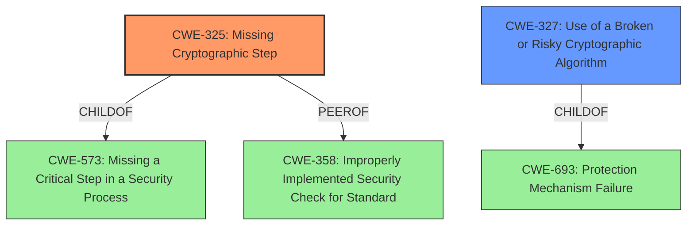

# Analysis for CVE-2021-26100

# Summary
| CWE ID | CWE Name | Confidence | CWE Abstraction Level | CWE Vulnerability Mapping Label | CWE-Vulnerability Mapping Notes |
|---|---|---|---|---|---|
| CWE-325 | Missing Cryptographic Step | 1.0 | Base | Allowed | Primary CWE |
| CWE-327 | Use of a Broken or Risky Cryptographic Algorithm | 0.5 | Class | Allowed-with-Review | Secondary Candidate |

## Evidence and Confidence

*   **Confidence Score:** 1.0
*   **Evidence Strength:** HIGH

## Relationship Analysis
The primary CWE selected is CWE-325 (Missing Cryptographic Step), which is a Base level CWE. CWE-325 is child of CWE-573 (Missing a Critical Step in a Security Process) and has a peer relationship with CWE-358 (Improperly Implemented Security Check for Standard). CWE-327 (Use of a Broken or Risky Cryptographic Algorithm) is considered as a secondary candidate, as the **missing step** could be related to a broken or risky algorithm. CWE-327 is a Class level CWE and a child of CWE-693 (Protection Mechanism Failure).

## Vulnerability Chain
The vulnerability chain starts with a **missing cryptographic step** (CWE-325), which leads to the ability for an unauthenticated attacker to manipulate encrypted messages and recover plaintexts. The **missing cryptographic step** is the root cause.

## Summary of Analysis
The primary assessment is based on the evidence from the "Vulnerability Description Key Phrases" and "CVE Reference Links Content Summary", which both point to a **missing cryptographic step**.

The "Vulnerability Description" states: "A **missing cryptographic step** in the Identity-Based Encryption service of FortiMail before 7.0.0 may allow an unauthenticated attacker who intercepts the encrypted messages to manipulate them in such a way that makes the tampering and the recovery of the plaintexts possible."

The "CVE Reference Links Content Summary" states: "Root cause of vulnerability: A missing cryptographic step in FortiMail's Identity-Based Encryption (IBE) implementation."

CWE-325 (Missing Cryptographic Step) is the most specific and appropriate CWE because it directly addresses the root cause described in the vulnerability. The retriever results also list CWE-325 as the top candidate.

CWE-327 (Use of a Broken or Risky Cryptographic Algorithm) was considered as a secondary CWE, but the description focuses more on the algorithm itself being flawed, rather than a step being missed.

Relevant CWE Information:
- CWE-325: Missing Cryptographic Step
- CWE-327: Use of a Broken or Risky Cryptographic Algorithm