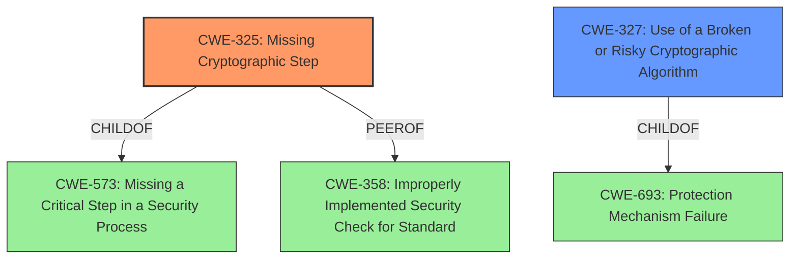

# Analysis for CVE-2021-26100

# Summary
| CWE ID | CWE Name | Confidence | CWE Abstraction Level | CWE Vulnerability Mapping Label | CWE-Vulnerability Mapping Notes |
|---|---|---|---|---|---|
| CWE-325 | Missing Cryptographic Step | 1.0 | Base | Allowed | Primary CWE |
| CWE-327 | Use of a Broken or Risky Cryptographic Algorithm | 0.5 | Class | Allowed-with-Review | Secondary Candidate |

## Evidence and Confidence

*   **Confidence Score:** 1.0
*   **Evidence Strength:** HIGH

## Relationship Analysis
The primary CWE selected is CWE-325 (Missing Cryptographic Step), which is a Base level CWE. CWE-325 is child of CWE-573 (Missing a Critical Step in a Security Process) and has a peer relationship with CWE-358 (Improperly Implemented Security Check for Standard). CWE-327 (Use of a Broken or Risky Cryptographic Algorithm) is considered as a secondary candidate, as the **missing step** could be related to a broken or risky algorithm. CWE-327 is a Class level CWE and a child of CWE-693 (Protection Mechanism Failure).

## Vulnerability Chain
The vulnerability chain starts with a **missing cryptographic step** (CWE-325), which leads to the ability for an unauthenticated attacker to manipulate encrypted messages and recover plaintexts. The **missing cryptographic step** is the root cause.

## Summary of Analysis
The primary assessment is based on the evidence from the "Vulnerability Description Key Phrases" and "CVE Reference Links Content Summary", which both point to a **missing cryptographic step**.

The "Vulnerability Description" states: "A **missing cryptographic step** in the Identity-Based Encryption service of FortiMail before 7.0.0 may allow an unauthenticated attacker who intercepts the encrypted messages to manipulate them in such a way that makes the tampering and the recovery of the plaintexts possible."

The "CVE Reference Links Content Summary" states: "Root cause of vulnerability: A missing cryptographic step in FortiMail's Identity-Based Encryption (IBE) implementation."

CWE-325 (Missing Cryptographic Step) is the most specific and appropriate CWE because it directly addresses the root cause described in the vulnerability. The retriever results also list CWE-325 as the top candidate.

CWE-327 (Use of a Broken or Risky Cryptographic Algorithm) was considered as a secondary CWE, but the description focuses more on the algorithm itself being flawed, rather than a step being missed.

Relevant CWE Information:
- CWE-325: Missing Cryptographic Step
- CWE-327: Use of a Broken or Risky Cryptographic Algorithm

# Enhanced Query for CVE-2021-26100

## Vulnerability Description
A **missing cryptographic step** in the Identity-Based Encryption service of FortiMail before 7.0.0 may allow an unauthenticated attacker who intercepts the encrypted messages to manipulate them in such a way that makes the tampering and the recovery of the plaintexts possible.

### Vulnerability Description Key Phrases
- **rootcause:** **missing cryptographic step**
- **impact:** manipulate encrypted messages and tampering and plaintext recovery
- **attacker:** unauthenticated attacker
- **product:** FortiMail
- **version:** before 7.0.0
- **component:** Identity-Based Encryption service

## CVE Reference Links Content Summary
- **Root cause of vulnerability**: A missing cryptographic step in FortiMail's Identity-Based Encryption (IBE) implementation.
- **Weaknesses/vulnerabilities present**: Improper access control due to a missing cryptographic step that leads to unauthenticated encryption manipulation.
- **Impact of exploitation**: An attacker who intercepts encrypted messages can manipulate them to recover the plaintext without authentication.
- **Attack vectors**: Interception and manipulation of encrypted messages.
- **Required attacker capabilities/position**: An attacker needs to be in a position to intercept FortiMail IBE encrypted messages. No authentication is required.

## Retriever Results

### Top Combined Results

| Rank | CWE ID | Name | Abstraction | Usage  | Retrievers | Individual Scores |
|------|--------|------|-------------|-------|------------|-------------------|
| 1 | 325 | Missing Cryptographic Step | Base | Allowed | sparse | 0.499 |
| 2 | 327 | Use of a Broken or Risky Cryptographic Algorithm | Class | Allowed-with-Review | sparse | 0.294 |
| 3 | 321 | Use of Hard-coded Cryptographic Key | Variant | Allowed | sparse | 0.281 |
| 4 | 347 | Improper Verification of Cryptographic Signature | Base | Allowed | sparse | 0.279 |
| 5 | 1240 | Use of a Cryptographic Primitive with a Risky Implementation | Base | Allowed | sparse | 0.267 |
| 6 | 649 | Reliance on Obfuscation or Encryption of Security-Relevant Inputs without Integrity Checking | Base | Allowed | dense | 0.536 |
| 7 | 208 | Observable Timing Discrepancy | Base | Allowed | graph | 0.002 |
| 8 | 1204 | Generation of Weak Initialization Vector (IV) | Base | Allowed | sparse | 0.264 |
| 9 | 862 | Missing Authorization | Class | Allowed-with-Review | sparse | 0.263 |
| 10 | 203 | Observable Discrepancy | Base | Allowed | sparse | 0.262 |

# Complete CWE Specifications

## CWE-325: Missing Cryptographic Step
**Abstraction:** Base
**Status:** Draft

### Description
The product does not implement a required step in a cryptographic algorithm, resulting in weaker encryption than advertised by the algorithm.

### Extended Description
Not provided

### Alternative Terms
None

### Relationships
ChildOf -> CWE-573
PeerOf -> CWE-358

### Mapping Guidance
**Usage:** Allowed
**Rationale:** This CWE entry is at the Base level of abstraction, which is a preferred level of abstraction for mapping to the root causes of vulnerabilities.
**Comments:** Carefully read both the name and description to ensure that this mapping is an appropriate fit. Do not try to 'force' a mapping to a lower-level Base/Variant simply to comply with this preferred level of abstraction.
**Reasons:**
- Acceptable-Use

### Additional Notes
**[Relationship]** Overlaps incomplete/missing security check.

**[Relationship]** Can be resultant.

### Observed Examples
- **CVE-2001-1585:** Missing challenge-response step allows authentication bypass using public key.

## CWE-327: Use of a Broken or Risky Cryptographic Algorithm
**Abstraction:** Class
**Status:** Draft

### Description
The product uses a broken or risky cryptographic algorithm or protocol.

### Extended Description

Cryptographic algorithms are the methods by which data is scrambled to prevent observation or influence by unauthorized actors. Insecure cryptography can be exploited to expose sensitive information, modify data in unexpected ways, spoof identities of other users or devices, or other impacts.

It is very difficult to produce a secure algorithm, and even high-profile algorithms by accomplished cryptographic experts have been broken. Well-known techniques exist to break or weaken various kinds of cryptography. Accordingly, there are a small number of well-understood and heavily studied algorithms that should be used by most products. Using a non-standard or known-insecure algorithm is dangerous because a determined adversary may be able to break the algorithm and compromise whatever data has been protected.

Since the state of cryptography advances so rapidly, it is common for an algorithm to be considered "unsafe" even if it was once thought to be strong. This can happen when new attacks are discovered, or if computing power increases so much that the cryptographic algorithm no longer provides the amount of protection that was originally thought.

For a number of reasons, this weakness is even more challenging to manage with hardware deployment of cryptographic algorithms as opposed to software implementation. First, if a flaw is discovered with hardware-implemented cryptography, the flaw cannot be fixed in most cases without a recall of the product, because hardware is not easily replaceable like software. Second, because the hardware product is expected to work for years, the adversary's computing power will only increase over time.

### Alternative Terms
None

### Relationships
ChildOf -> CWE-693
PeerOf -> CWE-311

### Mapping Guidance
**Usage:** Allowed-with-Review
**Rationale:** This CWE entry is a Class and might have Base-level children that would be more appropriate
**Comments:** Examine children of this entry to see if there is a better fit
**Reasons:**
- Abstraction

### Additional Notes
**[Maintenance]** Since CWE 4.4, various cryptography-related entries, including CWE-327 and CWE-1240, have been slated for extensive research, analysis, and community consultation to define consistent terminology, improve relationships, and reduce overlap or duplication. As of CWE 4.6, this work is still ongoing.

**[Maintenance]** The Taxonomy_Mappings to ISA/IEC 62443 were added in CWE 4.10, but they are still under review and might change in future CWE versions. These draft mappings were performed by members of the "Mapping CWE to 62443" subgroup of the CWE-CAPEC ICS/OT Special Interest Group (SIG), and their work is incomplete as of CWE 4.10. The mappings are included to facilitate discussion and review by the broader ICS/OT community, and they are likely to change in future CWE versions.

### Observed Examples
- **CVE-2022-30273:** SCADA-based protocol supports a legacy encryption mode that uses Tiny Encryption Algorithm (TEA) in ECB mode, which leaks patterns in messages and cannot protect integrity
- **CVE-2022-30320:** Programmable Logic Controller (PLC) uses a protocol with a cryptographically insecure hashing algorithm for passwords.
- **CVE-2008-3775:** Product uses "ROT-25" to obfuscate the password in the registry.

## CWE-321: Use of Hard-coded Cryptographic Key
**Abstraction:** Variant
**Status:** Draft

### Description
The use of a hard-coded cryptographic key significantly increases the possibility that encrypted data may be recovered.

### Extended Description
Not provided

### Alternative Terms
None

### Relationships
ChildOf -> CWE-798
ChildOf -> CWE-798
ChildOf -> CWE-798

### Mapping Guidance
**Usage:** Allowed
**Rationale:** This CWE entry is at the Variant level of abstraction, which is a preferred level of abstraction for mapping to the root causes of vulnerabilities.
**Comments:** Carefully read both the name and description to ensure that this mapping is an appropriate fit. Do not try to 'force' a mapping to a lower-level Base/Variant simply to comply with this preferred level of abstraction.
**Reasons:**
- Acceptable-Use

### Additional Notes
**[Other]** The main difference between the use of hard-coded passwords and the use of hard-coded cryptographic keys is the false sense of security that the former conveys. Many people believe that simply hashing a hard-coded password before storage will protect the information from malicious users. However, many hashes are reversible (or at least vulnerable to brute force attacks) -- and further, many authentication protocols simply request the hash itself, making it no better than a password.

**[Maintenance]** The Taxonomy_Mappings to ISA/IEC 62443 were added in CWE 4.10, but they are still under review and might change in future CWE versions. These draft mappings were performed by members of the "Mapping CWE to 62443" subgroup of the CWE-CAPEC ICS/OT Special Interest Group (SIG), and their work is incomplete as of CWE 4.10. The mappings are included to facilitate discussion and review by the broader ICS/OT community, and they are likely to change in future CWE versions.

### Observed Examples
- **CVE-2022-29960:** Engineering Workstation uses hard-coded cryptographic keys that could allow for unathorized filesystem access and privilege escalation
- **CVE-2022-30271:** Remote Terminal Unit (RTU) uses a hard-coded SSH private key that is likely to be used by default.
- **CVE-2020-10884:** WiFi router service has a hard-coded encryption key, allowing root access

## CWE-347: Improper Verification of Cryptographic Signature
**Abstraction:** Base
**Status:** Draft

### Description
The product does not verify, or incorrectly verifies, the cryptographic signature for data.

### Extended Description
Not provided

### Alternative Terms
None

### Relationships
ChildOf -> CWE-345
ChildOf -> CWE-345

### Mapping Guidance
**Usage:** Allowed
**Rationale:** This CWE entry is at the Base level of abstraction, which is a preferred level of abstraction for mapping to the root causes of vulnerabilities.
**Comments:** Carefully read both the name and description to ensure that this mapping is an appropriate fit. Do not try to 'force' a mapping to a lower-level Base/Variant simply to comply with this preferred level of abstraction.
**Reasons:**
- Acceptable-Use

### Observed Examples
- **CVE-2002-1796:** Does not properly verify signatures for "trusted" entities.
- **CVE-2005-2181:** Insufficient verification allows spoofing.
- **CVE-2005-2182:** Insufficient verification allows spoofing.

## CWE-1240: Use of a Cryptographic Primitive with a Risky Implementation
**Abstraction:** Base
**Status:** Draft

### Description
To fulfill the need for a cryptographic primitive, the product implements a cryptographic algorithm using a non-standard, unproven, or disallowed/non-compliant cryptographic implementation.

### Extended Description

Cryptographic protocols and systems depend on cryptographic primitives (and associated algorithms) as their basic building blocks. Some common examples of primitives are digital signatures, one-way hash functions, ciphers, and public key cryptography; however, the notion of "primitive" can vary depending on point of view. See "Terminology Notes" for further explanation of some concepts.

Cryptographic primitives are defined to accomplish one very specific task in a precisely defined and mathematically reliable fashion. For example, suppose that for a specific cryptographic primitive (such as an encryption routine), the consensus is that the primitive can only be broken after trying out N different inputs (where the larger the value of N, the stronger the cryptography). For an encryption scheme like AES-256, one would expect N to be so large as to be infeasible to execute in a reasonable amount of time.

If a vulnerability is ever found that shows that one can break a cryptographic primitive in significantly less than the expected number of attempts, then that primitive is considered weakened (or sometimes in extreme cases, colloquially it is "broken"). As a result, anything using this cryptographic primitive would now be considered insecure or risky. Thus, even breaking or weakening a seemingly small cryptographic primitive has the potential to render the whole system vulnerable, due to its reliance on the primitive. A historical example can be found in TLS when using DES. One would colloquially call DES the cryptographic primitive for transport encryption in this version of TLS. In the past, DES was considered strong, because no weaknesses were found in it; importantly, DES has a key length of 56 bits. Trying N=2^56 keys was considered impractical for most actors. Unfortunately, attacking a system with 56-bit keys is now practical via brute force, which makes defeating DES encryption practical. It is now practical for an adversary to read any information sent under this version of TLS and use this information to attack the system. As a result, it can be claimed that this use of TLS is weak, and that any system depending on TLS with DES could potentially render the entire system vulnerable to attack.

Cryptographic primitives and associated algorithms are only considered safe after extensive research and review from experienced cryptographers from academia, industry, and government entities looking for any possible flaws. Furthermore, cryptographic primitives and associated algorithms are frequently reevaluated for safety when new mathematical and attack techniques are discovered. As a result and over time, even well-known cryptographic primitives can lose their compliance status with the discovery of novel attacks that might either defeat the algorithm or reduce its robustness significantly.

If ad-hoc cryptographic primitives are implemented, it is almost certain that the implementation will be vulnerable to attacks that are well understood by cryptographers, resulting in the exposure of sensitive information and other consequences.

This weakness is even more difficult to manage for hardware-implemented deployment of cryptographic algorithms. First, because hardware is not patchable as easily as software, any flaw discovered after release and production typically cannot be fixed without a recall of the product. Secondly, the hardware product is often expected to work for years, during which time computation power available to the attacker only increases. Therefore, for hardware implementations of cryptographic primitives, it is absolutely essential that only strong, proven cryptographic primitives are used.

### Alternative Terms
None

### Relationships
ChildOf -> CWE-327

### Mapping Guidance
**Usage:** Allowed
**Rationale:** This CWE entry is at the Base level of abstraction, which is a preferred level of abstraction for mapping to the root causes of vulnerabilities.
**Comments:** Carefully read both the name and description to ensure that this mapping is an appropriate fit. Do not try to 'force' a mapping to a lower-level Base/Variant simply to comply with this preferred level of abstraction.
**Reasons:**
- Acceptable-Use

### Additional Notes
**[Terminology]** 

 Terminology for cryptography varies widely, from informal and colloquial to mathematically-defined, with different precision and formalism depending on whether the stakeholder is a developer, cryptologist, etc. Yet there is a need for CWE to be self-consistent while remaining understandable and acceptable to multiple audiences.

As of CWE 4.6, CWE terminology around "primitives" and "algorithms" is emerging as shown by the following example, subject to future consultation and agreement within the CWE and cryptography communities. Suppose one wishes to send encrypted data using a CLI tool such as OpenSSL. One might choose to use AES with a 256-bit key and require tamper protection (GCM mode, for instance). For compatibility's sake, one might also choose the ciphertext to be formatted to the PKCS#5 standard. In this case, the "cryptographic system" would be AES-256-GCM with PKCS#5 formatting. The "cryptographic function" would be AES-256 in the GCM mode of operation, and the "algorithm" would be AES. Colloquially, one would say that AES (and sometimes AES-256) is the "cryptographic primitive," because it is the algorithm that realizes the concept of symmetric encryption (without modes of operation or other protocol related modifications). In practice, developers and architects typically refer to base cryptographic algorithms (AES, SHA, etc.) as cryptographic primitives.

**[Maintenance]** Since CWE 4.4, various cryptography-related entries, including CWE-327 and CWE-1240, have been slated for extensive research, analysis, and community consultation to define consistent terminology, improve relationships, and reduce overlap or duplication. As of CWE 4.6, this work is still ongoing.

### Observed Examples
- **CVE-2020-4778:** software uses MD5, which is less safe than the default SHA-256 used by related products
- **CVE-2005-2946:** Default configuration of product uses MD5 instead of stronger algorithms that are available, simplifying forgery of certificates.
- **CVE-2019-3907:** identity card uses MD5 hash of a salt and password

## CWE-649: Reliance on Obfuscation or Encryption of Security-Relevant Inputs without Integrity Checking
**Abstraction:** Base
**Status:** Incomplete

### Description
The product uses obfuscation or encryption of inputs that should not be mutable by an external actor, but the product does not use integrity checks to detect if those inputs have been modified.

### Extended Description
When an application relies on obfuscation or incorrectly applied / weak encryption to protect client-controllable tokens or parameters, that may have an effect on the user state, system state, or some decision made on the server. Without protecting the tokens/parameters for integrity, the application is vulnerable to an attack where an adversary traverses the space of possible values of the said token/parameter in order to attempt to gain an advantage. The goal of the attacker is to find another admissible value that will somehow elevate their privileges in the system, disclose information or change the behavior of the system in some way beneficial to the attacker. If the application does not protect these critical tokens/parameters for integrity, it will not be able to determine that these values have been tampered with. Measures that are used to protect data for confidentiality should not be relied upon to provide the integrity service.

### Alternative Terms
None

### Relationships
ChildOf -> CWE-345

### Mapping Guidance
**Usage:** Allowed
**Rationale:** This CWE entry is at the Base level of abstraction, which is a preferred level of abstraction for mapping to the root causes of vulnerabilities.
**Comments:** Carefully read both the name and description to ensure that this mapping is an appropriate fit. Do not try to 'force' a mapping to a lower-level Base/Variant simply to comply with this preferred level of abstraction.
**Reasons:**
- Acceptable-Use

### Observed Examples
- **CVE-2005-0039:** An IPSec configuration does not perform integrity checking of the IPSec packet as the result of either not configuring ESP properly to support the integrity service or using AH improperly. In either case, the security gateway receiving the IPSec packet would not validate the integrity of the packet to ensure that it was not changed. Thus if the packets were intercepted the attacker could undetectably change some of the bits in the packets. The meaningful bit flipping was possible due to the known weaknesses in the CBC encryption mode. Since the attacker knew the structure of the packet, they were able (in one variation of the attack) to use bit flipping to change the destination IP of the packet to the destination machine controlled by the attacker. And so the destination security gateway would decrypt the packet and then forward the plaintext to the machine controlled by the attacker. The attacker could then read the original message. For instance if VPN was used with the vulnerable IPSec configuration the attacker could read the victim's e-mail. This vulnerability demonstrates the need to enforce the integrity service properly when critical data could be modified by an attacker. This problem might have also been mitigated by using an encryption mode that is not susceptible to bit flipping attacks, but the preferred mechanism to address this problem still remains message verification for integrity. While this attack focuses on the network layer and requires an entity that controls part of the communication path such as a router, the situation is not much different at the software level, where an attacker can modify tokens/parameters used by the application.

## CWE-208: Observable Timing Discrepancy
**Abstraction:** Base
**Status:** Incomplete

### Description
Two separate operations in a product require different amounts of time to complete, in a way that is observable to an actor and reveals security-relevant information about the state of the product, such as whether a particular operation was successful or not.

### Extended Description
In security-relevant contexts, even small variations in timing can be exploited by attackers to indirectly infer certain details about the product's internal operations. For example, in some cryptographic algorithms, attackers can use timing differences to infer certain properties about a private key, making the key easier to guess. Timing discrepancies effectively form a timing side channel.

### Alternative Terms
None

### Relationships
ChildOf -> CWE-203
CanPrecede -> CWE-385
CanPrecede -> CWE-327

### Mapping Guidance
**Usage:** Allowed
**Rationale:** This CWE entry is at the Base level of abstraction, which is a preferred level of abstraction for mapping to the root causes of vulnerabilities.
**Comments:** Carefully read both the name and description to ensure that this mapping is an appropriate fit. Do not try to 'force' a mapping to a lower-level Base/Variant simply to comply with this preferred level of abstraction.
**Reasons:**
- Acceptable-Use

### Additional Notes
**[Relationship]** Often primary in cryptographic applications and algorithms.

**[Maintenance]** CWE 4.16 removed a demonstrative example for a hardware module because it was inaccurate and unable to be adapted. The CWE team is developing an alternative.

### Observed Examples
- **CVE-2019-10071:** Java-oriented framework compares HMAC signatures using String.equals() instead of a constant-time algorithm, causing timing discrepancies
- **CVE-2019-10482:** Smartphone OS uses comparison functions that are not in constant time, allowing side channels
- **CVE-2014-0984:** Password-checking function in router terminates validation of a password entry when it encounters the first incorrect character, which allows remote attackers to obtain passwords via a brute-force attack that relies on timing differences in responses to incorrect password guesses, aka a timing side-channel attack.

## CWE-1204: Generation of Weak Initialization Vector (IV)
**Abstraction:** Base
**Status:** Incomplete

### Description
The product uses a cryptographic primitive that uses an Initialization
			Vector (IV), but the product does not generate IVs that are
			sufficiently unpredictable or unique according to the expected
			cryptographic requirements for that primitive.
			

### Extended Description
By design, some cryptographic primitives (such as block ciphers) require that IVs must have certain properties for the uniqueness and/or unpredictability of an IV. Primitives may vary in how important these properties are. If these properties are not maintained, e.g. by a bug in the code, then the cryptography may be weakened or broken by attacking the IVs themselves.

### Alternative Terms
None

### Relationships
ChildOf -> CWE-330

### Mapping Guidance
**Usage:** Allowed
**Rationale:** This CWE entry is at the Base level of abstraction, which is a preferred level of abstraction for mapping to the root causes of vulnerabilities.
**Comments:** Carefully read both the name and description to ensure that this mapping is an appropriate fit. Do not try to 'force' a mapping to a lower-level Base/Variant simply to comply with this preferred level of abstraction.
**Reasons:**
- Acceptable-Use

### Additional Notes
**[Maintenance]** As of CWE 4.5, terminology related to randomness, entropy, and predictability can vary widely. Within the developer and other communities, "randomness" is used heavily. However, within cryptography, "entropy" is distinct, typically implied as a measurement. There are no commonly-used definitions, even within standards documents and cryptography papers. Future versions of CWE will attempt to define these terms and, if necessary, distinguish between them in ways that are appropriate for different communities but do not reduce the usability of CWE for mapping, understanding, or other scenarios.

### Observed Examples
- **CVE-2020-1472:** ZeroLogon vulnerability - use of a static IV of all zeroes in AES-CFB8 mode
- **CVE-2011-3389:** BEAST attack in SSL 3.0 / TLS 1.0. In CBC mode, chained initialization vectors are non-random, allowing decryption of HTTPS traffic using a chosen plaintext attack.
- **CVE-2001-0161:** wireless router does not use 6 of the 24 bits for WEP encryption, making it easier for attackers to decrypt traffic

## CWE-862: Missing Authorization
**Abstraction:** Class
**Status:** Incomplete

### Description
The product does not perform an authorization check when an actor attempts to access a resource or perform an action.

### Extended Description
Not provided

### Alternative Terms
AuthZ: "AuthZ" is typically used as an abbreviation of "authorization" within the web application security community. It is distinct from "AuthN" (or, sometimes, "AuthC") which is an abbreviation of "authentication." The use of "Auth" as an abbreviation is discouraged, since it could be used for either authentication or authorization.

### Relationships
ChildOf -> CWE-285
ChildOf -> CWE-284

### Mapping Guidance
**Usage:** Allowed-with-Review
**Rationale:** This CWE entry is a Class and might have Base-level children that would be more appropriate
**Comments:** Examine children of this entry to see if there is a better fit
**Reasons:**
- Abstraction

### Additional Notes
**[Terminology]** Assuming a user with a given identity, authorization is the process of determining whether that user can access a given resource, based on the user's privileges and any permissions or other access-control specifications that apply to the resource.

### Observed Examples
- **CVE-2022-24730:** Go-based continuous deployment product does not check that a user has certain privileges to update or create an app, allowing adversaries to read sensitive repository information
- **CVE-2009-3168:** Web application does not restrict access to admin scripts, allowing authenticated users to reset administrative passwords.
- **CVE-2009-3597:** Web application stores database file under the web root with insufficient access control (CWE-219), allowing direct request.

## CWE-203: Observable Discrepancy
**Abstraction:** Base
**Status:** Incomplete

### Description
The product behaves differently or sends different responses under different circumstances in a way that is observable to an unauthorized actor, which exposes security-relevant information about the state of the product, such as whether a particular operation was successful or not.

### Extended Description
Discrepancies can take many forms, and variations may be detectable in timing, control flow, communications such as replies or requests, or general behavior. These discrepancies can reveal information about the product's operation or internal state to an unauthorized actor. In some cases, discrepancies can be used by attackers to form a side channel.

### Alternative Terms
Side Channel Attack: Observable Discrepancies are at the root of side channel attacks.

### Relationships
ChildOf -> CWE-200
ChildOf -> CWE-200

### Mapping Guidance
**Usage:** Allowed
**Rationale:** This CWE entry is at the Base level of abstraction, which is a preferred level of abstraction for mapping to the root causes of vulnerabilities.
**Comments:** Carefully read both the name and description to ensure that this mapping is an appropriate fit. Do not try to 'force' a mapping to a lower-level Base/Variant simply to comply with this preferred level of abstraction.
**Reasons:**
- Acceptable-Use

### Observed Examples
- **CVE-2020-8695:** Observable discrepancy in the RAPL interface for some Intel processors allows information disclosure.
- **CVE-2019-14353:** Crypto hardware wallet's power consumption relates to total number of pixels illuminated, creating a side channel in the USB connection that allows attackers to determine secrets displayed such as PIN numbers and passwords
- **CVE-2019-10071:** Java-oriented framework compares HMAC signatures using String.equals() instead of a constant-time algorithm, causing timing discrepancies

