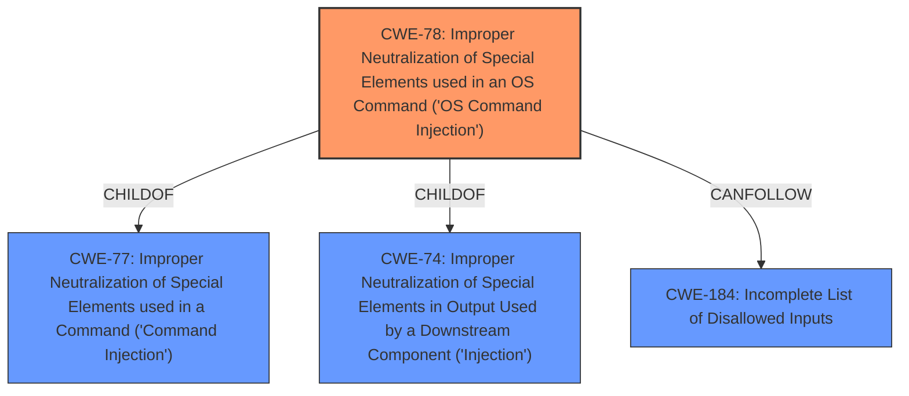

# Enhanced Analysis for CVE-2021-26106

# Summary
| CWE ID | CWE Name | Confidence | CWE Abstraction Level | CWE Vulnerability Mapping Label | CWE-Vulnerability Mapping Notes |
|---|---|---|---|---|---|
| CWE-78 | Improper Neutralization of Special Elements used in an OS Command ('OS Command Injection') | 1.0 | Base | Allowed | Primary CWE |

## Evidence and Confidence

*   **Confidence Score:** 1.0
*   **Evidence Strength:** HIGH

## Relationship Analysis
The primary relationship influencing the decision is that CWE-78 is a child of CWE-77 and CWE-74. While CWE-77 is a broader class, CWE-78 specifically addresses OS Command Injection, which aligns perfectly with the vulnerability description. The description explicitly mentions "OS Command" and "execute unauthorized commands", solidifying the selection of CWE-78 over its parent classes. The graph relationship confirms that CWE-78 can follow CWE-184, suggesting a potential scenario where incomplete input validation could lead to command injection.



## Vulnerability Chain
The vulnerability chain starts with the **improper neutralization of special elements** used in an OS command. This allows an authenticated attacker to inject crafted arguments into the `kdbg` CLI command. The final impact is the execution of unauthorized commands.
  - **Root Cause:** **Improper Neutralization of Special Elements used in an OS Command** (CWE-78)
  - **Impact:** Execution of unauthorized commands.

## Summary of Analysis
The initial analysis strongly pointed towards CWE-78 due to the explicit mention of "OS Command Injection" and "improper neutralization of special elements" in the vulnerability description and CVE Reference Links Content Summary. The retriever results further supported this selection with a high similarity score. The relationship analysis confirmed that CWE-78 is a more specific and appropriate choice than its parent classes (CWE-77 and CWE-74). The decision is based on the evidence that the vulnerability involves **improper neutralization** in the context of OS commands, leading to unauthorized command execution. The selection of CWE-78 is at the optimal level of specificity, as it directly reflects the nature of the weakness.

Relevant CWE Information:
- Vulnerability Description: "An **improper neutralization of special elements** used in an OS Command vulnerability in FortiAPs console ... may allow an authenticated attacker to execute unauthorized commands by running the kdbg CLI command with specifically crafted arguments."
- Vulnerability Description Key Phrases:
  - **rootcause:** **improper neutralization of special elements**
  - **weakness:** **os command injection**
- CVE Reference Links Content Summary:
  - **Root cause of vulnerability:** Improper neutralization of special elements used in an OS command within the FortiAP console.
  - **Weaknesses/vulnerabilities present:** OS Command Injection vulnerability.
  - **Impact of exploitation:** An authenticated attacker can execute unauthorized code or commands.
  - **Attack vectors:** By running the `kdbg` CLI command with specifically crafted arguments.

CWEs Considered and Rejected:

*   CWE-77: While related, it's a broader category ("Command Injection"). The description explicitly specifies "OS Command," making CWE-78 a more precise fit.
*   CWE-89: Relates to SQL injection, which is not applicable here.
*   CWE-1336: Relates to template engine injection, not applicable.
*   CWE-138: Too generic, as it refers to the **improper neutralization of special elements** without specifying the context of OS commands.
*   CWE-269: Relates to privilege management, which is not the root cause of this vulnerability. The issue is **improper neutralization**, not privilege assignment.
*   CWE-917: Relates to Expression Language Injection, which is not applicable here.
*   CWE-1236: Relates to CSV injection, which is not applicable here.
*   CWE-88: Relates to argument injection, while it can be related, the vulnerability is more directly related to **improper neutralization** of the OS Command, so it's less specific.
*   CWE-74: A high-level class that includes various injection vulnerabilities. CWE-78 is a more specific base-level weakness.


## CWE Relationship Analysis

Current CWEs represent these abstraction levels: .


### Vulnerability Chain Analysis

**Chain starting from CWE-1336:**
- 1336 (Improper Neutralization of Special Elements Used in a Template Engine) - ROOT


**Chain starting from CWE-88:**
- 88 (Improper Neutralization of Argument Delimiters in a Command ('Argument Injection')) - ROOT


### CWE Relationship Diagram

```mermaid
graph TD
    classDef primary fill:#f96,stroke:#333,stroke-width:2px
    classDef secondary fill:#69f,stroke:#333
    classDef tertiary fill:#9e9,stroke:#333
```