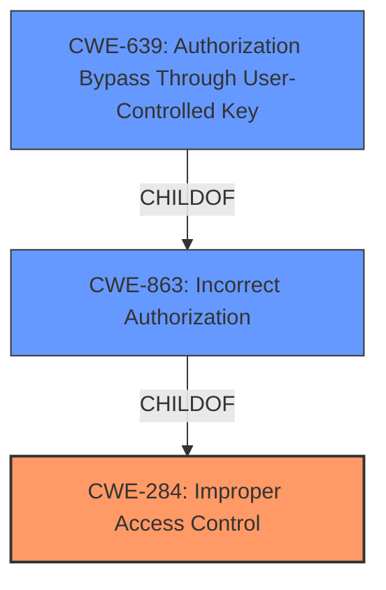

# Analysis Report for CVE-2021-26107

# Vulnerability Analysis Report: CVE-2021-26107

## Description


## Analysis (with Relationship Data)

# Summary
| CWE ID  | CWE Name                       | Confidence | CWE Abstraction Level | CWE Vulnerability Mapping Label | CWE-Vulnerability Mapping Notes |
| :-------- | :----------------------------- | :--------- | :---------------------- | :------------------------------ | :------------------------------ |
| CWE-284   | Improper Access Control        | 0.75       | Pillar                  | Primary CWE                     | Discouraged                    |
| CWE-863   | Incorrect Authorization        | 0.75       | Class                   | Secondary                       | Allowed-with-Review          |
| CWE-639   | Authorization Bypass Through User-Controlled Key | 0.60       | Base                   | Secondary                       | Allowed                    |

## Evidence and Confidence

*   **Confidence Score:** 0.70
*   **Evidence Strength:** HIGH

## Relationship Analysis
The analysis identified a primary weakness, **improper access control** [CWE-284], which is a very high-level *Pillar* in the CWE hierarchy. Because it is such a high level, it is discouraged, and the MITRE guidance suggests considering more specific descendants. The description indicates a problem with authorization, suggesting **incorrect authorization** [CWE-863], a *Class* level weakness, is an improvement, but the issue is that an authenticated user with restricted access can modify the VPN tunnel status of other VDOMs. This suggests a user-controlled key bypasses authorization, so **Authorization Bypass Through User-Controlled Key** [CWE-639], a *Base* level weakness, is another possibility.



## Vulnerability Chain
The chain of vulnerabilities starts with an **improper access control** [CWE-284], which leads to the ability for an authenticated user with restricted privileges to modify VPN tunnel statuses they should not have access to. This can be seen as an **incorrect authorization** [CWE-863] or **Authorization Bypass Through User-Controlled Key** [CWE-639].

## Summary of Analysis
The initial assessment pointed to **improper access control** [CWE-284] due to the vulnerability description explicitly stating an "**improper access control** vulnerability." However, CWE-284 is a high-level *Pillar*, and the MITRE guidance discourages its use, suggesting more specific descendants should be considered.

The vulnerability description indicates that the **improper access control** [CWE-284] allows "an authenticated attacker with a restricted user profile to modify the VPN tunnel status of other VDOMs using VPN Manager." This suggests the authentication is working, but the authorization is not properly restricting access based on the user's profile. This could be caused by **incorrect authorization** [CWE-863], a *Class* level weakness. It could also be caused by **Authorization Bypass Through User-Controlled Key** [CWE-639], a *Base* level weakness. Both are possible, but the **improper access control** [CWE-284] is the primary root cause, even if it is very general.

Therefore, the selected CWEs are at the most specific level that the provided evidence supports, with **improper access control** [CWE-284] being the primary and **incorrect authorization** [CWE-863] and **Authorization Bypass Through User-Controlled Key** [CWE-639] being secondary.

Relevant CWE Information:
- **Vulnerability Description**: "An **improper access control** vulnerability [CWE-284] in FortiManager versions 6.4.4 and 6.4.5 may allow an authenticated attacker with a restricted user profile to modify the VPN tunnel status of other VDOMs using VPN Manager."

# Enhanced Context (25 CWEs)
The following CWEs were identified as potentially relevant to this vulnerability:

## CWE-274: Improper Handling of Insufficient Privileges
**Abstraction Level**: Base
**Similarity Score**: 0.78
**Source**: dense

**Description**:
The product does not handle or incorrectly handles when it has insufficient privileges to perform an operation, leading to resultant weaknesses.

**Mapping Guidance**:
- Usage: Discouraged
- Rationale: This CWE entry could be deprecated in a future version of CWE.

## CWE-280: Improper Handling of Insufficient Permissions or Privileges 
**Abstraction Level**: Base
**Similarity Score**: 0.78
**Source**: dense

**Description**:
The product does not handle or incorrectly handles when it has insufficient privileges to access resources or functionality as specified by their permissions. This may cause it to follow unexpected code paths that may leave the product in an invalid state.

**Mapping Guidance**:
- Usage: Allowed
- Rationale: This CWE entry is at the Base level of abstraction, which is a preferred level of abstraction for mapping to the root causes of vulnerabilities.

## CWE-668: Exposure of Resource to Wrong Sphere
**Abstraction Level**: Class
**Similarity Score**: 0.77
**Source**: dense

**Description**:
The product exposes a resource to the wrong control sphere, providing unintended actors with inappropriate access to the resource.

**Mapping Guidance**:
- Usage: Discouraged
- Rationale: CWE-668 is high-level and is often misused as a catch-all when lower-level CWE IDs might be applicable. It is sometimes used for low-information vulnerability reports [REF-1287]. It is a level-1 Class (i.e., a child of a Pillar). It is not useful for trend analysis.

## CWE-497: Exposure of Sensitive System Information to an Unauthorized Control Sphere
**Abstraction Level**: Base
**Similarity Score**: 0.77
**Source**: dense

**Description**:
The product does not properly prevent sensitive system-level information from being accessed by unauthorized actors who do not have the same level of access to the underlying system as the product does.

**Mapping Guidance**:
- Usage: Allowed
- Rationale: This CWE entry is at the Base level of abstraction, which is a preferred level of abstraction for mapping to the root causes of vulnerabilities.

## CWE-653: Improper Isolation or Compartmentalization
**Abstraction Level**: Class
**Similarity Score**: 0.76
**Source**: dense

**Description**:
The product does not properly compartmentalize or isolate functionality, processes, or resources that require different privilege levels, rights, or permissions.

**Mapping Guidance**:
- Usage: Allowed
- Rationale: This CWE entry is at the Base level of abstraction, which is a preferred level of abstraction for mapping to the root causes of vulnerabilities.

## CWE-807: Reliance on Untrusted Inputs in a Security Decision
**Abstraction Level**: Base
**Similarity Score**: 0.76
**Source**: dense

**Description**:
The product uses a protection mechanism that relies on the existence or values of an input, but the input can be modified by an untrusted actor in a way that bypasses the protection mechanism.

**Mapping Guidance**:
- Usage: Allowed
- Rationale: This CWE entry is at the Base level of abstraction, which is a preferred level of abstraction for mapping to the root causes of vulnerabilities.

## CWE-226: Sensitive Information in Resource Not Removed Before Reuse
**Abstraction Level**: Base
**Similarity Score**: 0.76
**Source**: dense

**Description**:
The product releases a resource such as memory or a file so that it can be made available for reuse, but it does not clear or "zeroize" the information contained in the resource before the product performs a critical state transition or makes the resource available for reuse by other entities.

**Mapping Guidance**:
- Usage: Allowed
- Rationale: This CWE entry is at the Base level of abstraction, which is a preferred level of abstraction for mapping to the root causes of vulnerabilities.

## CWE-404: Improper Resource Shutdown or Release
**Abstraction Level**: Class
**Similarity Score**: 0.76
**Source**: dense

**Description**:
The product does not release or incorrectly releases a resource before it is made available for re-use.

**Mapping Guidance**:
- Usage: Allowed-with-Review
- Rationale: This CWE entry is a Class and might have Base-level children that would be more appropriate

## CWE-552: Files or Directories Accessible to External Parties
**Abstraction Level**: Base
**Similarity Score**: 0.76
**Source**: dense

**Description**:
The product makes files or directories accessible to unauthorized actors, even though they should not be.

**Mapping Guidance**:
- Usage: Allowed
- Rationale: This CWE entry is at the Base level of abstraction, which is a preferred level of


## CWE Relationship Analysis

Current CWEs represent these abstraction levels: .


### Vulnerability Chain Analysis

**Chain starting from CWE-497:**
- 497 (Exposure of Sensitive System Information to an Unauthorized Control Sphere) - ROOT


**Chain starting from CWE-404:**
- 404 (Improper Resource Shutdown or Release) - ROOT


### CWE Relationship Diagram

```mermaid
graph TD
    classDef primary fill:#f96,stroke:#333,stroke-width:2px
    classDef secondary fill:#69f,stroke:#333
    classDef tertiary fill:#9e9,stroke:#333
```


*Report generated on 2025-04-02 04:29:09*
