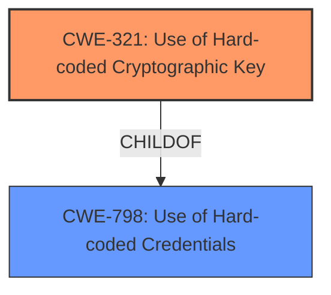

# Analysis for CVE-2021-26108

# Summary
| CWE ID | CWE Name | Confidence | CWE Abstraction Level | CWE Vulnerability Mapping Label | CWE-Vulnerability Mapping Notes |
|---|---|---|---|---|---|
| CWE-321 | Use of Hard-coded Cryptographic Key | 1.0 | Variant | Allowed | Primary CWE |

## Evidence and Confidence

*   **Confidence Score:** 1.0
*   **Evidence Strength:** HIGH

## Relationship Analysis
The primary relationship that influenced my decision was the hierarchical relationship between CWE-798 (Use of Hard-coded Credentials) and its child CWE-321 (Use of Hard-coded Cryptographic Key). The vulnerability description specifically mentions a "hard-coded cryptographic key", making CWE-321 a more precise and appropriate classification than its parent.

## Vulnerability Chain
The vulnerability chain is straightforward:
1.  **Root Cause:** **Use of a hard-coded cryptographic key** (CWE-321)
2.  **Impact:** An attacker can retrieve the key, leading to potential information disclosure and unauthorized access by decrypting SSLVPN cookies.

## Summary of Analysis
The initial analysis clearly pointed to CWE-321 as the most suitable classification due to the explicit mention of a "hard-coded cryptographic key" in the vulnerability description. The retriever results also ranked CWE-321 as the top candidate. The relationship analysis confirmed that CWE-321 is a more specific variant of CWE-798, making it the preferred choice.

The evidence from the vulnerability description is:
- "A **use of hard-coded cryptographic key** vulnerability in the SSLVPN of FortiOS before 7.0.1 may allow an attacker to retrieve the key by reverse engineering."
- "**Root cause of vulnerability:** The vulnerability stems from the **use of a hardcoded cryptographic key** for SSLVPN cookie encryption within FortiOS."
- "**Weaknesses/vulnerabilities present:** The primary weakness is the presence of a hardcoded cryptographic key, which is a violation of secure coding practices. This falls under CWE-321 (Use of Hard-coded Cryptographic Key)."

The selection of CWE-321 is at the optimal level of specificity because it directly addresses the root cause described in the vulnerability.

Relevant CWE Information:

## CWE-321: Use of Hard-coded Cryptographic Key
**Abstraction:** Variant
**Status:** Draft

### Description
The use of a hard-coded cryptographic key significantly increases the possibility that encrypted data may be recovered.