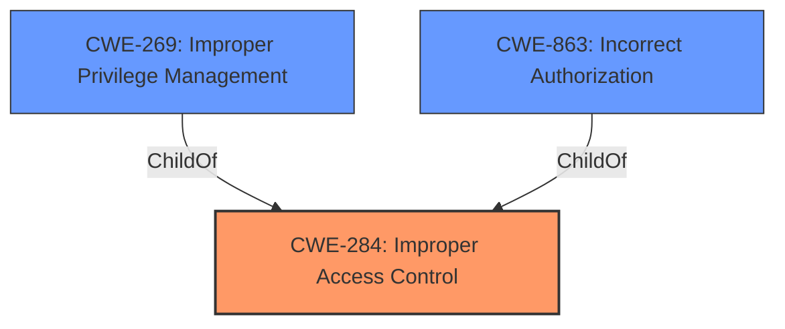

# Analysis Report for CVE-2021-26110

# Vulnerability Analysis Report: CVE-2021-26110

## Description


## Analysis (with Relationship Data)

# Summary
| CWE ID | CWE Name | Confidence | CWE Abstraction Level | CWE Vulnerability Mapping Label | CWE-Vulnerability Mapping Notes |
|---|---|---|---|---|---|
| CWE-284 | Improper Access Control | 0.9 | Pillar | Primary | Discouraged |
| CWE-269 | Improper Privilege Management | 0.6 | Class | Secondary | Discouraged |
| CWE-863 | Incorrect Authorization | 0.5 | Class | Secondary | Allowed-with-Review |

## Evidence and Confidence

*   **Confidence Score:** 0.7
*   **Evidence Strength:** HIGH

## Relationship Analysis
The primary CWE identified is CWE-284, a Pillar-level weakness, representing a very broad category of access control issues. CWE-269 (Improper Privilege Management) and CWE-863 (Incorrect Authorization) are considered as secondary candidates since they are child concepts of CWE-284 and offer more specific insights. However, due to the limited information provided in the vulnerability description, it's challenging to definitively determine a more granular classification. CWE-284 is discouraged for mapping due to its high-level nature, but it accurately reflects the information available.



## Vulnerability Chain
The vulnerability chain begins with **improper access control** [CWE-284], allowing a low-privileged attacker to then **escalate privileges** to super_admin. This suggests a direct progression from the initial weakness to the resulting impact.

## Summary of Analysis
Initial analysis strongly suggests **improper access control** [CWE-284] as the root cause, supported by the "Vulnerability Description Key Phrases" and "CVE Reference Links Content Summary" which explicitly states the root cause as "Improper access control". The retriever results also list CWE-284 as the top combined result.

The MITRE mapping guidance discourages the use of CWE-284 due to its high-level nature. However, given the information available, it's difficult to pinpoint a more specific CWE. While CWE-269 (Improper Privilege Management) and CWE-863 (Incorrect Authorization) are potential candidates and children of CWE-284, there isn't sufficient evidence to definitively classify the vulnerability under these more specific categories. The description highlights a privilege escalation, making CWE-269 a plausible secondary candidate. The issue lies in the incorrect authorization checks, which leads to privilege escalation, thus making CWE-863 another plausible secondary candidate.

The final decision is to assign CWE-284 as the primary CWE, with CWE-269 and CWE-863 as secondary candidates, recognizing the limitations of the available information and the need for a more detailed analysis to pinpoint the exact flaw in the access control mechanism. This is based on the explicit statement of **improper access control** as the root cause, and the observed impact of privilege escalation. The chosen CWEs are at the appropriate level of specificity given the available evidence.

Relevant CWE Information:

# Enhanced Context (25 CWEs)

## CWE-23: Relative Path Traversal
**Abstraction Level**: Base
The product uses external input to construct a pathname that should be within a restricted directory, but it does not properly neutralize sequences such as ".." that can resolve to a location that is outside of that directory.
This is not related to the described vulnerability.

## CWE-41: Improper Resolution of Path Equivalence
**Abstraction Level**: Base
The product is vulnerable to file system contents disclosure through path equivalence. Path equivalence involves the use of special characters in file and directory names. The associated manipulations are intended to generate multiple names for the same object.
This is not related to the described vulnerability.

## CWE-59: Improper Link Resolution Before File Access ('Link Following')
**Abstraction Level**: Base
The product attempts to access a file based on the filename, but it does not properly prevent that filename from identifying a link or shortcut that resolves to an unintended resource.
This is not related to the described vulnerability.

## CWE-73: External Control of File Name or Path
**Abstraction Level**: Base
The product allows user input to control or influence paths or file names that are used in filesystem operations.
This is not related to the described vulnerability.

## CWE-184: Incomplete List of Disallowed Inputs
**Abstraction Level**: Base
The product implements a protection mechanism that relies on a list of inputs (or properties of inputs) that are not allowed by policy or otherwise require other action to neutralize before additional processing takes place, but the list is incomplete.
This is not related to the described vulnerability.

## CWE-668: Exposure of Resource to Wrong Sphere
**Abstraction Level**: Class
The product exposes a resource to the wrong control sphere, providing unintended actors with inappropriate access to the resource.
This is not related to the described vulnerability.

## CWE-36: Absolute Path Traversal
**Abstraction Level**: Base
The product uses external input to construct a pathname that should be within a restricted directory, but it does not properly neutralize absolute path sequences such as "/abs/path" that can resolve to a location that is outside of that directory.
This is not related to the described vulnerability.

## CWE-552: Files or Directories Accessible to External Parties
**Abstraction Level**: Base
The product makes files or directories accessible to unauthorized actors, even though they should not be.
This is not related to the described vulnerability.

## CWE-538: Insertion of Sensitive Information into Externally-Accessible File or Directory
**Abstraction Level**: Base
The product places sensitive information into files or directories that are accessible to actors who are allowed to have access to the files, but not to the sensitive information.
This is not related to the described vulnerability.

## CWE-212: Improper Removal of Sensitive Information Before Storage or Transfer
**Abstraction Level**: Base
The product stores, transfers, or shares a resource that contains sensitive information, but it does not properly remove that information before the product makes the resource available to unauthorized actors.
This is not related to the described vulnerability.

## CWE-22: Improper Limitation of a Pathname to a Restricted Directory ('Path Traversal')
**Abstraction Level**: Base
The product uses external input to construct a pathname that is intended to identify a file or directory that is located underneath a restricted parent directory, but the product does not properly neutralize special elements within the pathname that can cause the pathname to resolve to a location that is outside of the restricted directory.
This is not related to the described vulnerability.

## CWE-23: Relative Path Traversal
**Abstraction Level**: Base
The product uses external input to construct a pathname that should be within a restricted directory, but it does not properly neutralize sequences such as ".." that can resolve to a location that is outside of that directory.
This is not related to the described vulnerability.

## CWE-184: Incomplete List of Disallowed Inputs
**Abstraction Level**: Base
The product implements a protection mechanism that relies on a list of inputs (or properties of inputs) that are not allowed by policy or otherwise require other action to neutralize before additional processing takes place, but the list is incomplete.
This is not related to the described vulnerability.

## CWE-863: Incorrect Authorization
**Abstraction Level**: Class
The product performs an authorization check when an actor attempts to access a resource or perform an action, but it does not correctly perform the check.
As a child of CWE-284 this is a possible secondary candidate. The vulnerability involves an **improper access control**, and **privilege escalation**. If the **improper access control** results from incorrect authorization checks, then CWE-863 would be appropriate.

## CWE-59: Improper Link Resolution Before File Access ('Link Following')
**Abstraction Level**: Base
The product attempts to access a file based on the filename, but it does not properly prevent that filename from identifying a link or shortcut that resolves to an unintended resource.
This is not related to the described vulnerability.

## CWE-78: Improper Neutralization of Special Elements used in an OS Command ('OS Command Injection')
**Abstraction Level**: base
The product constructs all or part of an OS command using externally-influenced input from an upstream component, but it does not neutralize or incorrectly neutralizes special elements that could modify the intended OS command when it is sent to a downstream component.
This is not related to the described vulnerability.

## CWE-98: Improper Control of Filename for Include/Require Statement in PHP Program ('PHP Remote File Inclusion')
**Abstraction Level**: variant
The product uses external input to construct a pathname that is intended to identify a file or directory that is located underneath a restricted parent directory, but the product does not properly neutralize special elements within the pathname that can cause the pathname to resolve to a location that is outside of the restricted directory


## CWE Relationship Analysis

Current CWEs represent these abstraction levels: .


### Vulnerability Chain Analysis

**Chain starting from CWE-36:**
- 36 (Absolute Path Traversal) - ROOT


**Chain starting from CWE-41:**
- 41 (Improper Resolution of Path Equivalence) - ROOT


### CWE Relationship Diagram

```mermaid
graph TD
    classDef primary fill:#f96,stroke:#333,stroke-width:2px
    classDef secondary fill:#69f,stroke:#333
    classDef tertiary fill:#9e9,stroke:#333
```


*Report generated on 2025-04-02 13:52:56*
