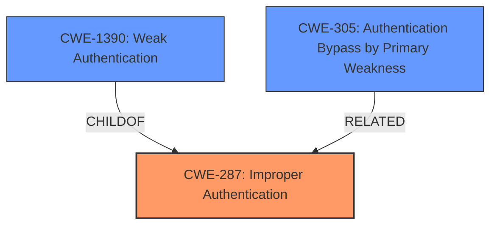

# Analysis for CVE-2021-26117

# Summary
| CWE ID | CWE Name | Confidence | CWE Abstraction Level | CWE Vulnerability Mapping Label | CWE-Vulnerability Mapping Notes |
|---|---|---|---|---|---|
| CWE-287 | Improper Authentication | 0.9 | Class | Primary | Discouraged |
| CWE-1390 | Weak Authentication | 0.9 | Class | Secondary | Allowed-with-Review |
| CWE-305 | Authentication Bypass by Primary Weakness | 0.7 | Base | Secondary | Allowed |

## Evidence and Confidence

*   **Confidence Score:** 0.9
*   **Evidence Strength:** HIGH

## Relationship Analysis
The primary CWE is CWE-287 (Improper Authentication), a class-level CWE. CWE-1390 (Weak Authentication) is a child of CWE-287 and represents a more specific type of authentication failure. CWE-305 (Authentication Bypass by Primary Weakness) indicates that the authentication is bypassed due to a separate weakness.

## Vulnerability Chain
The vulnerability chain starts with the **misconfiguration** of the ActiveMQ LDAP login module to use **anonymous access**. This leads to **no check on the password** for valid users, ultimately resulting in an **authentication bypass**.

## Summary of Analysis
Initially, CWE-287 (Improper Authentication) seemed like the most appropriate choice, given the **root cause** of the vulnerability is that the system is not properly authenticating users, as the **anonymous access** bypasses the intended authentication mechanisms. However, the MITRE guidance discourages the use of CWE-287 directly, suggesting to consider it's children such as CWE-1390 (Weak Authentication) or CWE-306 (Missing Authentication for Critical Function).

The **Vulnerability Description Key Phrases** section highlights the use of **anonymous access to LDAP server**, leading to **no check on password for valid users**. The CVE reference summary states, "The ActiveMQ LDAP login module could be configured to use anonymous access to the LDAP server, which allows verification of a user's password using an anonymous context, skipping password checks," which strongly indicates an authentication bypass.

CWE-1390 (Weak Authentication) is considered as the authentication mechanism is insufficient. This is a Class-level CWE, however, and ideally a Base-level CWE should be selected.

CWE-305 (Authentication Bypass by Primary Weakness) is considered because the authentication is bypassed due to the **misconfiguration** of using **anonymous access**. This is a Base-level CWE, and the "root_cause" section in the CVE reference links content summary provides evidence for it: "The ActiveMQ LDAP login module could be configured to use anonymous access to the LDAP server, which allows verification of a user's password using an anonymous context, skipping password checks."

Therefore, CWE-287 (Improper Authentication) is the primary CWE and CWE-1390 (Weak Authentication) and CWE-305 (Authentication Bypass by Primary Weakness) are secondary CWEs. While CWE-287 is discouraged, no other CWE more closely represents the vulnerability and the evidence is clear.

Relevant CWE Information:

# Enhanced Context (25 CWEs)
The following CWEs were identified as potentially relevant to this vulnerability:

## CWE-303: Incorrect Implementation of Authentication Algorithm
**Abstraction Level**: Base
**Similarity Score**: 0.79
**Source**: dense

**Description**:
The requirements for the product dictate the use of an established authentication algorithm, but the implementation of the algorithm is incorrect.

**Mapping Guidance**:
- Usage: Allowed
- Rationale: This CWE entry is at the Base level of abstraction, which is a preferred level of abstraction for mapping to the root causes of vulnerabilities.

## CWE-1391: Use of Weak Credentials
**Abstraction Level**: Class
**Similarity Score**: 0.77
**Source**: dense

**Description**:
The product uses weak credentials (such as a default key or hard-coded password) that can be calculated, derived, reused, or guessed by an attacker.

**Mapping Guidance**:
- Usage: Allowed-with-Review
- Rationale: This CWE entry is a Class and might have Base-level children that would be more appropriate

## CWE-1390: Weak Authentication
**Abstraction Level**: Class
**Similarity Score**: 0.77
**Source**: dense

**Description**:
The product uses an authentication mechanism to restrict access to specific users or identities, but the mechanism does not sufficiently prove that the claimed identity is correct.

**Mapping Guidance**:
- Usage: Allowed-with-Review
- Rationale: This CWE entry is a Class and might have Base-level children that would be more appropriate

## CWE-807: Reliance on Untrusted Inputs in a Security Decision
**Abstraction Level**: Base
**Similarity Score**: 0.76
**Source**: dense

**Description**:
The product uses a protection mechanism that relies on the existence or values of an input, but the input can be modified by an untrusted actor in a way that bypasses the protection mechanism.

**Mapping Guidance**:
- Usage: Allowed
- Rationale: This CWE entry is at the Base level of abstraction, which is a preferred level of abstraction for mapping to the root causes of vulnerabilities.

## CWE-305: Authentication Bypass by Primary Weakness
**Abstraction Level**: Base
**Similarity Score**: 0.75
**Source**: dense

**Description**:
The authentication algorithm is sound, but the implemented mechanism can be bypassed as the result of a separate weakness that is primary to the authentication error.

**Mapping Guidance**:
- Usage: Allowed
- Rationale: This CWE entry is at the Base level of abstraction, which is a preferred level of abstraction for mapping to the root causes of vulnerabilities.

## CWE-204: Observable Response Discrepancy
**Abstraction Level**: Base
**Similarity Score**: 0.75
**Source**: dense

**Description**:
The product provides different responses to incoming requests in a way that reveals internal state information to an unauthorized actor outside of the intended control sphere.

**Mapping Guidance**:
- Usage: Allowed
- Rationale: This CWE entry is at the Base level of abstraction, which is a preferred level of abstraction for mapping to the root causes of vulnerabilities.

## CWE-319: Cleartext Transmission of Sensitive Information
**Abstraction Level**: Base
**Similarity Score**: 0.75
**Source**: dense

**Description**:
The product transmits sensitive or security-critical data in cleartext in a communication channel that can be sniffed by unauthorized actors.

**Mapping Guidance**:
- Usage: Allowed
- Rationale: This CWE entry is at the Base level of abstraction, which is a preferred level of abstraction for mapping to the root causes of vulnerabilities.

## CWE-90: Improper Neutralization of Special Elements used in an LDAP Query ('LDAP Injection')
**Abstraction Level**: Base
**Similarity Score**: 0.75
**Source**: dense

**Description**:
The product constructs all or part of an LDAP query using externally-influenced input from an upstream component, but it does not neutralize or incorrectly neutralizes special elements that could modify the intended LDAP query when it is sent to a downstream component.

**Mapping Guidance**:
- Usage: Allowed
- Rationale: This CWE entry is at the Base level of abstraction, which is a preferred level of abstraction for mapping to the root causes of vulnerabilities.

## CWE-307: Improper Restriction of Excessive Authentication Attempts
**Abstraction Level**: Base
**Similarity Score**: 0.75
**Source**: dense

**Description**:
The product does not implement sufficient measures to prevent multiple failed authentication attempts within a short time frame.

**Mapping Guidance**:
- Usage: Allowed
- Rationale: This CWE entry is at the Base level of abstraction, which is a preferred level of abstraction for mapping to the root causes of vulnerabilities.

## CWE-288: Authentication Bypass Using an Alternate Path or Channel
**Abstraction Level**: Base
**Similarity Score**: 0.75
**Source**: dense

**Description**:
The product requires authentication, but the product has an alternate path or channel that does not require authentication.

**Mapping Guidance**:
- Usage: Allowed
- Rationale: This CWE entry is at the Base level of abstraction, which is a preferred level of abstraction for mapping to the root causes of vulnerabilities.

## CWE-1390: Weak Authentication
**Abstraction Level**: Class
**Similarity Score**: 4393.59
**Source**: sparse

**Description**:
The product uses an authentication mechanism to restrict access to specific users or identities, but