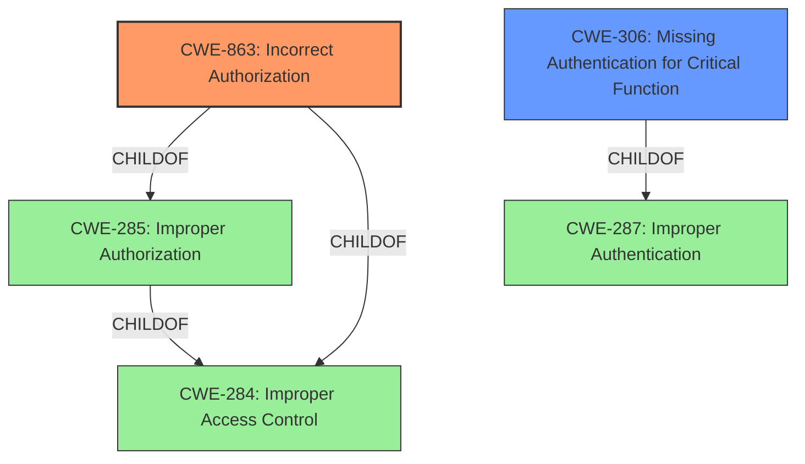

# Analysis Report for CVE-2021-26118

# Vulnerability Analysis Report: CVE-2021-26118

## Description


## Analysis (with Relationship Data)

# Summary
| CWE ID | CWE Name | Confidence | CWE Abstraction Level | CWE Vulnerability Mapping Label | CWE-Vulnerability Mapping Notes |
|---|---|---|---|---|---|
| CWE-863 | Incorrect Authorization | 0.9 | Class | Primary | Allowed-with-Review |
| CWE-306 | Missing Authentication for Critical Function | 0.7 | Base | Secondary | Allowed |

## Evidence and Confidence

*   **Confidence Score:** 0.8
*   **Evidence Strength:** MEDIUM

## Relationship Analysis
The primary CWE is CWE-863, which is a child of CWE-285 (Improper Authorization) and CWE-284 (Improper Access Control). CWE-306 is also a child of CWE-287 (Improper Authentication). The relationships influenced the decision by suggesting a move from the more general CWE-285 to the more specific CWE-863.



## Vulnerability Chain
The vulnerability chain involves the **incorrect authorization** (CWE-863) in the production of advisory messages, leading to a bypass of policy-based access control. The **missing authentication** (CWE-306) could also be considered, though authorization is the more precise issue here.

## Summary of Analysis
The initial assessment identified CWE-863 as the primary weakness. The provided evidence states that the creation of advisory messages bypassed policy-based access control. This aligns directly with the description of CWE-863: "The product performs an authorization check when an actor attempts to access a resource or perform an action, but it does not correctly perform the check." The "Vulnerability Description Key Phrases" also mentions "bypass policy based access control" which reinforces this choice. The mapping guidance for CWE-863 suggests reviewing its children, but none appear to be a better fit.

The choice of CWE-863 is based on the root cause, which is an **incorrect authorization** check. The abstraction level of Class is appropriate as it is more specific than Pillar (CWE-284) but not as detailed as a Base or Variant in this case. CWE-306 was considered, but since the advisory messages were being produced without proper checks, it is more about authorization than authentication.

Relevant CWE Information:

# Enhanced Context (25 CWEs)

## CWE-662: Improper Synchronization
**Abstraction Level**: Class
**Similarity Score**: 0.77

**Description**:
The product utilizes multiple threads or processes to allow temporary access to a shared resource that can only be exclusive to one process at a time, but it does not properly synchronize these actions, which might cause simultaneous accesses of this resource by multiple threads or processes.
*Reason Not Used*: This doesn't appear to be a concurrency issue.

## CWE-405: Asymmetric Resource Consumption (Amplification)
**Abstraction Level**: Class
**Similarity Score**: 0.77

**Description**:
The product does not properly control situations in which an adversary can cause the product to consume or produce excessive resources without requiring the adversary to invest equivalent work or otherwise prove authorization, i.e., the adversary's influence is "asymmetric."
*Reason Not Used*: This doesn't appear to be an amplification issue.

## CWE-362: Concurrent Execution using Shared Resource with Improper Synchronization ('Race Condition')
**Abstraction Level**: Class
**Similarity Score**: 0.76
*Reason Not Used*: This doesn't appear to be a concurrency issue.

## CWE-667: Improper Locking
**Abstraction Level**: Class
**Similarity Score**: 0.75
*Reason Not Used*: This doesn't appear to be a locking issue.

## CWE-404: Improper Resource Shutdown or Release
**Abstraction Level**: Class
**Similarity Score**: 0.75
*Reason Not Used*: This doesn't appear to be a resource release issue.

## CWE-366: Race Condition within a Thread
**Abstraction Level**: Base
**Similarity Score**: 0.75
*Reason Not Used*: This doesn't appear to be a concurrency issue.

## CWE-367: Time-of-check Time-of-use (TOCTOU) Race Condition
**Abstraction Level**: Base
**Similarity Score**: 0.75
*Reason Not Used*: This doesn't appear to be a TOCTOU issue.

## CWE-799: Improper Control of Interaction Frequency
**Abstraction Level**: Class
**Similarity Score**: 0.75
*Reason Not Used*: This doesn't appear to be a frequency control issue.

## CWE-664: Improper Control of a Resource Through its Lifetime
**Abstraction Level**: Pillar
**Similarity Score**: 0.74
*Reason Not Used*: Too general.

## CWE-754: Improper Check for Unusual or Exceptional Conditions
**Abstraction Level**: Class
**Similarity Score**: 0.73
*Reason Not Used*: Not checking for errors is not the issue.

## CWE-941: Incorrectly Specified Destination in a Communication Channel
**Abstraction Level**: Base
**Similarity Score**: 6329.23
*Reason Not Used*: This is not related to communication channels.

## CWE-863: Incorrect Authorization
**Abstraction Level**: Class
**Similarity Score**: 6237.05

**Description**:
The product performs an authorization check when an actor attempts to access a resource or perform an action, but it does not correctly perform the check.
*Reason Used*: The vulnerability involves bypassing policy-based access control, indicating an **incorrect authorization** process.

## CWE-285: Improper Authorization
**Abstraction Level**: Class
**Similarity Score**: 6109.83

**Description**:
The product does not perform or incorrectly performs an authorization check when an actor attempts to access a resource or perform an action.
*Reason Not Used*: CWE-863 is a better fit because it highlights the **incorrectness** of the authorization check, rather than just its absence.

## CWE-287: Improper Authentication
**Abstraction Level**: Class
**Similarity Score**: 6049.26

**Description**:
When an actor claims to have a given identity, the product does not prove or insufficiently proves that the claim is correct.
*Reason Not Used*: Authorization is more relevant than authentication in this case.

## CWE-306: Missing Authentication for Critical Function
**Abstraction Level**: Base
**Similarity Score**: 6009.02

**Description**:
The product does not perform any authentication for functionality that requires a provable user identity or consumes a significant amount of resources.
*Reason Used*: While authorization is the primary issue, the **missing authentication** for advisory messages could be considered a contributing factor.

## CWE-1284: Improper Validation of Specified Quantity in Input
**Abstraction Level**: base
**Similarity Score**: 4.33
*Reason Not Used*: This isn't related to input validation.

## CWE-252: Unchecked Return Value
**Abstraction Level**: base
**Similarity Score**: 4.33
*Reason Not Used*: This isn't related to return values.

## CWE-476: NULL Pointer Dereference
**Abstraction Level**: base
**Similarity Score**: 4.33
*Reason Not Used*: This isn't related to null pointers.

## CWE-789: Memory Allocation with Excessive Size Value
**Abstraction Level**: variant
**Similarity Score**: 3.88
*Reason Not Used*: This isn't related to memory allocation.

## CWE-178: Improper Handling of Case Sensitivity
**Abstraction Level**: base
**Similarity Score**: 3.76
*Reason Not Used*: This isn't related to case sensitivity.

## CWE-1289: Improper Validation of Unsafe Equivalence in Input
**Abstraction Level**: base
**Similarity Score**: 3.64
*Reason Not Used*: This isn't related to input validation.

## CWE-1325: Improperly Controlled Sequential Memory Allocation
**Abstraction Level**: base
**Similarity Score**: 3.57
*Reason Not Used


## CWE Relationship Analysis

Current CWEs represent these abstraction levels: .


### Vulnerability Chain Analysis

**Chain starting from CWE-754:**
- 754 (Improper Check for Unusual or Exceptional Conditions) - ROOT


**Chain starting from CWE-404:**
- 404 (Improper Resource Shutdown or Release) - ROOT


### CWE Relationship Diagram

```mermaid
graph TD
    classDef primary fill:#f96,stroke:#333,stroke-width:2px
    classDef secondary fill:#69f,stroke:#333
    classDef tertiary fill:#9e9,stroke:#333
```


*Report generated on 2025-04-02 02:24:33*
