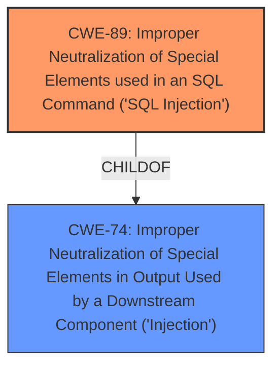

# Analysis Report for CVE-2021-26201

# Vulnerability Analysis Report: CVE-2021-26201

## Description


## Analysis (with Relationship Data)

# Summary
| CWE ID | CWE Name | Confidence | CWE Abstraction Level | CWE Vulnerability Mapping Label | CWE-Vulnerability Mapping Notes |
|---|---|---|---|---|---|
| CWE-89 | Improper Neutralization of Special Elements used in an SQL Command ('SQL Injection') | 1.0 | Base | Primary | Allowed |

## Evidence and Confidence

*   **Confidence Score:** 1.0
*   **Evidence Strength:** HIGH

## Relationship Analysis
The primary relationship impacting the decision is that CWE-89 is a child of CWE-74 (Improper Neutralization of Special Elements in Output Used by a Downstream Component ('Injection')). CWE-89 is a base level CWE which is the preferred level of abstraction for mapping.



## Vulnerability Chain
The vulnerability chain starts with the **improper neutralization** of input that allows for **SQL injection**, leading to **authentication bypass**.

## Summary of Analysis
The vulnerability description clearly states that the Login Panel of CASAP Automated Enrollment System 1.0 is vulnerable to **SQL injection**, leading to an authentication bypass. The attacker can inject a SQL query in the username field of the login page to gain access to the admin panel. The CVE Reference Links Content Summary also confirms that the root cause is an **SQL injection** vulnerability in the `login.php` page and that by crafting a specific SQL query in the username field, the attacker can bypass the authentication mechanism.

The primary CWE match from the retriever results is CWE-89 (Improper Neutralization of Special Elements used in an SQL Command ('SQL Injection')), which has a score of 1.0. This CWE accurately describes the vulnerability where the product constructs an SQL command using externally-influenced input but does not neutralize special elements, allowing attackers to modify the intended SQL command. The weakness is a base level which is the preferred level of abstraction.

Relevant CWE Information:

**CWE-89: Improper Neutralization of Special Elements used in an SQL Command ('SQL Injection')**
**Abstraction:** Base
**Status:** Stable

### Description
The product constructs all or part of an SQL command using externally-influenced input from an upstream component, but it does not neutralize or incorrectly neutralizes special elements that could modify the intended SQL command when it is sent to a downstream component. Without sufficient removal or quoting of SQL syntax in user-controllable inputs, the generated SQL query can cause those inputs to be interpreted as SQL instead of ordinary user data.

### Mapping Guidance
**Usage:** Allowed
**Rationale:** This CWE entry is at the Base level of abstraction, which is a preferred level of abstraction for mapping to the root causes of vulnerabilities.

### Observed Examples
- **CVE-2023-32530:** SQL injection in security product dashboard using crafted certificate fields
- **CVE-2021-42258:** SQL injection in time and billing software, as exploited in the wild per CISA KEV.
- **CVE-2021-27101:** SQL injection in file-transfer system via a crafted Host header, as exploited in the wild per CISA KEV.


## CWE Relationship Analysis

Current CWEs represent these abstraction levels: .


### Vulnerability Chain Analysis

**Chain starting from CWE-89:**
- 89 (Improper Neutralization of Special Elements used in an SQL Command ('SQL Injection')) - ROOT


**Chain starting from CWE-74:**
- 74 (Improper Neutralization of Special Elements in Output Used by a Downstream Component ('Injection')) - ROOT


### CWE Relationship Diagram

```mermaid
graph TD
    classDef primary fill:#f96,stroke:#333,stroke-width:2px
    classDef secondary fill:#69f,stroke:#333
    classDef tertiary fill:#9e9,stroke:#333
```


*Report generated on 2025-04-02 12:54:59*
