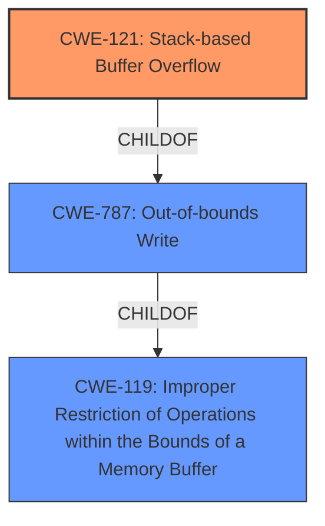

# Raw Analyzer Response for CVE-2021-26236

# Summary
| CWE ID | CWE Name | Confidence | CWE Abstraction Level | CWE Vulnerability Mapping Label | CWE-Vulnerability Mapping Notes |
|---|---|---|---|---|---|
| CWE-121 | Stack-based Buffer Overflow | 1.0 | Variant | Allowed | Primary CWE |
| CWE-787 | Out-of-bounds Write | 0.7 | Base | Allowed | Secondary Candidate |
| CWE-119 | Improper Restriction of Operations within the Bounds of a Memory Buffer | 0.6 | Class | Discouraged | Secondary Candidate |

## Evidence and Confidence

*   **Confidence Score:** 0.85
*   **Evidence Strength:** HIGH

## Relationship Analysis
The primary CWE is CWE-121, a **Variant** of CWE-787 (Out-of-bounds Write), which in turn is a child of CWE-119 (Improper Restriction of Operations within the Bounds of a Memory Buffer). The vulnerability description specifically mentions a stack-based buffer overflow, making CWE-121 the most specific and appropriate choice.

## Vulnerability Chain
The chain of events is as follows:
1.  A malformed CUR file is opened.
2.  The `BitCount` field within the `BITMAPINFOHEADER` structure contains a large value.
3.  This leads to an excessive number of bytes being read from the file.
4.  A **stack-based buffer overflow** (CWE-121) occurs, due to the out-of-bounds write (CWE-787).
5.  The SEH chain on the stack is corrupted.
6.  Attackers can achieve code execution.

The root cause is the **stack-based buffer overflow**, leading to corruption of the SEH and ultimately code execution.

## Summary of Analysis
The initial analysis pointed towards CWE-121 (Stack-based Buffer Overflow) due to the explicit mention in the vulnerability description: "FastStone Image Viewer v.<= 7.5 is affected by a **Stack-based Buffer Overflow**". The "CVE Reference Links Content Summary" further supports this by stating "The vulnerability is a **stack-based buffer overflow** that occurs when processing CUR files." This is strong evidence for selecting CWE-121 as the primary CWE.

CWE-787 (Out-of-bounds Write) is considered as a secondary CWE because a buffer overflow inherently involves writing data beyond the intended boundaries of a buffer.

CWE-119 (Improper Restriction of Operations within the Bounds of a Memory Buffer) is a more general class of weakness that encompasses buffer overflows. However, given the specific nature of the vulnerability being a stack-based overflow, CWE-121 is a more precise and preferred mapping. The MITRE mapping guidance discourages using CWE-119 when more specific CWEs are available.

The selected CWEs are at the optimal level of specificity because CWE-121 directly reflects the type of buffer overflow (stack-based), and CWE-787 highlights the out-of-bounds write aspect of the overflow.

Relevant CWE Information:

# Enhanced Context (25 CWEs)
The following CWEs were identified as potentially relevant to this vulnerability:

## CWE-124: Buffer Underwrite ('Buffer Underflow')
**Abstraction Level**: Base
**Similarity Score**: 0.78
**Source**: dense

**Description**:
The product writes to a buffer using an index or pointer that references a memory location prior to the beginning of the buffer.

**Mapping Guidance**:
- Usage: Allowed
- Rationale: This CWE entry is at the Base level of abstraction, which is a preferred level of abstraction for mapping to the root causes of vulnerabilities.

**Rationale for not selecting:** Buffer underwrite is not the type of vulnerability. The vulnerability is a buffer overflow.

## CWE-191: Integer Underflow (Wrap or Wraparound)
**Abstraction Level**: Base
**Similarity Score**: 0.77
**Source**: dense

**Description**:
The product subtracts one value from another, such that the result is less than the minimum allowable integer value, which produces a value that is not equal to the correct result.

**Mapping Guidance**:
- Usage: Allowed
- Rationale: This CWE entry is at the Base level of abstraction, which is a preferred level of abstraction for mapping to the root causes of vulnerabilities.

**Rationale for not selecting:** There's no mention of integer underflow in the description, reference links content summary, or key phrases. Therefore, this CWE is not applicable.

## CWE-131: Incorrect Calculation of Buffer Size
**Abstraction Level**: Base
**Similarity Score**: 0.76
**Source**: dense

**Description**:
The product does not correctly calculate the size to be used when allocating a buffer, which could lead to a buffer overflow.

**Mapping Guidance**:
- Usage: Allowed
- Rationale: This CWE entry is at the Base level of abstraction, which is a preferred level of abstraction for mapping to the root causes of vulnerabilities.

**Rationale for not selecting:** While an incorrect buffer size calculation *could* be a contributing factor, the description emphasizes the **stack-based buffer overflow** due to a large value in the `BitCount` field, indicating **improper input handling** rather than a calculation error.

## CWE-805: Buffer Access with Incorrect Length Value
**Abstraction Level**: Base
**Similarity Score**: 0.76
**Source**: dense

**Description**:
The product uses a sequential operation to read or write a buffer, but it uses an incorrect length value that causes it to access memory that is outside of the bounds of the buffer.

**Mapping Guidance**:
- Usage: Allowed
- Rationale: This CWE entry is at the Base level of abstraction, which is a preferred level of abstraction for mapping to the root causes of vulnerabilities.

**Rationale for not selecting:** The description indicates that the `BitCount` field is used to determine the number of bytes to read, which then causes a stack-based buffer overflow. Therefore, a more specific CWE, CWE-121, is more applicable.

## CWE-680: Integer Overflow to Buffer Overflow
**Abstraction Level**: Compound
**Similarity Score**: 0.76
**Source**: dense

**Description**:
The product performs a calculation to determine how much memory to allocate, but an integer overflow can occur that causes less memory to be allocated than expected, leading to a buffer overflow.

**Mapping Guidance**:
- Usage: Discouraged
- Rationale: This CWE entry is a named chain, which combines multiple weaknesses.

**Rationale for not selecting:** While an integer overflow could *potentially* be involved, the provided information doesn't explicitly state this. The core issue is the **stack-based buffer overflow** due to an overly large `BitCount` field.

## CWE-126: Buffer Over-read
**Abstraction Level**: Variant
**Similarity Score**: 0.75
**Source**: dense

**Description**:
The product reads from a buffer using buffer access mechanisms such as indexes or pointers that reference memory locations after the targeted buffer.

**Mapping Guidance**:
- Usage: Allowed
- Rationale: This CWE entry is at the Variant level of abstraction, which is a preferred level of abstraction for mapping to the root causes of vulnerabilities.

**Rationale for not selecting:** This is not a buffer over-read vulnerability. The vulnerability is a buffer overflow.

## CWE-125: Out-of-bounds Read
**Abstraction Level**: Base
**Similarity Score**: 0.74
**Source**: dense

**Description**:
The product reads data past the end, or before the beginning, of the intended buffer.

**Mapping Guidance**:
- Usage: Allowed
- Rationale: This CWE entry is at the Base level of abstraction, which is a preferred level of abstraction for mapping to the root causes of vulnerabilities.

**Rationale for not selecting:** This is not an out-of-bounds read. The vulnerability is a buffer overflow, specifically an out-of-bounds write that is facilitated by a large value in the `BitCount` field.

## CWE-190: Integer Overflow or Wraparound
**Abstraction Level**: Base
**Similarity Score**: 0.74
**Source**: dense

**Description**:
The product performs a calculation that can
         produce an integer overflow or wraparound when the logic
         assumes that the resulting value will always be larger than
         the original value. This occurs when an integer value is
         incremented to a value that is too large to store in the
         associated representation. When this occurs