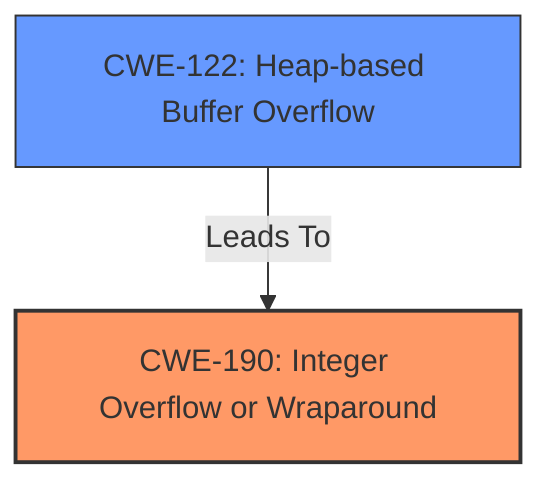

# Enhanced Analysis for CVE-2021-26260

# Summary
| CWE ID | CWE Name | Confidence | CWE Abstraction Level | CWE Vulnerability Mapping Label | CWE-Vulnerability Mapping Notes |
|---|---|---|---|---|---|
| CWE-190 | Integer Overflow or Wraparound | 1.0 | Base | Primary | Allowed |
| CWE-122 | Heap-based Buffer Overflow | 0.9 | Variant | Secondary | Allowed |

## Evidence and Confidence

*   **Confidence Score:** 0.95
*   **Evidence Strength:** HIGH

## Relationship Analysis
The primary CWE selected is CWE-190, representing the root cause of the vulnerability: an integer overflow. CWE-122 is included as a secondary CWE since the integer overflow leads directly to a heap-based buffer overflow, which is the exploitable condition.



## Vulnerability Chain
The vulnerability chain starts with CWE-190 (Integer Overflow or Wraparound) which then leads to CWE-122 (Heap-based Buffer Overflow). The integer overflow occurs during the calculation of the buffer size, resulting in a smaller than expected buffer allocation. Subsequent writes to this undersized buffer then causes the heap-based buffer overflow and a crash.

## Summary of Analysis
The analysis is based on the vulnerability description and the provided CVE reference summary. The vulnerability is due to an **integer overflow** (CWE-190) in the DwaCompressor of OpenEXR. This **integer overflow** leads to a **heap-buffer overflow** (CWE-122), which causes the application to crash.

Evidence from the CVE Reference Links Content Summary:
*   "The vulnerability is due to an integer overflow within the `Imf_2_5::DwaCompressor::initializeBuffers` function in the OpenEXR library."
*   "This overflow occurs when calculating the buffer size needed for DWA compression, potentially leading to a heap buffer overflow."
*   "**Integer Overflow:** The calculation of the buffer size for the DWA compressor is vulnerable to integer overflow."
*   "**Heap-based Buffer Overflow:** If the integer overflow occurs, it can lead to allocation of smaller-than-required buffer. When data is later written to the undersized buffer, a heap buffer overflow can occur."
*   "The fix involves using `size_t` and `size_t` calculation instead of `int`, preventing the integer overflow."

The retriever results also support the selection of CWE-190 as a primary CWE. The relationship analysis and the vulnerability chain analysis show that CWE-190 is the root cause, and CWE-122 is the direct consequence. The chosen CWEs are at the optimal level of specificity as CWE-190 is a Base level CWE describing the integer overflow, and CWE-122 is a Variant level CWE which describes where the buffer overflow happens.

Other CWEs Considered:

*   CWE-119 (Improper Restriction of Operations within the Bounds of a Memory Buffer): While this CWE is related to buffer overflows, it is a Class level CWE and is too general. The vulnerability description provides enough information to select more specific CWEs.
*   CWE-125 (Out-of-bounds Read): This CWE is not appropriate because the vulnerability is due to a write operation outside the bounds of a buffer, not a read operation.
*   CWE-191 (Integer Underflow (Wrap or Wraparound)): This CWE was considered, but the vulnerability is caused by an overflow not an underflow.
*   CWE-131 (Incorrect Calculation of Buffer Size): Although the integer overflow results in incorrect calculation of the buffer, the integer overflow is the root cause so CWE-190 is more applicable.
*   CWE-681 (Incorrect Conversion between Numeric Types): This CWE could have been a contributing factor, as described in the CVE Reference summary. However, the integer overflow is explicitly mentioned in the Vulnerability Description so CWE-190 is the better fit as the root cause.


## CWE Relationship Analysis

Current CWEs represent these abstraction levels: .


### Vulnerability Chain Analysis

**Chain starting from CWE-122:**
- 122 (Heap-based Buffer Overflow) - ROOT


**Chain starting from CWE-125:**
- 125 (Out-of-bounds Read) - ROOT


### CWE Relationship Diagram

```mermaid
graph TD
    classDef primary fill:#f96,stroke:#333,stroke-width:2px
    classDef secondary fill:#69f,stroke:#333
    classDef tertiary fill:#9e9,stroke:#333
```