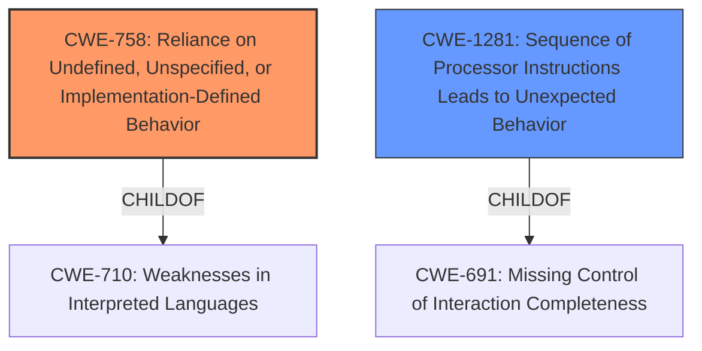

# Enhanced Analysis for CVE-2021-26307

# Summary
| CWE ID | CWE Name | Confidence | CWE Abstraction Level | CWE Vulnerability Mapping Label | CWE-Vulnerability Mapping Notes |
|---|---|---|---|---|---|
| CWE-758 | Reliance on Undefined, Unspecified, or Implementation-Defined Behavior | 0.9 | Class | Allowed-with-Review | Primary CWE |
| CWE-1281 | Sequence of Processor Instructions Leads to Unexpected Behavior | 0.7 | Base | Allowed | Secondary Candidate |

## Evidence and Confidence

*   **Confidence Score:** 0.8
*   **Evidence Strength:** HIGH

## Relationship Analysis
The primary CWE, CWE-758 **Reliance on Undefined, Unspecified, or Implementation-Defined Behavior**, is a Class-level CWE. It is a child of CWE-710 Weaknesses in Interpreted Languages. The secondary CWE, CWE-1281 **Sequence of Processor Instructions Leads to Unexpected Behavior**, is a Base-level CWE and a child of CWE-691 Missing Control of Interaction Completeness. These relationships show that the vulnerability stems from relying on unspecified behavior, possibly due to instruction sequence issues.



## Vulnerability Chain
The chain of events starts with the **incorrect slice construction** using `std::slice::from_raw_parts()` and the **unsafe `__cpuid_count()` intrinsic exposed as a safe function** without proper CPU support checks. This leads to undefined behavior and potential crashes, culminating in a denial-of-service.

## Summary of Analysis
The initial analysis focused on identifying the root cause of the vulnerability. The **Vulnerability Description Key Phrases** and **CVE Reference Links Content Summary** revealed that the issue stems from undefined behavior and calling `cpuid_count()` on unsupported CPUs.

CWE-758 **Reliance on Undefined, Unspecified, or Implementation-Defined Behavior** is selected as the primary CWE because the vulnerability description details how the code relies on undefined behavior when constructing byte slices and when calling the `__cpuid_count()` intrinsic on unsupported CPUs. The CVE summary states, "Undefined behavior due to constructing byte slices using `std::slice::from_raw_parts()` with data from `#[repr(Rust)]` structs in `VendorInfo::as_string()`, `SoCVendorBrand::as_string()`, and `ExtendedFunctionInfo::processor_brand_string()`" and "Exposing the unsafe `__cpuid_count()` intrinsic as a safe function in `native_cpuid::cpuid_count()` without checking if the CPU supports the function, violating safety requirements."

CWE-1281 **Sequence of Processor Instructions Leads to Unexpected Behavior** is a secondary candidate because the crash is caused by a specific instruction (`CPUID`) being called on an unsupported CPU.

CWE-758 is preferred over CWE-1281 as the primary because it covers both undefined behavior issues (slice construction and CPUID call).

The selected CWEs are at an appropriate level of specificity. CWE-758 is a Class, but the evidence doesn't allow for a more specific Base or Variant level CWE selection.

# Enhanced Context (25 CWEs)
The following CWEs were identified as potentially relevant to this vulnerability:

## CWE-703: Improper Check or Handling of Exceptional Conditions
**Abstraction Level**: Pillar
**Similarity Score**: 0.78
**Source**: dense

**Description**:
The product does not properly anticipate or handle exceptional conditions that rarely occur during normal operation of the product.

**Mapping Guidance**:
- Usage: Discouraged
- Rationale: This CWE entry is extremely high-level, a Pillar.

## CWE-754: Improper Check for Unusual or Exceptional Conditions
**Abstraction Level**: Class
**Similarity Score**: 0.77
**Source**: dense

**Description**:
The product does not check or incorrectly checks for unusual or exceptional conditions that are not expected to occur frequently during day to day operation of the product.

**Mapping Guidance**:
- Usage: Allowed-with-Review
- Rationale: This CWE entry is a Class and might have Base-level children that would be more appropriate

## CWE-667: Improper Locking
**Abstraction Level**: Class
**Similarity Score**: 0.76
**Source**: dense

**Description**:
The product does not properly acquire or release a lock on a resource, leading to unexpected resource state changes and behaviors.

**Mapping Guidance**:
- Usage: Allowed-with-Review
- Rationale: This CWE entry is a Class and might have Base-level children that would be more appropriate

## CWE-758: Reliance on Undefined, Unspecified, or Implementation-Defined Behavior
**Abstraction Level**: Class
**Similarity Score**: 0.76
**Source**: dense

**Description**:
The product uses an API function, data structure, or other entity in a way that relies on properties that are not always guaranteed to hold for that entity.

**Mapping Guidance**:
- Usage: Allowed-with-Review
- Rationale: This CWE entry is a Class and might have Base-level children that would be more appropriate

## CWE-404: Improper Resource Shutdown or Release
**Abstraction Level**: Class
**Similarity Score**: 0.76
**Source**: dense

**Description**:
The product does not release or incorrectly releases a resource before it is made available for re-use.

**Mapping Guidance**:
- Usage: Allowed-with-Review
- Rationale: This CWE entry is a Class and might have Base-level children that would be more appropriate

## CWE-191: Integer Underflow (Wrap or Wraparound)
**Abstraction Level**: Base
**Similarity Score**: 0.76
**Source**: dense

**Description**:
The product subtracts one value from another, such that the result is less than the minimum allowable integer value, which produces a value that is not equal to the correct result.

**Mapping Guidance**:
- Usage: Allowed
- Rationale: This CWE entry is at the Base level of abstraction, which is a preferred level of abstraction for mapping to the root causes of vulnerabilities.

## CWE-1289: Improper Validation of Unsafe Equivalence in Input
**Abstraction Level**: Base
**Similarity Score**: 0.76
**Source**: dense

**Description**:
The product receives an input value that is used as a resource identifier or other type of reference, but it does not validate or incorrectly validates that the input is equivalent to a potentially-unsafe value.

**Mapping Guidance**:
- Usage: Allowed
- Rationale: This CWE entry is at the Base level of abstraction, which is a preferred level of abstraction for mapping to the root causes of vulnerabilities.

## CWE-755: Improper Handling of Exceptional Conditions
**Abstraction Level**: Class
**Similarity Score**: 0.75
**Source**: dense

**Description**:
The product does not handle or incorrectly handles an exceptional condition.

**Mapping Guidance**:
- Usage: Discouraged
- Rationale: This CWE entry is a level-1 Class (i.e., a child of a Pillar). It might have lower-level children that would be more appropriate

## CWE-226: Sensitive Information in Resource Not Removed Before Reuse
**Abstraction Level**: Base
**Similarity Score**: 0.75
**Source**: dense

**Description**:
The product releases a resource such as memory or a file so that it can be made available for reuse, but it does not clear or "zeroize" the information contained in the resource before the product performs a critical state transition or makes the resource available for reuse by other entities.

**Mapping Guidance**:
- Usage: Allowed
- Rationale: This CWE entry is at the Base level of abstraction, which is a preferred level of abstraction for mapping to the root causes of vulnerabilities.

## CWE-665: Improper Initialization
**Abstraction Level**: Class
**Similarity Score**: 0.75
**Source**: dense

**Description**:
The product does not initialize or incorrectly initializes a resource, which might leave the resource in an unexpected state when it is accessed or used.

**Mapping Guidance**:
- Usage: Discouraged
- Rationale: This CWE entry is a level-1 Class (i.e., a child of a Pillar). It might have lower-level children that would be more appropriate

## CWE-362: Concurrent Execution using Shared Resource with Improper Synchronization ('Race Condition')
**Abstraction Level**: Class
**Similarity Score**: 4464.77
**Source**: sparse

**Description**:
The product contains a concurrent code sequence that requires temporary,


## CWE Relationship Analysis

Current CWEs represent these abstraction levels: .


### Vulnerability Chain Analysis

**Chain starting from CWE-691:**
- 691 (Insufficient Control Flow Management) - ROOT


**Chain starting from CWE-754:**
- 754 (Improper Check for Unusual or Exceptional Conditions) - ROOT


### CWE Relationship Diagram

```mermaid
graph TD
    classDef primary fill:#f96,stroke:#333,stroke-width:2px
    classDef secondary fill:#69f,stroke:#333
    classDef tertiary fill:#9e9,stroke:#333
```