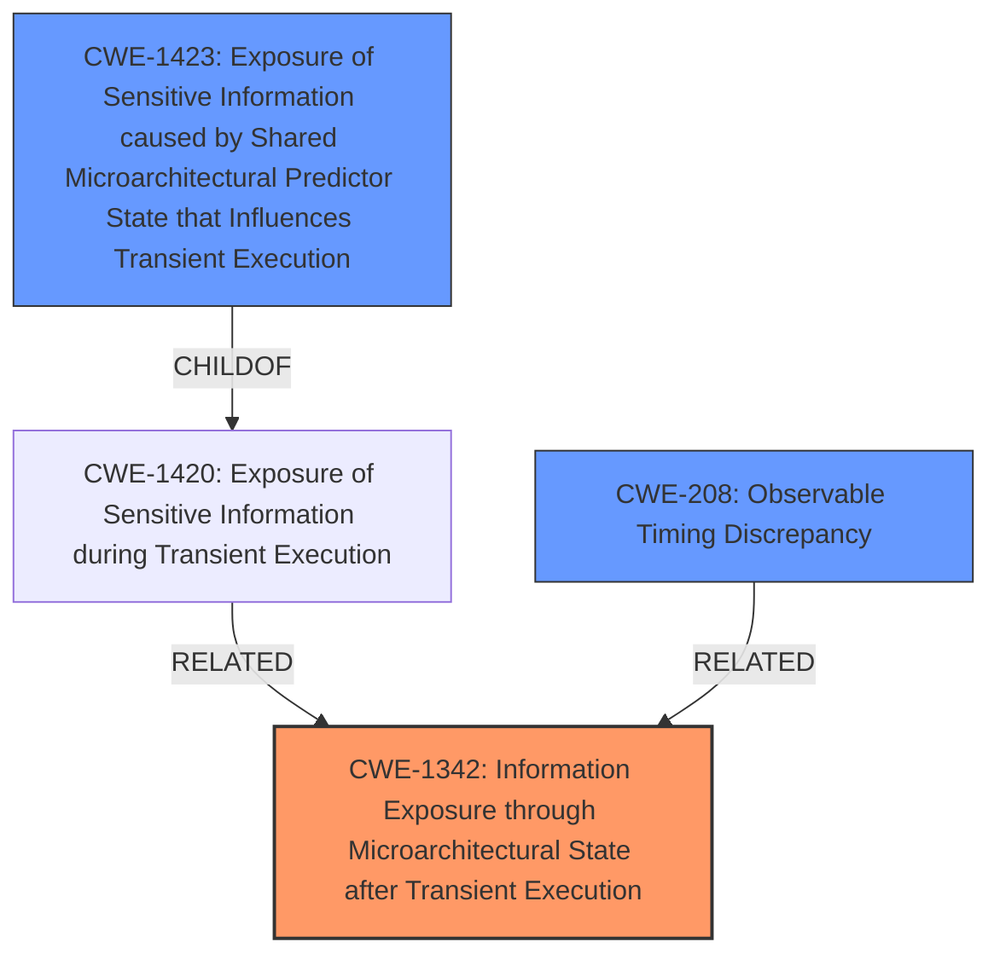

# Analysis for CVE-2021-26313

# Summary
| CWE ID  | CWE Name | Confidence | CWE Abstraction Level | CWE Vulnerability Mapping Label | CWE-Vulnerability Mapping Notes |
|----------------|-----------------------------------------------------------------------------------------------------------------------------------|------------|-----------------------|-----------------------------------|------------------------------------------------------------------------------------------------------------------------------------|
| **CWE-1342** | **Information Exposure through Microarchitectural State after Transient Execution** | 0.9 | Base | Primary | Allowed.  |
| CWE-1423 | Exposure of Sensitive Information caused by Shared Microarchitectural Predictor State that Influences Transient Execution | 0.7 | Base | Secondary | Allowed.  |
| CWE-208 | Observable Timing Discrepancy | 0.6 | Base | Secondary | Allowed.  |

## Evidence and Confidence

*   **Confidence Score:** 0.8
*   **Evidence Strength:** HIGH

## Relationship Analysis
The primary CWE is CWE-1342, which describes information exposure through microarchitectural state after transient execution. CWE-1423 is a child of CWE-1420 which is related to CWE-1342, focusing on shared microarchitectural predictor state influencing transient execution. CWE-208 is about observable timing discrepancies, which can be a manifestation of transient execution vulnerabilities. The relationships indicate a hierarchy of potential weaknesses, with CWE-1342 providing a broad base and CWE-1423 and CWE-208 offering more specific contexts.

## Vulnerability Chain
The vulnerability chain starts with **speculative execution of overwritten instructions**, leading to incorrect speculation, and finally resulting in data leakage.
  - **Root Cause:** Speculative execution of overwritten instructions.
  - **Weakness:** Incorrect speculation.
  - **Impact:** Data leakage.

## Summary of Analysis
The initial analysis centered on identifying the root cause and the resulting impact. The vulnerability description and CVE reference links clearly point to **speculative execution** as the core issue leading to data leakage.

The analysis and resulting conclusion are based on provided evidence, especially the "Vulnerability Description Key Phrases" and "CVE Reference Links Content Summary". Specifically, the description mentions "**speculative execution of overwritten instructions**", and the CVE summary states, "Speculative code store bypass occurs due to incorrect speculation when a sequence of overwritten instructions is speculatively executed," and "Speculative execution of overwritten instructions leading to incorrect speculation."

CWE-1342, which addresses information exposure through microarchitectural state after transient execution, closely aligns with the vulnerability's description of **speculative execution** causing data leakage.

CWE-1423 was also considered because it addresses the specific case of shared microarchitectural predictor state influencing transient execution.

CWE-208 was considered because timing discrepancies can be a side effect of speculative execution vulnerabilities.

The selected CWEs are at the optimal level of specificity because they directly address the root cause (CWE-1342) and contributing factors (CWE-1423, CWE-208) of the vulnerability.

Relevant CWE Information:

# Enhanced Context (25 CWEs)
The following CWEs were identified as potentially relevant to this vulnerability:

## CWE-1342: Information Exposure through Microarchitectural State after Transient Execution
**Abstraction Level**: Base
**Similarity Score**: 0.77
**Source**: dense

**Description**:
The processor does not properly clear microarchitectural state after incorrect microcode assists or speculative execution, resulting in transient execution.

**Mapping Guidance**:
- Usage: Allowed
- Rationale: This CWE entry is at the Base level of abstraction, which is a preferred level of abstraction for mapping to the root causes of vulnerabilities.

## CWE-1423: Exposure of Sensitive Information caused by Shared Microarchitectural Predictor State that Influences Transient Execution
**Abstraction Level**: Base
**Similarity Score**: 7149.44
**Source**: sparse

**Description**:
Shared microarchitectural predictor state may allow code to influence
				transient execution across a hardware boundary, potentially exposing
				data that is accessible beyond the boundary over a covert channel.
			

**Mapping Guidance**:
- Usage: Allowed
- Rationale: This CWE entry is at the Base level of abstraction, which is a preferred level of abstraction for mapping to the root causes of vulnerabilities

## CWE-208: Observable Timing Discrepancy
**Abstraction Level**: base
**Similarity Score**: 4.33
**Source**: graph

**Description**:
CWE-208: Observable Timing Discrepancy

**Mapping Guidance**:
- Usage: Allowed
- Rationale: This CWE entry is at the Base level of abstraction, which is a preferred level of abstraction for mapping to the root causes of vulnerabilities.

**Relationships**:
- PARENTOF -> CWE-1254
- CANPRECEDE -> CWE-327
- CANPRECEDE -> CWE-385
- CHILDOF -> CWE-203
- CANFOLLOW -> CWE-208

**CWE-1342: Information Exposure through Microarchitectural State after Transient Execution**

This is the primary CWE because the core issue is related to **speculative execution**, which falls under the description of CWE-1342. The **weakness** is that "the processor does not properly clear microarchitectural state after incorrect microcode assists or speculative execution, resulting in transient execution." This directly aligns with the vulnerability description. The impact is information exposure via data leakage.

**CWE-1423: Exposure of Sensitive Information caused by Shared Microarchitectural Predictor State that Influences Transient Execution**

CWE-1423 is a secondary CWE to consider. While the primary issue is transient execution, the vulnerability involves incorrect speculation. Since predictors influence speculative execution, CWE-1423 is related. The description states that "shared microarchitectural predictor state may allow code to influence transient execution across a hardware boundary, potentially exposing data that is accessible beyond the boundary over a covert channel." The evidence to support this is weaker, hence the lower confidence.

**CWE-208: Observable Timing Discrepancy**

CWE-208 is a secondary consideration as timing discrepancies can be a side channel through which data is leaked during **speculative execution**. The description of CWE-208 is "Two separate operations in a product require different amounts of time to complete, in a way that is observable to an actor and reveals security-relevant information about the state of the product, such as whether a particular operation was successful or not." The evidence to support this is weaker, hence the lower confidence.

**Other CWEs Considered but Not Used:**

CWE-1303, CWE-1264, CWE-1037, CWE-119, CWE-1281, CWE-193, CWE-131, CWE-787, CWE-1420, CWE-121 were considered but ultimately deemed less relevant. These CWEs, while related to hardware and memory management issues, did not directly address the **speculative execution** aspect highlighted in the vulnerability description. For instance, CWE-119 (Improper Restriction of Operations within the Bounds of a Memory Buffer) and CWE-787 (Out-of-bounds Write) relate to buffer overflows, which are not explicitly mentioned as the root cause in this case. Similarly, CWE-1037 (Processor Optimization Removal or Modification of Security-critical Code) is related to processor optimizations, but the primary driver is **speculative execution** of overwritten instructions.