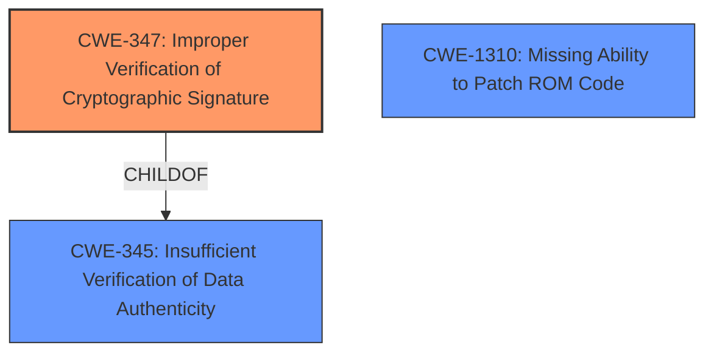

# Analysis for CVE-2021-26315

# Summary
| CWE ID | CWE Name | Confidence | CWE Abstraction Level | CWE Vulnerability Mapping Label | CWE-Vulnerability Mapping Notes |
|---|---|---|---|---|---|
| CWE-347 | Improper Verification of Cryptographic Signature | 0.8 | Base | Allowed | Primary CWE |
| CWE-345 | Insufficient Verification of Data Authenticity | 0.6 | Class | Discouraged | Secondary Candidate |
| CWE-1310 | Missing Ability to Patch ROM Code | 0.5 | Base | Allowed | Secondary Candidate |

## Evidence and Confidence

*   **Confidence Score:** 0.8
*   **Evidence Strength:** HIGH

## Relationship Analysis
The primary CWE identified is CWE-347, which is a Base level CWE and a child of CWE-345. CWE-345 is a class level of abstraction and therefore less specific. CWE-1310 is also considered as a secondary candidate because the **insufficient verification** occurs in the boot ROM and there's no patching ability.

## Vulnerability Chain
The chain of events is as follows:
1.  **Root Cause:** **Insufficient verification of the integrity of decrypted image** (CWE-347).
2.  **Impact:** Arbitrary code execution in the PSP.

## Summary of Analysis
The initial analysis identified the **insufficient verification of the integrity of the decrypted image** as the primary **weakness**. The vulnerability description and CVE reference links support this.

The primary CWE is CWE-347, which directly addresses the **improper verification of a cryptographic signature**. The evidence is strong, as the vulnerability stems from the CPU internal ROM improperly implementing the decryption of signed off-chip firmware, which falls under the scope of CWE-347.

CWE-345 was considered but not chosen as the primary because it's a broader class describing **insufficient verification of data authenticity**, but CWE-347 is more specific to cryptographic signatures. The mapping guidance discourages using class-level CWEs when a more specific base-level CWE is available.

CWE-1310 was considered as a secondary CWE because the vulnerability occurs in the ROM.

The selected CWEs are at the optimal level of specificity, with CWE-347 being the most direct representation of the vulnerability's root cause.

Relevant CWE Information:

# Enhanced Context (25 CWEs)
The following CWEs were identified as potentially relevant to this vulnerability:

## CWE-345: Insufficient Verification of Data Authenticity
**Abstraction Level**: Class
**Similarity Score**: 0.78
**Source**: dense

**Description**:
The product does not sufficiently verify the origin or authenticity of data, in a way that causes it to accept invalid data.

**Mapping Guidance**:
- Usage: Discouraged
- Rationale: This CWE entry is a level-1 Class (i.e., a child of a Pillar). It might have lower-level children that would be more appropriate

## CWE-347: Improper Verification of Cryptographic Signature
**Abstraction Level**: Base
**Similarity Score**: 0.77
**Source**: dense

**Description**:
The product does not verify, or incorrectly verifies, the cryptographic signature for data.

**Mapping Guidance**:
- Usage: Allowed
- Rationale: This CWE entry is at the Base level of abstraction, which is a preferred level of abstraction for mapping to the root causes of vulnerabilities.

## CWE-1310: Missing Ability to Patch ROM Code
**Abstraction Level**: Base
**Similarity Score**: 0.54
**Source**: dense

**Description**:
Missing an ability to patch ROM code may leave a System or System-on-Chip (SoC) in a vulnerable state.

**Mapping Guidance**:
- Usage: Allowed
- Rationale: This CWE entry is at the Base level of abstraction, which is a preferred level of abstraction for mapping to the root causes of vulnerabilities.