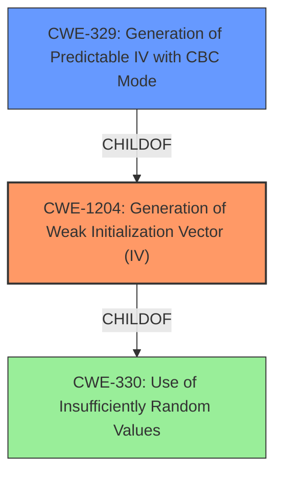

# Raw Analyzer Response for CVE-2021-26322

# Summary
| CWE ID | CWE Name | Confidence | CWE Abstraction Level | CWE Vulnerability Mapping Label | CWE-Vulnerability Mapping Notes |
|---|---|---|---|---|---|
| CWE-1204 | Generation of Weak Initialization Vector (IV) | 0.9 | Base | Primary | Allowed |
| CWE-329 | Generation of Predictable IV with CBC Mode | 0.7 | Variant | Secondary | Allowed |

## Evidence and Confidence

*   **Confidence Score:** 0.9
*   **Evidence Strength:** HIGH

## Relationship Analysis
The primary CWE is CWE-1204, which describes the **generation of a weak initialization vector (IV)**. CWE-329 is a variant that focuses on the specific case of **predictable IVs with CBC mode**. The relationship is hierarchical, with CWE-329 being a child of CWE-1204. This relationship suggests that if the vulnerability specifically involves CBC mode and predictable IVs, CWE-329 would be a more specific choice. Since the vulnerability mentions a "two time pad attack", which is linked to IV reuse, this pushes the assessment to rate CWE-1204 as the primary weakness. The abstraction levels also played a role, favoring the more specific Base level of CWE-1204 over the Class level of some other candidates.



## Vulnerability Chain
The vulnerability chain starts with the **root cause**, which is the **lack of a random IV** when protecting the platform private key. This leads to the **weakness**, a potential **two-time pad attack**, and ultimately compromises the security of the system.

## Summary of Analysis
The initial analysis focused on the description "Persistent platform private key may not be protected with a random IV leading to a potential **two time pad attack**." The key phrase "may not be protected with a random IV" suggests a problem with the Initialization Vector (IV). The phrase "**two time pad attack**" indicates that the same IV is being reused with the same key to encrypt different data.

The supporting evidence from "CVE Reference Links Content Summary" says:
```
{
  "vulnerability_details": {
    "root_cause": "The persistent platform private key may not be protected with a random IV.",
    "weaknesses": [
      "The lack of a random Initialization Vector (IV) when protecting a persistent platform private key can lead to a vulnerability.",
       "This can enable a 'two-time pad attack' if the same key is used to encrypt data with the same IV."
    ],
    "impact": "A successful exploitation could compromise the security of the system.",
    "attack_vectors": [
      "This is likely a local attack given the description of platform private key, which indicates the need for local access to the system where the vulnerability exists."
    ],
     "required_capabilities": [
      "An attacker would likely need to have some level of access to the system where the key is stored."
     ]
  }
}
```
The "Retriever Results" listed CWE-1204 (Generation of Weak Initialization Vector (IV)) as the top candidate. The description of CWE-1204 matches the vulnerability description well: "The product uses a cryptographic primitive that uses an Initialization Vector (IV), but the product does not generate IVs that are sufficiently unpredictable or unique according to the expected cryptographic requirements for that primitive."

CWE-329 (Generation of Predictable IV with CBC Mode) was considered as a secondary candidate because the description doesn't explicitly mention CBC mode, though it is a common use case.

Other CWEs considered but not chosen:

*   CWE-335 (Incorrect Usage of Seeds in Pseudo-Random Number Generator (PRNG)): While related to randomness, this CWE is more about the seed used to generate random numbers, not the IV itself.
*   CWE-208 (Observable Timing Discrepancy): This is a side-channel attack and doesn't directly address the IV issue.
*   CWE-321 (Use of Hard-coded Cryptographic Key): This is about hard-coded keys, not IVs.
*   CWE-327 (Use of a Broken or Risky Cryptographic Algorithm): This is a higher-level class and less specific than CWE-1204.
*   CWE-798 (Use of Hard-coded Credentials): This is about credentials, not IVs.
*   CWE-203 (Observable Discrepancy): This is a general side-channel issue.
*   CWE-347 (Improper Verification of Cryptographic Signature): This is related to signature verification, not IVs.

The selection of CWE-1204 is at the optimal level of specificity because it directly addresses the **root cause** of the vulnerability: the **lack of a sufficiently random IV**.