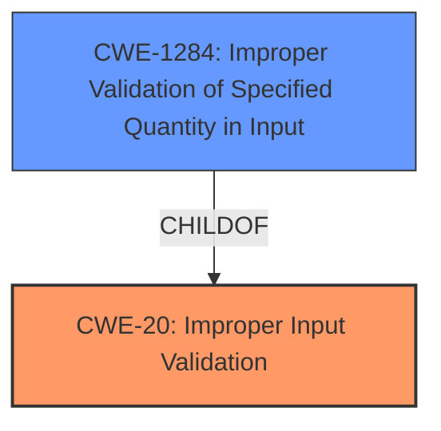

# Enhanced Analysis for CVE-2021-26325

# Summary
| CWE ID | CWE Name | Confidence | CWE Abstraction Level | CWE Vulnerability Mapping Label | CWE-Vulnerability Mapping Notes |
|---|---|---|---|---|---|
| CWE-20 | Improper Input Validation | 0.75 | Class | Discouraged | The description focuses on **insufficient input validation**, which aligns with CWE-20. However, it is too high level and a more specific CWE should be selected. |
| CWE-1284 | Improper Validation of Specified Quantity in Input | 0.75 | Base | Allowed | A potential quantity could be related to the **SNP_GUEST_REQUEST** |

## Evidence and Confidence

*   **Confidence Score:** 0.75
*   **Evidence Strength:** MEDIUM

## Relationship Analysis
The relationship analysis shows that CWE-20 is a Class-level CWE, and it has several child CWEs that are more specific.
CWE-1284 is a child of CWE-20 and is a Base-level CWE.



## Vulnerability Chain
The vulnerability chain starts with **insufficient input validation** (CWE-20), which leads to a data abort error and denial of service.

## Summary of Analysis
The initial assessment identified CWE-20 as a potential match due to the **insufficient input validation** described in the vulnerability. However, CWE-20 is a Class-level CWE and the mapping guidance discourages its use when more specific CWEs are available.

The retriever results suggest CWE-1284 (Improper Validation of Specified Quantity in Input) as a possible candidate.
The vulnerability description mentions the "SNP_GUEST_REQUEST command," suggesting that a specific quantity or parameter associated with this command may be improperly validated.

Based on the available evidence and the mapping guidance, CWE-20 is a candidate, but a more specific CWE is required. The details about the SNP_GUEST_REQUEST command suggest that a quantity could be involved.

Relevant CWE Information:

# Enhanced Context (25 CWEs)

## CWE-20: Improper Input Validation
**Abstraction:** Class

The product receives input or data, but it does not validate or incorrectly validates that the input has the properties that are required to process the data safely and correctly.

### Mapping Guidance
**Usage:** Discouraged
**Rationale:** CWE-20 is commonly misused in low-information vulnerability reports when lower-level CWEs could be used instead, or when more details about the vulnerability are available

## CWE-1284: Improper Validation of Specified Quantity in Input
**Abstraction:** Base

The product receives input that is expected to specify a quantity (such as size or length), but it does not validate or incorrectly validates that the quantity has the required properties.

### Mapping Guidance
**Usage:** Allowed
**Rationale:** This CWE entry is at the Base level of abstraction, which is a preferred level of abstraction for mapping to the root causes of vulnerabilities.


## CWE Relationship Analysis

Current CWEs represent these abstraction levels: .


### Vulnerability Chain Analysis

**Chain starting from CWE-20:**
- 20 (Improper Input Validation) - ROOT


**Chain starting from CWE-1284:**
- 1284 (Improper Validation of Specified Quantity in Input) - ROOT


### CWE Relationship Diagram

```mermaid
graph TD
    classDef primary fill:#f96,stroke:#333,stroke-width:2px
    classDef secondary fill:#69f,stroke:#333
    classDef tertiary fill:#9e9,stroke:#333
```