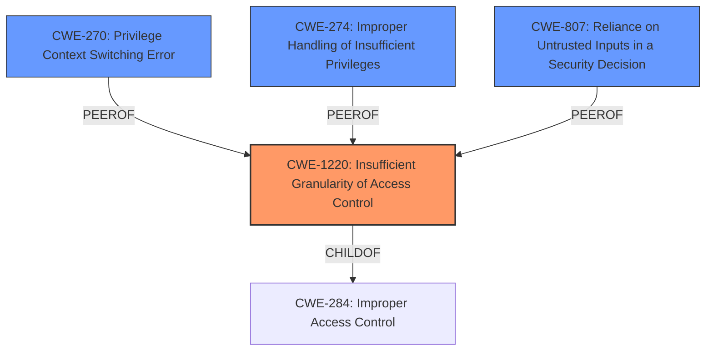

# Raw Analyzer Response for CVE-2021-26327

# Summary
| CWE ID | CWE Name | Confidence | CWE Abstraction Level | CWE Vulnerability Mapping Label | CWE-Vulnerability Mapping Notes |
|---|---|---|---|---|---|
| CWE-1220 | Insufficient Granularity of Access Control | 0.8 | Base | Allowed | Primary CWE |
| CWE-270 | Privilege Context Switching Error | 0.6 | Base | Allowed | Secondary Candidate |
| CWE-274 | Improper Handling of Insufficient Privileges | 0.5 | Base | Discouraged | Secondary Candidate |
| CWE-807 | Reliance on Untrusted Inputs in a Security Decision | 0.5 | Base | Allowed | Secondary Candidate |

## Evidence and Confidence

*   **Confidence Score:** 0.8
*   **Evidence Strength:** MEDIUM

## Relationship Analysis
The primary relationship considered was the hierarchical structure, specifically the ChildOf relationship to CWE-284 (Improper Access Control). CWE-1220 is a more specific Base variant of CWE-284. The other candidates, such as CWE-270, CWE-274, and CWE-807, are related to privilege management and security decisions based on inputs, but they do not directly address the core issue of insufficient granularity in access control as accurately as CWE-1220.

## Vulnerability Chain
The vulnerability chain consists of:
1.  **Root Cause:** **Insufficient validation of guest context** in the SNP Firmware.
2.  **Weakness:** **Insufficient Granularity of Access Control** (CWE-1220) leading to inadequate protection of guest context.
3.  **Impact:** Potential loss of guest confidentiality.

## Summary of Analysis
The initial analysis focused on the root cause, which is the **insufficient validation of guest context**. The CVE Reference Links Content Summary explicitly mentions this as the root cause. The **impact** is identified as a potential loss of guest confidentiality.

The Retriever Results suggested several CWEs, including CWE-1220, CWE-270, CWE-274, and CWE-807. After carefully reviewing the descriptions and relationships, CWE-1220 (Insufficient Granularity of Access Control) was determined to be the most appropriate primary CWE. This is because the vulnerability stems from the access controls not being sufficiently fine-grained to properly protect the guest context, leading to potential confidentiality breaches.

The evidence supporting this decision comes directly from the Vulnerability Description, which states "**Insufficient validation of guest context** in the SNP Firmware could lead to a potential loss of guest confidentiality," and the CVE Reference Links Content Summary, which highlights the lack of proper validation as the root cause.

The selection of CWE-1220 is based on the following:
*   It directly addresses the root cause of **insufficient validation of guest context** by the SNP firmware, aligning with the vulnerability description.
*   It is at the Base level of abstraction, which is preferred for mapping root causes.
*   The Mapping Guidance allows its usage.

The decision to select CWE-1220 is also influenced by its relationship to CWE-284 (Improper Access Control), as CWE-1220 is a child of CWE-284, providing a more specific classification.

CWE-270 (Privilege Context Switching Error), CWE-274 (Improper Handling of Insufficient Privileges), and CWE-807 (Reliance on Untrusted Inputs in a Security Decision) were considered but not selected as the primary CWE because they don't directly address the core issue of the granularity of access control. They are related to privilege management and security decisions based on inputs, but CWE-1220 more accurately captures the specific weakness. These are noted as secondary candidates.

The selected CWE is at the optimal level of specificity because it accurately reflects the root cause (insufficient granularity) rather than a more general category like improper input validation.