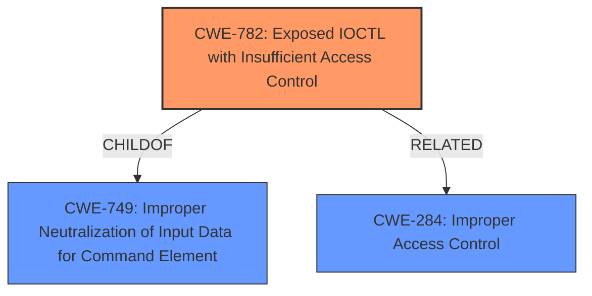

# Raw Analyzer Response for CVE-2021-26334

# Summary
| CWE ID | CWE Name | Confidence | CWE Abstraction Level | CWE Vulnerability Mapping Label | CWE-Vulnerability Mapping Notes |
|---|---|---|---|---|---|
| CWE-782 | Exposed IOCTL with Insufficient Access Control | 0.8 | Variant | Allowed | Primary CWE |
| CWE-284 | Improper Access Control | 0.5 | Pillar | Discouraged | Secondary Candidate |

## Evidence and Confidence

*   **Confidence Score:** 0.8
*   **Evidence Strength:** HIGH

## Relationship Analysis
The primary CWE, CWE-782, is a Variant of CWE-749 (Improper Neutralization of Input Data for Command). It is related to access control issues within IOCTLs. CWE-284 is a higher-level Pillar that represents a general access control problem, but is too broad. The relationship between CWE-782 and its parent, CWE-749, helps to refine the focus to IOCTL-specific access control issues.

## Vulnerability Chain
The vulnerability chain involves an initial **improper access control** weakness that allows lower-privileged users to access MSRs in the kernel via a driver IOCTL. This leads to privilege escalation and potential ring-0 code execution.
  - The **root cause** is the **insufficient access control** on the IOCTL, which is **CWE-782**.
  - The **impact** is privilege escalation and ring-0 code execution.

## Summary of Analysis
The initial analysis focused on the **improper access control** that allows lower-privileged users to access MSRs in the kernel. The key evidence supporting this is the "CVE Reference Links Content Summary" section, which states that the "**root cause** is a **lack of proper access control** in the `AMDPowerProfiler.sys` driver" and that "**Improper Access Control:** Lower privileged users can access Model Specific Registers (MSRs) in the kernel. This is a privilege escalation vulnerability."

The Retriever Results identified CWE-782 (Exposed IOCTL with Insufficient Access Control) as the top candidate. This aligns well with the vulnerability description, as it specifically addresses access control issues related to IOCTLs. The vulnerability description mentions the `AMDPowerProfiler.sys` driver, which uses IOCTLs for communication with the kernel.

CWE-284 (Improper Access Control) was considered but deemed too general. While it accurately describes the high-level problem, CWE-782 provides a more specific and relevant classification, focusing on the IOCTL-related aspect of the vulnerability. The MITRE mapping guidance discourages the use of CWE-284 due to its high-level nature.

The selection of CWE-782 is at the optimal level of specificity because it directly addresses the **weakness** in the IOCTL's access control, which is the **root cause** of the vulnerability. It is a Variant-level CWE, which is a preferred level of abstraction.

Relevant CWE Information:

# Enhanced Context (25 CWEs)
The following CWEs were identified as potentially relevant to this vulnerability:

## CWE-782: Exposed IOCTL with Insufficient Access Control
**Abstraction:** Variant
**Status:** Draft

### Description
The product implements an IOCTL with functionality that should be restricted, but it does not properly enforce access control for the IOCTL.

## CWE-284: Improper Access Control
**Abstraction:** Pillar
**Status:** Incomplete

### Description
The product does not restrict or incorrectly restricts access to a resource from an unauthorized actor.
INSERT