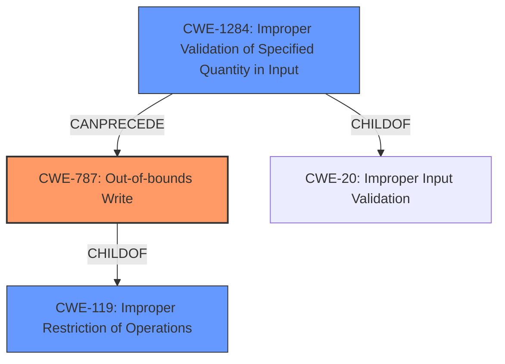

# Analysis Report for CVE-2021-26336

# Vulnerability Analysis Report: CVE-2021-26336

## Description


## Analysis (with Relationship Data)

# Summary
| CWE ID | CWE Name | Confidence | CWE Abstraction Level | CWE Vulnerability Mapping Label | CWE-Vulnerability Mapping Notes |
|---|---|---|---|---|---|
| CWE-787 | Out-of-bounds Write | 0.9 | Base | Allowed | Primary CWE |
| CWE-1284 | Improper Validation of Specified Quantity in Input | 0.7 | Base | Allowed | Secondary Candidate |
| CWE-119 | Improper Restriction of Operations within the Bounds of a Memory Buffer | 0.6 | Class | Discouraged | Secondary Candidate |

## Evidence and Confidence

*   **Confidence Score:** 0.8
*   **Evidence Strength:** HIGH

## Relationship Analysis
The primary CWE is CWE-787, which is a child of CWE-119. CWE-119 is a Class-level CWE that is often misused when more specific CWEs are available. CWE-787 is a Base-level CWE that describes writing data past the end of the intended buffer, which aligns with the vulnerability description's mention of invalid memory accesses/updates. CWE-1284, while also a Base-level CWE, focuses on the improper validation of specified quantities in input, potentially leading to issues like buffer overflows. The relationship between these CWEs helps refine the selection towards the most accurate representation of the vulnerability.



## Vulnerability Chain
The vulnerability chain begins with **insufficient bounds checking** (CWE-787) in the System Management Unit (SMU). This leads to invalid memory accesses/updates, causing the SMU to hang, and subsequently failing to service further requests. The chain can be summarized as:
1.  **Insufficient bounds checking** (CWE-787)
2.  Invalid memory access/updates
3.  SMU hang
4.  Failure to service requests

## Summary of Analysis
The initial analysis focused on identifying the root cause described as "**insufficient bounds checking**" which leads to "invalid memory accesses/updates". The retriever results suggested CWE-119, CWE-125, CWE-1285, CWE-20 and CWE-787 among others.

The key evidence supporting CWE-787 comes directly from the vulnerability description: "**Insufficient bounds checking** in System Management Unit (SMU) may cause invalid memory accesses/updates". This aligns with CWE-787's description of writing data past the end of the intended buffer.

CWE-119 was considered but ultimately deemed less specific than CWE-787, as CWE-119 is a more general class of weakness. The MITRE mapping guidance discourages the use of CWE-119 when more specific CWEs are available.

CWE-1284 was considered as a secondary weakness because **insufficient bounds checking** can be seen as a failure to properly validate the quantity (size, length, etc.) of the data being written to memory. If the bounds are not properly checked, an out-of-bounds write (CWE-787) can occur.

CWE-20 and CWE-1285 were also considered, but these were deemed less directly relevant. CWE-20 is too general ("Improper Input Validation"), while CWE-1285 focuses on validating indices, positions, or offsets, which is not explicitly mentioned in the vulnerability description.

The final decision to prioritize CWE-787 is based on the direct evidence of "**insufficient bounds checking**" leading to "invalid memory accesses/updates", the Base level of abstraction of CWE-787, and the MITRE mapping guidance to prefer more specific CWEs over general ones like CWE-119. CWE-1284 is included as it contributes to the rootcause.

Relevant CWE Information:

**CWE-787: Out-of-bounds Write**: This is the primary CWE because the **insufficient bounds checking** directly leads to the possibility of writing past the end of the allocated buffer. The security implication is memory corruption, potentially leading to arbitrary code execution or denial of service. This aligns directly with the observed impact of the SMU hanging. The abstraction level is Base, which is the preferred level of specificity.

**CWE-1284: Improper Validation of Specified Quantity in Input**: This is a secondary CWE, since **insufficient bounds checking** relates to a failure to validate the "quantity" (size/length) of the data being written. It is a "CanPrecede" relationship with CWE-787, meaning that an improper quantity validation can lead to an out-of-bounds write.

**CWE-119: Improper Restriction of Operations within the Bounds of a Memory Buffer**: While this CWE is related, it is a more general class. CWE-787 is a child of CWE-119 and is more specific to the vulnerability. Furthermore, the mapping guidance discourages using this CWE.


## CWE Relationship Analysis

Current CWEs represent these abstraction levels: .


### Vulnerability Chain Analysis

**Chain starting from CWE-787:**
- 787 (Out-of-bounds Write) - ROOT


**Chain starting from CWE-125:**
- 125 (Out-of-bounds Read) - ROOT


### CWE Relationship Diagram

```mermaid
graph TD
    classDef primary fill:#f96,stroke:#333,stroke-width:2px
    classDef secondary fill:#69f,stroke:#333
    classDef tertiary fill:#9e9,stroke:#333
```


*Report generated on 2025-04-01 22:33:51*
