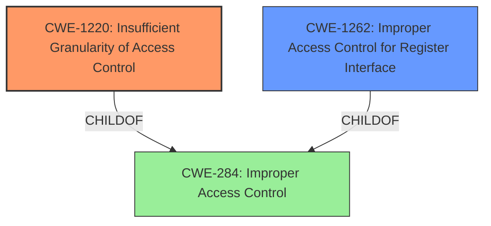

# Analysis Report for CVE-2021-26338

# Vulnerability Analysis Report: CVE-2021-26338

## Description


## Analysis (with Relationship Data)

# Summary
| CWE ID | CWE Name | Confidence | CWE Abstraction Level | CWE Vulnerability Mapping Label | CWE-Vulnerability Mapping Notes |
|---|---|---|---|---|---|
| CWE-1220 | Insufficient Granularity of Access Control | 0.9 | Base | Allowed | Primary CWE |
| CWE-1262 | Improper Access Control for Register Interface | 0.7 | Base | Allowed | Secondary Candidate |
| CWE-284 | Improper Access Control | 0.5 | Pillar | Discouraged | Secondary Candidate |

## Evidence and Confidence

*   **Confidence Score:** 0.8
*   **Evidence Strength:** HIGH

## Relationship Analysis
The primary CWE, CWE-1220, is a child of the more general CWE-284. While CWE-284 broadly covers improper access control, CWE-1220 specifies that the access control is insufficient in granularity. CWE-1262, another potential candidate, is also a child of CWE-284 but focuses on memory-mapped I/O registers, which is not explicitly stated in the vulnerability description but a possiblity. Choosing CWE-1220 provides a more specific and accurate representation of the vulnerability.



## Vulnerability Chain
The vulnerability chain starts with **improper access controls** (CWE-1220). This leads to the ability of an attacker to override performance control tables in DRAM, ultimately resulting in a potential lack of system resources.

## Summary of Analysis
The initial analysis correctly identified **improper access controls** as the root cause. The retriever results provided several potential CWEs, with CWE-1220 (Insufficient Granularity of Access Control) and CWE-284 (Improper Access Control) being top contenders. Given that the vulnerability description highlights the lack of granularity in access controls within the System Management Unit (SMU), CWE-1220 is the most appropriate choice. This is further supported by the "Root cause of vulnerability" in the CVE Reference Links Content Summary, which states "Improper access controls in System Management Unit (SMU)." CWE-1262, while relevant to hardware register interfaces, is less directly supported by the provided evidence.

The selection of CWE-1220 is at the optimal level of specificity because it directly addresses the root cause, i.e., the lack of sufficient granularity in access control mechanisms within the SMU. The vulnerability description explicitly states "Improper access controls in System Management Unit (SMU) may allow for an attacker to override performance control tables located in DRAM resulting in a potential lack of system resources." This aligns perfectly with CWE-1220's description: "The product implements access controls via a policy or other feature with the intention to disable or restrict accesses...However, implemented access controls lack required granularity..."
# Enhanced Context (25 CWEs)
The following CWEs were identified as potentially relevant to this vulnerability:

## CWE-1220: Insufficient Granularity of Access Control
**Abstraction Level**: Base
**Similarity Score**: 0.78
**Source**: dense

**Description**:
The product implements access controls via a policy or other feature with the intention to disable or restrict accesses (reads and/or writes) to assets in a system from untrusted agents. However, implemented access controls lack required granularity, which renders the control policy too broad because it allows accesses from unauthorized agents to the security-sensitive assets.

**Mapping Guidance**:
- Usage: Allowed
- Rationale: This CWE entry is at the Base level of abstraction, which is a preferred level of abstraction for mapping to the root causes of vulnerabilities.

## CWE-1262: Improper Access Control for Register Interface
**Abstraction Level**: Base
**Similarity Score**: 0.576
**Source**: dense

**Description**:
The product uses memory-mapped I/O registers that act as an interface to hardware functionality from software, but there is improper access control to those registers.

**Mapping Guidance**:
- Usage: Allowed
- Rationale: This CWE entry is at the Base level of abstraction, which is a preferred level of abstraction for mapping to the root causes of vulnerabilities.

## CWE-284: Improper Access Control
**Abstraction Level**: Pillar
**Similarity Score**: 0.192
**Source**: sparse

**Description**:
The product does not restrict or incorrectly restricts access to a resource from an unauthorized actor.

### Mapping Guidance
**Usage:** Discouraged
**Rationale:** CWE-284 is extremely high-level, a Pillar. Its name, "Improper Access Control," is often misused in low-information vulnerability reports [REF-1287] or by active use of the OWASP Top Ten, such as "A01:2021-Broken Access Control". It is not useful for trend analysis.
**Comments:** Consider using descendants of CWE-284 that are more specific to the kind of access control involved, such as those involving authorization (Missing Authorization (CWE-862), Incorrect Authorization (CWE-863), Incorrect Permission Assignment for Critical Resource (CWE-732), etc.); authentication (Missing Authentication (CWE-306) or Weak Authentication (CWE-1390)); Incorrect User Management (CWE-286); Improper Restriction of Communication Channel to Intended Endpoints (CWE-923); etc.
**Reasons:**
- Frequent Misuse
- Abstraction
**Suggested Alternatives:**
- CWE-862: Missing Authorization
- CWE-863: Incorrect Authorization
- CWE-732: Incorrect Permission Assignment for Critical Resource
- CWE-306: Missing Authentication
- CWE-1390: Weak Authentication
- CWE-923: Improper Restriction of Communication Channel to Intended Endpoints


## CWE Relationship Analysis

Current CWEs represent these abstraction levels: .


### Vulnerability Chain Analysis

**Chain starting from CWE-732:**
- 732 (Incorrect Permission Assignment for Critical Resource) - ROOT


**Chain starting from CWE-286:**
- 286 (Incorrect User Management) - ROOT


### CWE Relationship Diagram

```mermaid
graph TD
    classDef primary fill:#f96,stroke:#333,stroke-width:2px
    classDef secondary fill:#69f,stroke:#333
    classDef tertiary fill:#9e9,stroke:#333
```


*Report generated on 2025-04-02 15:26:41*
