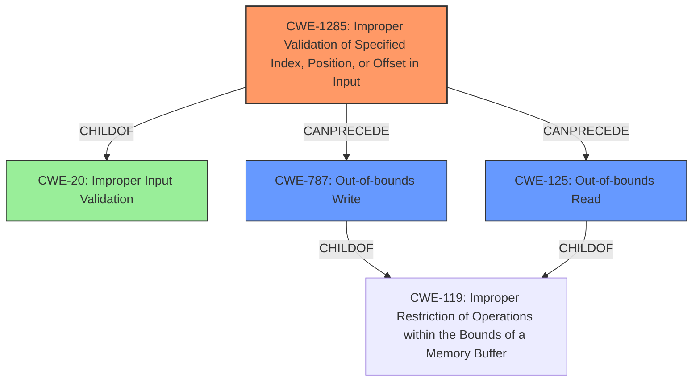

# Analysis for CVE-2021-26352

# Summary
| CWE ID | CWE Name | Confidence | CWE Abstraction Level | CWE Vulnerability Mapping Label | CWE-Vulnerability Mapping Notes |
|---|---|---|---|---|---|
| CWE-1285 | Improper Validation of Specified Index, Position, or Offset in Input | 0.8 | Base | Primary | Allowed |
| CWE-787 | Out-of-bounds Write | 0.5 | Base | Secondary | Allowed |
| CWE-125 | Out-of-bounds Read | 0.4 | Base | Secondary | Allowed |

## Evidence and Confidence

*   **Confidence Score:** 0.7
*   **Evidence Strength:** HIGH

## Relationship Analysis
The primary relationship influencing the decision is the hierarchical structure, particularly the child-of relationship between CWE-1285 and CWE-20, where CWE-1285 provides a more specific characterization of the input validation issue. Additionally, the potential chain relationship between CWE-1285 and CWE-787 (Out-of-bounds Write) and CWE-125 (Out-of-bounds Read) suggests a possible sequence of events following the initial improper input validation. The base abstraction level of CWE-1285 is preferred as it directly addresses the root cause.

## Vulnerability Chain
The vulnerability chain starts with **insufficient bound checks** (Improper Validation of Specified Index, Position, or Offset in Input - CWE-1285). This leads to access/updates from/to invalid address space (Out-of-bounds Write - CWE-787 or Out-of-bounds Read - CWE-125). The final impact is denial of service.

CWE-1285 (Root Cause) -> CWE-787/CWE-125 (Weakness) -> Denial of Service (Impact)

## Summary of Analysis
The initial assessment focused on the **insufficient bound checks** in the System Management Unit (SMU) PCIe Hot Plug table, which directly aligns with the description of CWE-1285: Improper Validation of Specified Index, Position, or Offset in Input. This CWE is at the base level of abstraction and accurately represents the root cause of the vulnerability. The retriever results also suggested CWE-119, CWE-1284, and CWE-823, but these were either too general (CWE-119) or did not precisely capture the nature of the **improper validation** of an index, position, or offset. CWE-1285 directly addresses the **lack of validation** of the boundaries when accessing the PCIe Hot Plug table as indicated in the CVE Reference Links Content Summary.

The decision to include CWE-787 and CWE-125 as secondary CWEs stems from the potential for out-of-bounds write or read operations as a direct consequence of the **insufficient bound checks**. While the vulnerability description does not explicitly state these operations, the access/updates from/to invalid address space strongly suggest their presence.

The final selection of CWE-1285 as the primary CWE is based on its specific focus on **improper validation** of indices, positions, or offsets, which is the root cause of the vulnerability. The evidence from the vulnerability description and the CVE Reference Links Content Summary supports this classification, and the CWE's base level of abstraction provides the appropriate level of detail.

Relevant CWE Information:

# Enhanced Context (25 CWEs)

## CWE-1289: Improper Validation of Unsafe Equivalence in Input
**Abstraction Level**: Base
**Similarity Score**: 0.79
**Source**: dense

**Description**:
The product receives an input value that is used as a resource identifier or other type of reference, but it does not validate or incorrectly validates that the input is equivalent to a potentially-unsafe value.

**Mapping Guidance**:
- Usage: Allowed
- Rationale: This CWE entry is at the Base level of abstraction, which is a preferred level of abstraction for mapping to the root causes of vulnerabilities.

## CWE-345: Insufficient Verification of Data Authenticity
**Abstraction Level**: Class
**Similarity Score**: 0.77
**Source**: dense

**Description**:
The product does not sufficiently verify the origin or authenticity of data, in a way that causes it to accept invalid data.

**Mapping Guidance**:
- Usage: Discouraged
- Rationale: This CWE entry is a level-1 Class (i.e., a child of a Pillar). It might have lower-level children that would be more appropriate

## CWE-807: Reliance on Untrusted Inputs in a Security Decision
**Abstraction Level**: Base
**Similarity Score**: 0.76
**Source**: dense

**Description**:
The product uses a protection mechanism that relies on the existence or values of an input, but the input can be modified by an untrusted actor in a way that bypasses the protection mechanism.

**Mapping Guidance**:
- Usage: Allowed
- Rationale: This CWE entry is at the Base level of abstraction, which is a preferred level of abstraction for mapping to the root causes of vulnerabilities.

## CWE-657: Violation of Secure Design Principles
**Abstraction Level**: Class
**Similarity Score**: 0.76
**Source**: dense

**Description**:
The product violates well-established principles for secure design.

**Mapping Guidance**:
- Usage: Discouraged
- Rationale: This CWE entry is a level-1 Class (i.e., a child of a Pillar). It might have lower-level children that would be more appropriate

## CWE-1288: Improper Validation of Consistency within Input
**Abstraction Level**: Base
**Similarity Score**: 0.75
**Source**: dense

**Description**:
The product receives a complex input with multiple elements or fields that must be consistent with each other, but it does not validate or incorrectly validates that the input is actually consistent.

**Mapping Guidance**:
- Usage: Allowed
- Rationale: This CWE entry is at the Base level of abstraction, which is a preferred level of abstraction for mapping to the root causes of vulnerabilities.

## CWE-274: Improper Handling of Insufficient Privileges
**Abstraction Level**: Base
**Similarity Score**: 0.75
**Source**: dense

**Description**:
The product does not handle or incorrectly handles when it has insufficient privileges to perform an operation, leading to resultant weaknesses.

**Mapping Guidance**:
- Usage: Discouraged
- Rationale: This CWE entry could be deprecated in a future version of CWE.

## CWE-703: Improper Check or Handling of Exceptional Conditions
**Abstraction Level**: Pillar
**Similarity Score**: 0.75
**Source**: dense

**Description**:
The product does not properly anticipate or handle exceptional conditions that rarely occur during normal operation of the product.

**Mapping Guidance**:
- Usage: Discouraged
- Rationale: This CWE entry is extremely high-level, a Pillar.

## CWE-252: Unchecked Return Value
**Abstraction Level**: Base
**Similarity Score**: 0.75
**Source**: dense

**Description**:
The product does not check the return value from a method or function, which can prevent it from detecting unexpected states and conditions.

**Mapping Guidance**:
- Usage: Allowed
- Rationale: This CWE entry is at the Base level of abstraction, which is a preferred level of abstraction for mapping to the root causes of vulnerabilities.

## CWE-653: Improper Isolation or Compartmentalization
**Abstraction Level**: Class
**Similarity Score**: 0.75
**Source**: dense

**Description**:
The product does not properly compartmentalize or isolate functionality, processes, or resources that require different privilege levels, rights, or permissions.

**Mapping Guidance**:
- Usage: Allowed
- Rationale: This CWE entry is at the Base level of abstraction, which is a preferred level of abstraction for mapping to the root causes of vulnerabilities.

## CWE-691: Insufficient Control Flow Management
**Abstraction Level**: Pillar
**Similarity Score**: 0.75