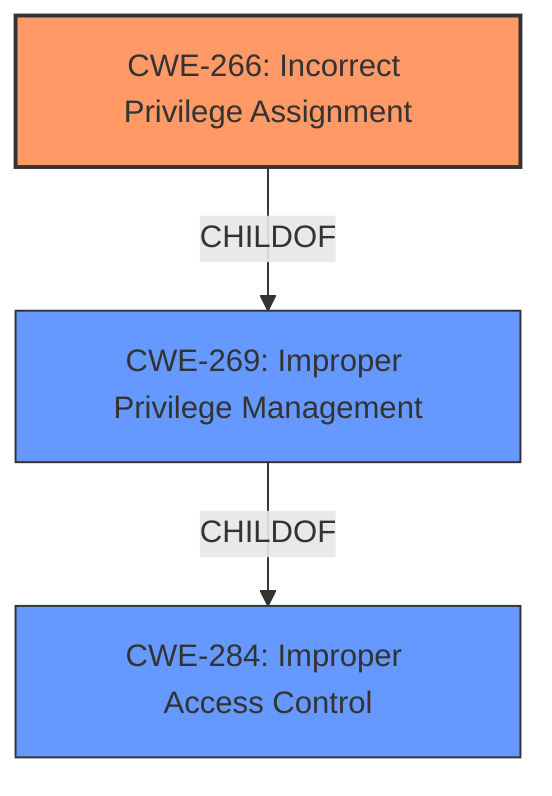

# Analysis Report for CVE-2021-26426

# Vulnerability Analysis Report: CVE-2021-26426

## Description


## Analysis (with Relationship Data)

# Summary
| CWE ID | CWE Name | Confidence | CWE Abstraction Level | CWE Vulnerability Mapping Label | CWE-Vulnerability Mapping Notes |
|---|---|---|---|---|---|
| CWE-266 | Incorrect Privilege Assignment | 0.7 | Base | Allowed | Primary CWE |

## Evidence and Confidence

*   **Confidence Score:** 0.7
*   **Evidence Strength:** LOW

## Relationship Analysis
The primary CWE, CWE-266, is a base-level CWE which is a child of CWE-269 (Improper Privilege Management) which itself is a child of CWE-284 (Improper Access Control). CWE-266 is the most specific match given the available information.



## Vulnerability Chain
The chain of events is as follows: an **incorrect privilege assignment** (CWE-266) leads to an **elevation of privilege**. The root cause is the **incorrect privilege assignment**.

## Summary of Analysis
The vulnerability description indicates that there is an **elevation of privilege** vulnerability related to Windows user account profile pictures. The key phrase indicating the root cause is the **impact** of "elevation of privilege".

Given the limited information, the most appropriate CWE is CWE-266 (Incorrect Privilege Assignment). This is because the vulnerability results in the elevation of privilege, which suggests that a privilege was incorrectly assigned.

The retriever results listed several CWEs that are potentially relevant.
*   CWE-59 (Improper Link Resolution Before File Access ('Link Following')) - This CWE is not applicable because there is no mention of symbolic links or link following in the vulnerability description.
*   CWE-1386 (Insecure Operation on Windows Junction / Mount Point) - This CWE is not applicable because there is no mention of junctions or mount points.
*   CWE-266 (Incorrect Privilege Assignment) - This CWE is potentially applicable, as the vulnerability involves an **elevation of privilege**, suggesting a problem with privilege assignment.
*   CWE-732 (Incorrect Permission Assignment for Critical Resource) - This CWE is a class level CWE and not as specific as CWE-266.
*   CWE-269 (Improper Privilege Management) - This CWE is a class level CWE and is discouraged. It's less specific than CWE-266.
*   CWE-520 (.NET Misconfiguration: Use of Impersonation) - This CWE is specific to .NET misconfigurations and is not applicable in this case.
*   CWE-363 (Race Condition Enabling Link Following) - This CWE is related to race conditions and link following, which are not mentioned in the vulnerability description.
*   CWE-639 (Authorization Bypass Through User-Controlled Key) - This CWE is related to authorization bypass through user-controlled keys, which is not mentioned in the vulnerability description.
*   CWE-434 (Unrestricted Upload of File with Dangerous Type) - This CWE is related to unrestricted file uploads, which is not mentioned in the vulnerability description.
*   CWE-123 (Write-what-where Condition) - This CWE is related to write-what-where conditions, which are not mentioned in the vulnerability description.

I am selecting CWE-266 because the vulnerability description states that the vulnerability results in "elevation of privilege" which suggests that a privilege was incorrectly assigned. While this could be due to other underlying factors, the information provided is insufficient to determine a more specific root cause. Therefore, CWE-266 is the most appropriate CWE based on the available evidence.


## CWE Relationship Analysis

Current CWEs represent these abstraction levels: .


### Vulnerability Chain Analysis

**Chain starting from CWE-732:**
- 732 (Incorrect Permission Assignment for Critical Resource) - ROOT


**Chain starting from CWE-123:**
- 123 (Write-what-where Condition) - ROOT


### CWE Relationship Diagram

```mermaid
graph TD
    classDef primary fill:#f96,stroke:#333,stroke-width:2px
    classDef secondary fill:#69f,stroke:#333
    classDef tertiary fill:#9e9,stroke:#333
```


*Report generated on 2025-04-02 02:55:15*
