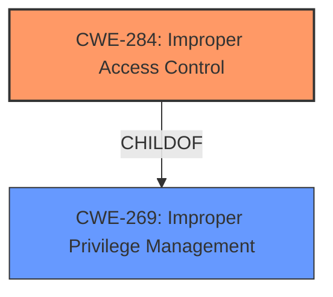

# Analysis for CVE-2021-26431

# Summary
| CWE ID  | CWE Name | Confidence | CWE Abstraction Level | CWE Vulnerability Mapping Label | CWE-Vulnerability Mapping Notes |
|-----------------|----------------------------------------------------|-------------------|--------------------------|-----------------------------------|-----------------------------------|
| CWE-284 | Improper Access Control | 0.9 | Class | Primary | Allowed |
| CWE-269 | Improper Privilege Management | 0.5 | Class | Secondary | Discouraged |

## Evidence and Confidence

*   **Confidence Score:** 0.7
*   **Evidence Strength:** MEDIUM

## Relationship Analysis
The primary CWE is CWE-284, which is a Class-level CWE. The suggested alternate CWE, CWE-269 is also a Class-level CWE.

## Vulnerability Chain
The vulnerability chain starts with **improper access control** leading to elevation of privilege.
  - **Root Cause:** **Improper Access Control**
  - **Impact:** Elevation of Privilege

## Summary of Analysis
The vulnerability is due to a **lack of proper access control** before authentication on the Windows lock screen, leading to an elevation of privilege.

The primary CWE is **CWE-284 (Improper Access Control)**, which is a Class-level CWE. This is the most appropriate CWE because the vulnerability description explicitly mentions the **lack of proper access control** as the root cause. The "CVE Reference Links Content Summary" also states: "The vulnerability exists due to the **lack of proper access control** prior to authentication on the Windows lock screen" and "Improper Access Control: The system fails to enforce adequate access control mechanisms before a user is authenticated."

CWE-269 (Improper Privilege Management) was considered as a secondary CWE, as the vulnerability ultimately leads to an elevation of privilege. However, CWE-269 is discouraged because it's often misused and conflated with the impact of privilege escalation rather than the root cause. The root cause is specifically the **improper access control**, making CWE-284 a better fit.

The retriever results suggested several other CWEs, including:
* CWE-454 (External Initialization of Trusted Variables or Data Stores): This doesn't fit the description, as the issue isn't related to external initialization of variables.
* CWE-59 (Improper Link Resolution Before File Access ('Link Following')): This is also not relevant, as the vulnerability doesn't involve symbolic links or file access issues.
* CWE-426 (Untrusted Search Path): This is not applicable, as the vulnerability doesn't involve an untrusted search path.
* CWE-266 (Incorrect Privilege Assignment): While related to privileges, it's not as accurate as CWE-284, which directly addresses the **improper access control**.
* CWE-732 (Incorrect Permission Assignment for Critical Resource): Similar to CWE-266, it's related to permissions, but not as direct as CWE-284.
* CWE-1386 (Insecure Operation on Windows Junction / Mount Point): This is specific to Windows junctions/mount points, which is not mentioned in the vulnerability description.

Based on the evidence and the CWE descriptions, CWE-284 is the most accurate and specific CWE for this vulnerability.

Relevant CWE Information:

# Enhanced Context (25 CWEs)

## CWE-284: Improper Access Control
**Abstraction Level**: Class
**Description**: The software does not restrict or incorrectly restricts access to a resource (data, files, functionality, etc.).
**Mapping Guidance**: Usage: Allowed
## CWE-269: Improper Privilege Management
**Abstraction Level**: Class
**Description**: The product does not properly assign, modify, track, or check privileges for an actor, creating an unintended sphere of control for that actor.
**Mapping Guidance**: Usage: Discouraged