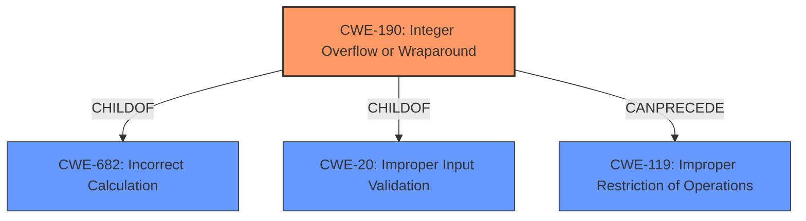

# Analysis for CVE-2021-26461

# Summary
| CWE ID  | CWE Name  | Confidence | CWE Abstraction Level | CWE Vulnerability Mapping Label | CWE-Vulnerability Mapping Notes |
|---|---|---|---|---|---|
| CWE-190 | Integer Overflow or Wraparound | 1.0 | Base | Allowed | Primary CWE |

## Evidence and Confidence

*   **Confidence Score:** 1.0
*   **Evidence Strength:** HIGH

## Relationship Analysis
The primary CWE is CWE-190 **Integer Overflow or Wraparound**, which is a Base level CWE. It has ChildOf relationships to CWE-682 and CWE-20, indicating it's a specific type of numeric error and input validation issue, respectively. It can also precede CWE-119 **Improper Restriction of Operations within the Bounds of a Memory Buffer**. The other CWEs considered are related to memory allocation, resource management, and input validation, but CWE-190 directly reflects the **integer wrap-around** described in the vulnerability.

## Vulnerability Chain
The vulnerability chain starts with the **integer wrap-around** (CWE-190). This leads to an improper memory assignment, causing arbitrary memory allocation. The final impact is unexpected behavior, such as a crash or remote code injection/execution.

## Summary of Analysis
The vulnerability description clearly states "**integer wrap-around**" as the root cause. The Retriever Results also lists CWE-190 **Integer Overflow or Wraparound** as the top candidate. The description of CWE-190 aligns perfectly with the vulnerability: "The product performs a calculation that can produce an integer overflow or wraparound...". The resulting memory allocation issues and potential for crashes or remote code execution are consistent with the potential impacts of an integer overflow.

The evidence is strong, directly linking the vulnerability to an integer overflow. The graph relationships show that CWE-190 can lead to buffer overflows (CWE-119), which can explain the potential for remote code execution. The selected CWE is at the optimal level of specificity (Base) as it directly addresses the root cause.

Relevant CWE Information:
# Enhanced Context (25 CWEs)
The following CWEs were identified as potentially relevant to this vulnerability:

## CWE-789: Memory Allocation with Excessive Size Value
**Abstraction Level**: Variant
**Similarity Score**: 0.78
**Source**: dense

**Description**:
The product allocates memory based on an untrusted, large size value, but it does not ensure that the size is within expected limits, allowing arbitrary amounts of memory to be allocated.

**Mapping Guidance**:
- Usage: Allowed
- Rationale: This CWE entry is at the Variant level of abstraction, which is a preferred level of abstraction for mapping to the root causes of vulnerabilities.

*Reasoning for not using this CWE:*
While the vulnerability ultimately leads to memory allocation issues, the root cause is the **integer wrap-around**, not directly an excessive size value.

## CWE-191: Integer Underflow (Wrap or Wraparound)
**Abstraction Level**: Base
**Similarity Score**: 0.77
**Source**: dense

**Description**:
The product subtracts one value from another, such that the result is less than the minimum allowable integer value, which produces a value that is not equal to the correct result.

**Mapping Guidance**:
- Usage: Allowed
- Rationale: This CWE entry is at the Base level of abstraction, which is a preferred level of abstraction for mapping to the root causes of vulnerabilities.

*Reasoning for not using this CWE:*
The vulnerability description specifically mentions "**integer wrap-around**", which can be caused by both overflow and underflow. However, the description of CWE-190 **Integer Overflow or Wraparound** more closely aligns with the general concept of wraparound due to exceeding the maximum value.

## CWE-1325: Improperly Controlled Sequential Memory Allocation
**Abstraction Level**: Base
**Similarity Score**: 0.77
**Source**: dense

**Description**:
The product manages a group of objects or resources and performs a separate memory allocation for each object, but it does not properly limit the total amount of memory that is consumed by all of the combined objects.

**Mapping Guidance**:
- Usage: Allowed
- Rationale: This CWE entry is at the Base level of abstraction, which is a preferred level of abstraction for mapping to the root causes of vulnerabilities.

*Reasoning for not using this CWE:*
This CWE is too specific. The vulnerability is about an **integer wrap-around** in memory allocation functions, not necessarily about sequential memory allocation.

## CWE-404: Improper Resource Shutdown or Release
**Abstraction Level**: Class
**Similarity Score**: 0.77
**Source**: dense

**Description**:
The product does not release or incorrectly releases a resource before it is made available for re-use.

**Mapping Guidance**:
- Usage: Allowed-with-Review
- Rationale: This CWE entry is a Class and might have Base-level children that would be more appropriate

*Reasoning for not using this CWE:*
This CWE is not directly related to the root cause of the vulnerability, which is an **integer wrap-around**.

## CWE-226: Sensitive Information in Resource Not Removed Before Reuse
**Abstraction Level**: Base
**Similarity Score**: 0.76
**Source**: dense

**Description**:
The product releases a resource such as memory or a file so that it can be made available for reuse, but it does not clear or "zeroize" the information contained in the resource before the product performs a critical state transition or makes the resource available for reuse by other entities.

**Mapping Guidance**:
- Usage: Allowed
- Rationale: This CWE entry is at the Base level of abstraction, which is a preferred level of abstraction for mapping to the root causes of vulnerabilities.

*Reasoning for not using this CWE:*
This CWE is not directly related to the root cause of the vulnerability, which is an **integer wrap-around**.

## CWE-197: Numeric Truncation Error
**Abstraction Level**: Base
**Similarity Score**: 0.76
**Source**: dense

**Description**:
Truncation errors occur when a primitive is cast to a primitive of a smaller size and data is lost in the conversion.

**Mapping Guidance**:
- Usage: Allowed
- Rationale: This CWE entry is at the Base level of abstraction, which is a preferred level of abstraction for mapping to the root causes of vulnerabilities.

*Reasoning for not using this CWE:*
The vulnerability description specifies "**integer wrap-around**", not truncation.

## CWE-131: Incorrect Calculation of Buffer Size
**Abstraction Level**: Base
**Similarity Score**: 0.76
**Source**: dense

**Description**:
The product does not correctly calculate the size to be used when allocating a buffer, which could lead to a buffer overflow.

**Mapping Guidance**:
- Usage: Allowed
- Rationale: This CWE entry is at the Base level of abstraction, which is a preferred level of abstraction for mapping to the root causes of vulnerabilities.

*Reasoning for not using this CWE:*
While the vulnerability can lead to improper memory allocation, the root cause is the **integer wrap-around**, not the incorrect calculation of the buffer size itself.

## CWE-667: Improper Locking
**Abstraction Level**: Class
**Similarity Score**: 0.74
**Source**: dense

**Description**:
The product does not properly acquire or release a lock on a resource, leading to unexpected resource state changes and behaviors.

**Mapping Guidance**:
- Usage: Allowed-with-Review
- Rationale: This CWE entry is a Class and might have Base-level children that would be more appropriate

*Reasoning for not using this CWE:*
This CWE is not related to the root cause **integer wrap-around**.

## CWE-681: Incorrect Conversion between Numeric Types
**Abstraction Level**: Base
**Similarity Score**: 0.74
**Source**: dense

**Description**:
When converting from one data type to another, such as long to integer, data can be omitted or translated in a way that produces unexpected values. If the resulting values are used in a sensitive context, then dangerous behaviors may occur.

**Mapping Guidance**:
- Usage: Allowed
- Rationale: This CWE entry is at the Base level of abstraction, which is a preferred level of abstraction for mapping to the root causes of vulnerabilities.

*Reasoning for not using this CWE:*
The vulnerability description does not mention incorrect conversion between numeric types.