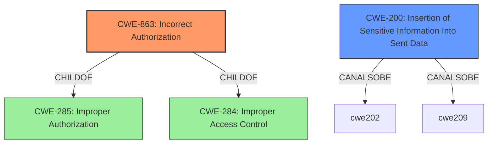

# Analysis Report for CVE-2021-26559

# Vulnerability Analysis Report: CVE-2021-26559

## Description


## Analysis (with Relationship Data)

# Summary
| CWE ID | CWE Name | Confidence | CWE Abstraction Level | CWE Vulnerability Mapping Label | CWE-Vulnerability Mapping Notes |
|---|---|---|---|---|---|
| CWE-863 | Incorrect Authorization | 0.9 | Class | Allowed-with-Review | Primary CWE. The application performs an authorization check, but the check is **incorrect**. |
| CWE-200 | Insertion of Sensitive Information Into Sent Data | 0.7 | Base | Allowed | Secondary CWE. Configuration data contains **sensitive information** that is **inserted** and **sent** to a user with insufficient privileges. |

## Evidence and Confidence

*   **Confidence Score:** 0.8
*   **Evidence Strength:** HIGH

## Relationship Analysis
The primary weakness is **CWE-863 (Incorrect Authorization)**, a Class-level CWE. Although it is a class, there isn't sufficient information to pick a more specific child. **CWE-200 (Insertion of Sensitive Information Into Sent Data)** is a Base-level CWE and represents the disclosure of sensitive information. **CWE-200** can be related to **CWE-863**, showing that the improper authorization leads to sensitive data exposure.



## Vulnerability Chain
The vulnerability chain starts with **improper access control (CWE-863)**, which leads to the **insertion of sensitive information into sent data (CWE-200)**, resulting in privilege escalation.
1.  **Root Cause:** **CWE-863** - **Incorrect Authorization** on the configurations endpoint. Users with "Viewer" or "User" roles are incorrectly authorized to access sensitive configuration data.
2.  **Weakness:** **CWE-200** - **Insertion of Sensitive Information Into Sent Data.** The application sends sensitive configuration data to unauthorized users.
3.  **Impact:** Privilege escalation, as the exposed configuration data can be used to gain higher-level access or control.

## Summary of Analysis
The initial analysis identified **CWE-863 (Incorrect Authorization)** as the primary weakness, which aligns with the vulnerability description stating "**Improper Access Control on Configurations Endpoint**." The "**improper**" aspect is the key indicator for **Incorrect Authorization**. This is further supported by the CVE Reference Links Content Summary, which highlights the improper access control as the root cause.

The secondary weakness, **CWE-200 (Insertion of Sensitive Information Into Sent Data)**, captures the fact that **sensitive information** is being exposed due to the authorization bypass. This is supported by the vulnerability description stating that users can get Airflow Configurations including **sensitive information**.

Based on the evidence provided and the CWE specifications, these CWEs are at the optimal level of specificity. **CWE-863** correctly identifies the authorization failure, and **CWE-200** accurately describes the sensitive data exposure.


## CWE Relationship Analysis

Current CWEs represent these abstraction levels: .


### Vulnerability Chain Analysis

**Chain starting from CWE-285:**
- 285 (Improper Authorization) - ROOT


**Chain starting from CWE-200:**
- 200 (Exposure of Sensitive Information to an Unauthorized Actor) - ROOT


### CWE Relationship Diagram

```mermaid
graph TD
    classDef primary fill:#f96,stroke:#333,stroke-width:2px
    classDef secondary fill:#69f,stroke:#333
    classDef tertiary fill:#9e9,stroke:#333
```


*Report generated on 2025-04-01 21:10:55*
